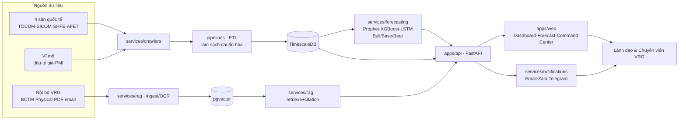

# Luồng Dữ liệu Tổng thể

> Từ thu thập → xử lý → dự báo → hiển thị/cảnh báo → truy vấn.

## Sơ đồ

## Diễn giải
1. **Thu thập**: crawler 4 sàn + vĩ mô; tri thức nội bộ qua OCR/ingest.
2. **Chuẩn hóa**: ETL pipeline → TimescaleDB (số) và pgvector (embedding).
3. **Suy luận**: forecasting sinh dự báo + kịch bản; RAG truy xuất kèm citation.
4. **Phục vụ**: FastAPI gộp dữ liệu → Web (dashboard/chat) + Notifications (cảnh báo).
5. **Báo cáo tự động**: 07:30 (dự báo mở cửa) và 17:00 (thực tế vs dự báo).
