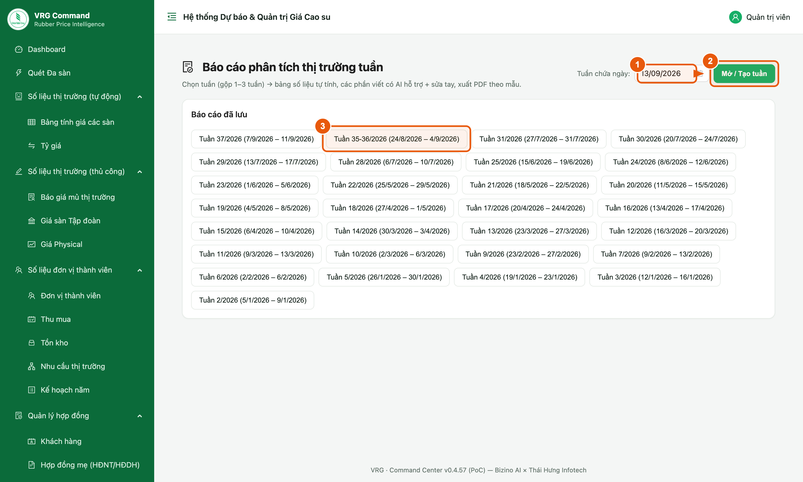
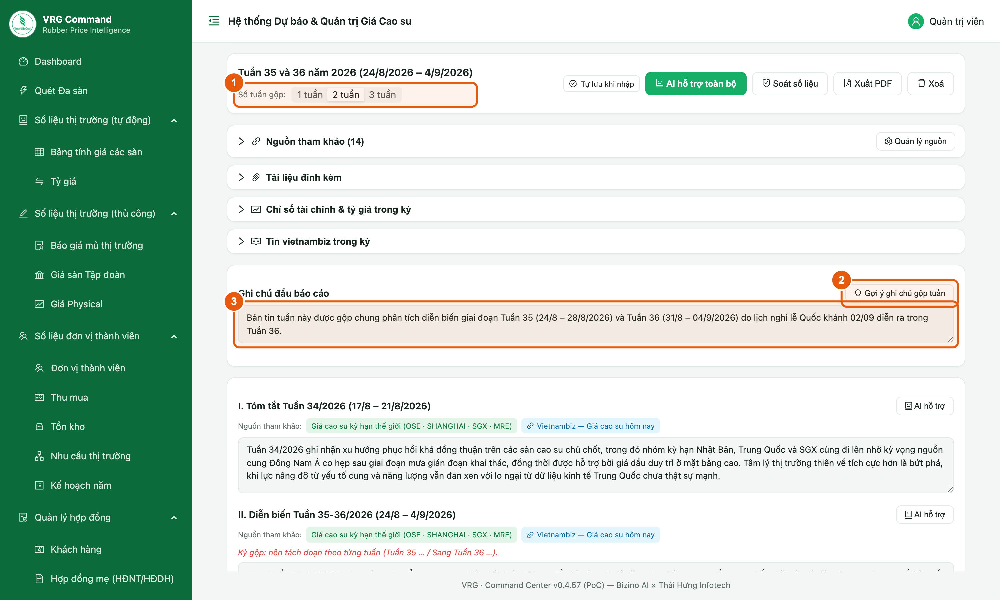
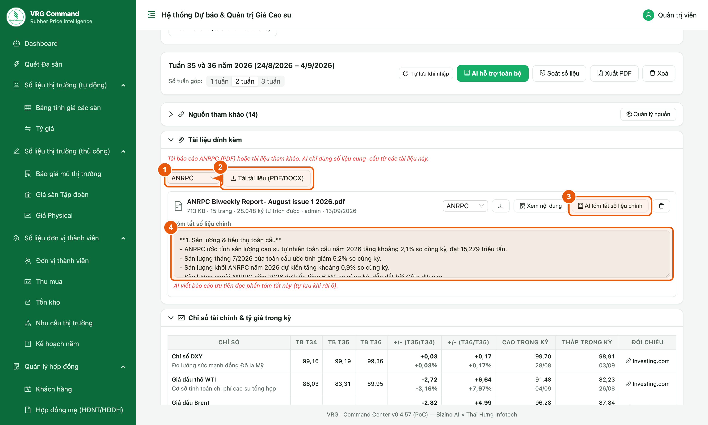
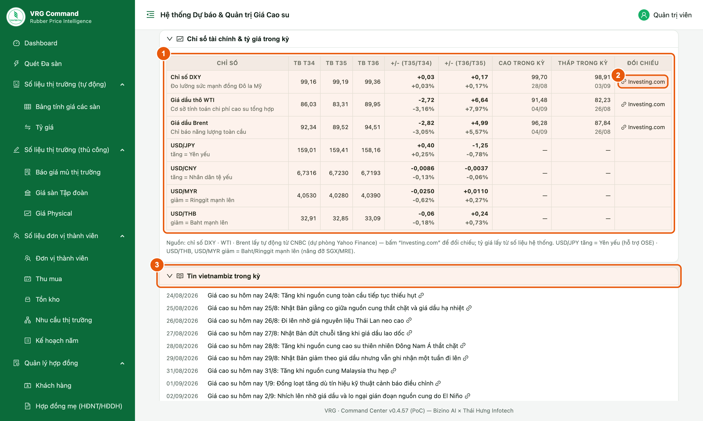
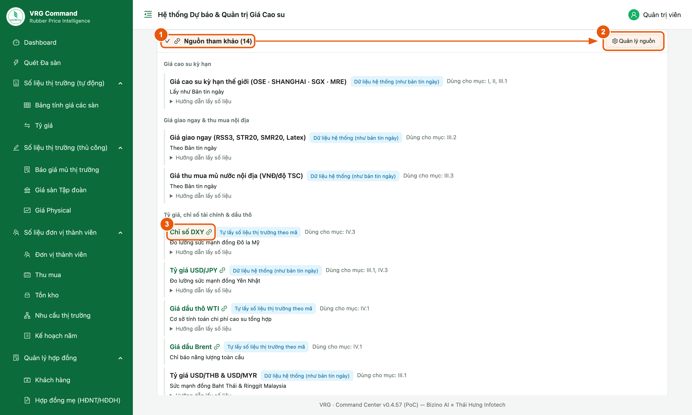
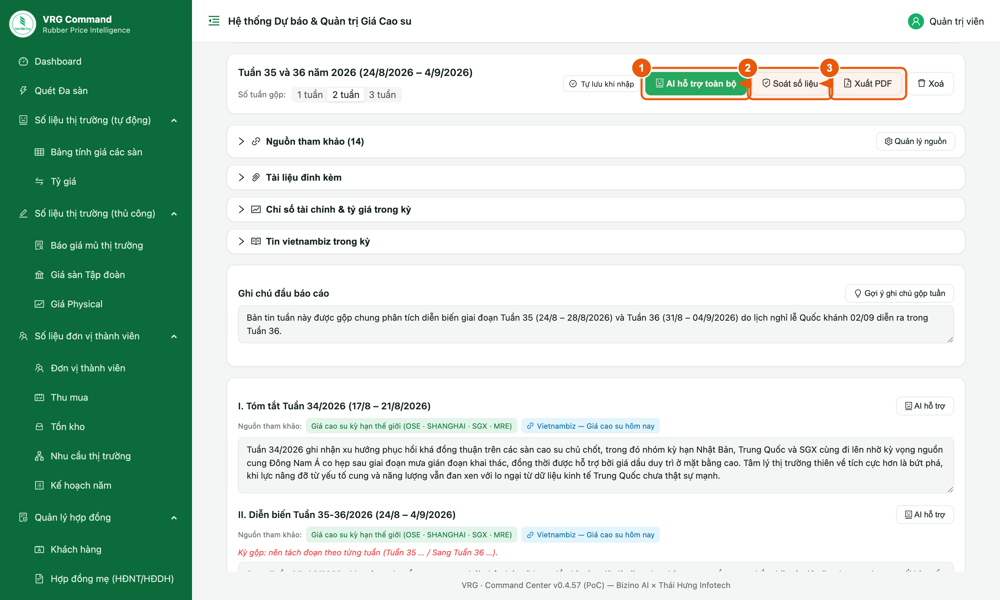
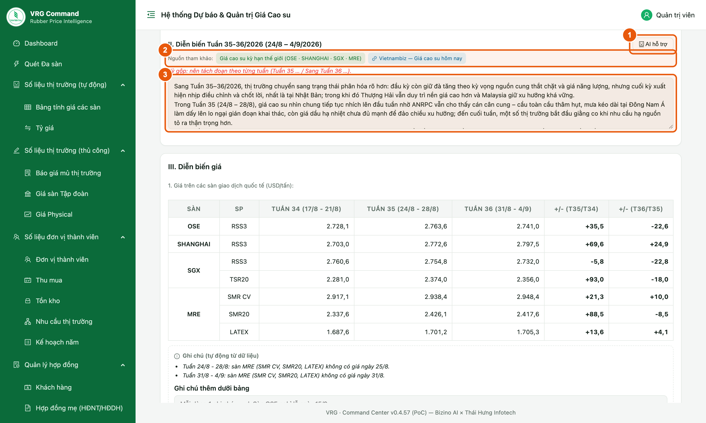
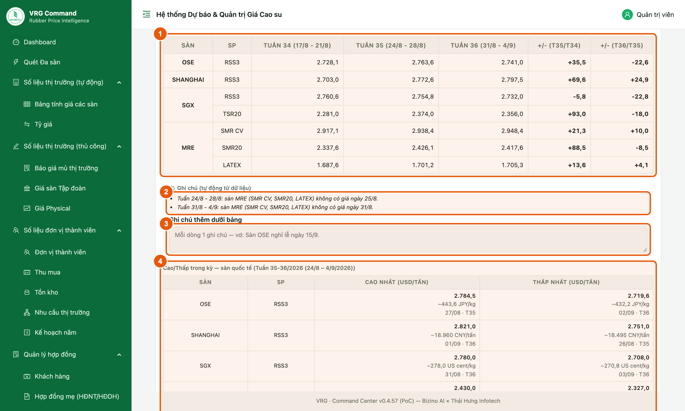
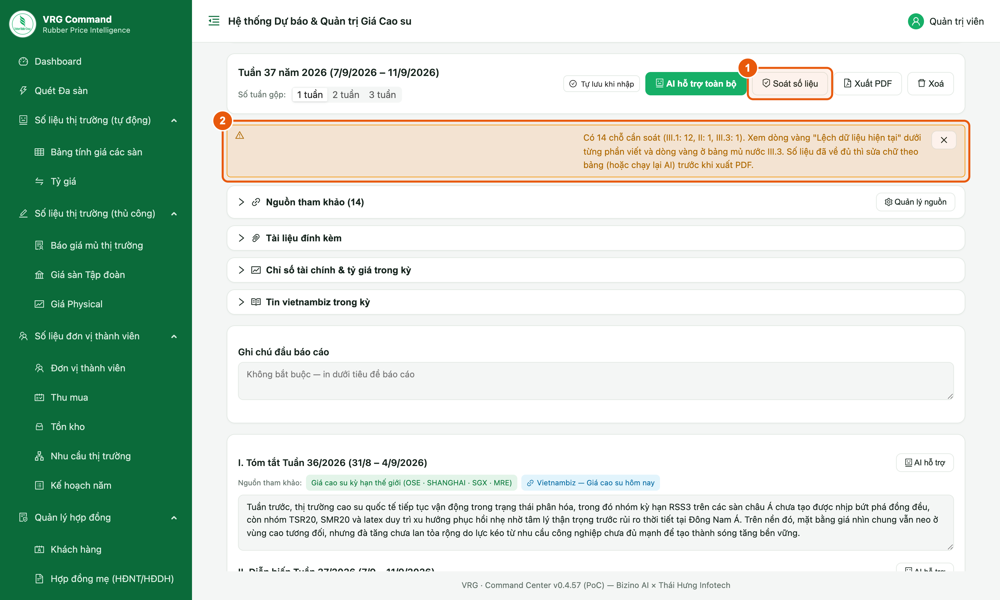
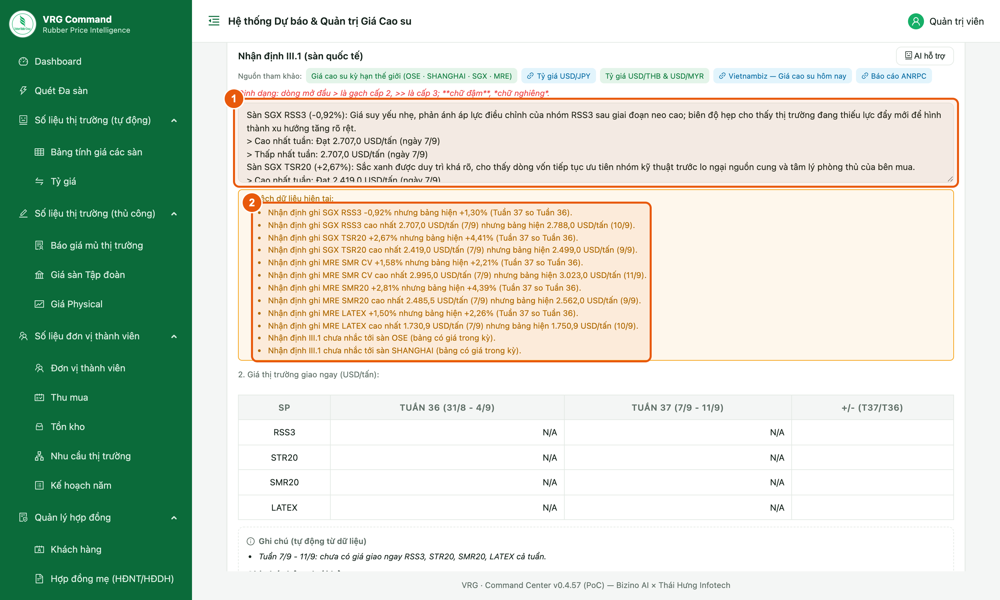

# Hướng dẫn sử dụng — Báo cáo phân tích thị trường tuần

Tài liệu dành cho **chuyên viên Ban Thị trường – Kinh doanh** soạn **Báo cáo phân tích thị trường cao su tuần**.

Quy trình gọn: **mở tuần** → (gộp tuần nếu có lễ) → **tải báo cáo ANRPC** → **AI hỗ trợ toàn bộ** → soát, sửa → **Soát số liệu** → **Xuất PDF**.

> Bản Word đầy đủ (có ảnh chú thích): [Huong-dan-bao-cao-tuan.docx](./Huong-dan-bao-cao-tuan.docx)
> Sửa nội dung: chỉ sửa `spec.json` rồi chạy `python3 render_readme.py` (dựng lại README) và `node build_guide.js spec.json` (dựng lại bản Word).

## 1. Mở hoặc tạo báo cáo tuần

**Vị trí:** Menu **Phân tích & Bản tin** → **Báo cáo tuần**

Mỗi báo cáo gắn với một tuần (Thứ Hai – Thứ Sáu). Bảng giá được hệ thống tự tính, không cần nhập.

*Hình 1. Mở báo cáo tuần*

1. Chọn **một ngày bất kỳ** trong tuần cần làm.
2. Bấm **Mở / Tạo tuần**.
3. Muốn làm tiếp báo cáo cũ thì bấm tên tuần trong **Báo cáo đã lưu**.

> Hệ thống tự lưu khi gõ. Không có nút Lưu.

## 2. Gộp tuần và ghi chú đầu báo cáo

**Vị trí:** Menu **Phân tích & Bản tin** → **Báo cáo tuần**

Tuần có lễ có thể gộp 2–3 tuần vào một báo cáo, như Tuần 35–36 dịp Quốc khánh.

*Hình 2. Chọn số tuần gộp và ghi chú*

1. Chọn **Số tuần gộp**: 1, 2 hoặc 3 tuần. Bảng giá tự đổi sang nhiều cột tuần.
2. Bấm **Gợi ý ghi chú gộp tuần** để chèn câu mẫu.
3. Sửa lý do gộp trong ô **Ghi chú đầu báo cáo** (vd nghỉ lễ Quốc khánh 02/09).

> - Ghi chú này in ngay dưới tiêu đề báo cáo PDF.
> - Báo cáo 1 tuần thì để trống ô ghi chú.

## 3. Tải báo cáo ANRPC và cho AI tóm tắt

**Vị trí:** Menu **Phân tích & Bản tin** → **Báo cáo tuần** → khối **Tài liệu đính kèm**

AI chỉ lấy số cung – cầu (sản lượng, tiêu thụ, cán cân) từ tài liệu đính kèm. Nên tải báo cáo ANRPC mới nhất trước khi cho AI viết.

*Hình 3. Tải tài liệu và tóm tắt số liệu chính*

1. Chọn loại tài liệu: **ANRPC** hoặc **Khác**.
2. Bấm **Tải tài liệu (PDF/DOCX)** và chọn file.
3. Bấm **AI tóm tắt số liệu chính**. Chờ khoảng 10 giây.
4. Đọc lại phần **Tóm tắt số liệu chính**, sửa nếu thấy sai. Rời ô là tự lưu.

> - Chỉ nhận file PDF hoặc Word (.docx), tối đa 25 MB.
> - File scan dạng ảnh không đọc được chữ. Hệ thống sẽ báo đỏ ngay dưới file.
> - Dòng vàng dưới phần tóm tắt là số AI chưa tìm thấy nguyên văn trong file. Kiểm lại số đó trước khi dùng.
> - Mỗi tuần tải lại file ANRPC nếu muốn AI dùng.

## 4. Xem chỉ số tài chính và tin trong kỳ

**Vị trí:** Menu **Phân tích & Bản tin** → **Báo cáo tuần** → khối **Chỉ số tài chính & tỷ giá** và **Tin vietnambiz trong kỳ**

Hai khối này giúp nắm nhanh bối cảnh tuần trước khi viết. AI cũng đọc các số và tin này.

*Hình 4. Chỉ số tài chính, tỷ giá và tin trong kỳ*

1. Xem bảng **DXY, dầu WTI, dầu Brent** và **tỷ giá USD/JPY, CNY, MYR, THB**: trung bình từng tuần, tăng/giảm, cao/thấp trong kỳ.
2. Bấm **Investing.com** nếu cần đối chiếu số.
3. Bấm tiêu đề bài trong **Tin vietnambiz trong kỳ** để đọc bài gốc.

> USD/JPY tăng nghĩa là đồng Yên yếu đi. USD/THB, USD/MYR giảm nghĩa là Baht, Ringgit mạnh lên.

## 5. Nguồn tham khảo

**Vị trí:** Menu **Phân tích & Bản tin** → **Báo cáo tuần** → khối **Nguồn tham khảo**

Danh mục nguồn theo logic viết báo cáo tuần: giá sàn, giá giao ngay, tỷ giá – dầu, tin tức, ANRPC, EUDR, vĩ mô Việt Nam.

*Hình 5. Danh mục nguồn tham khảo*

1. Bấm **Nguồn tham khảo** để mở danh mục.
2. Bấm **Quản lý nguồn** để thêm, sửa, tắt nguồn hoặc khôi phục mặc định.
3. Bấm tên nguồn để mở trang gốc. Mục **Hướng dẫn lấy số liệu** ghi cách lấy từng nguồn.

> Nguồn nào gắn với phần nào thì hiện thành nút nhỏ ngay dưới ô viết phần đó.

## 6. Thanh công cụ của báo cáo

**Vị trí:** Menu **Phân tích & Bản tin** → **Báo cáo tuần**

*Hình 6. Các nút chính*

1. **AI hỗ trợ toàn bộ**: AI viết nháp mọi phần một lượt, các phần kể cùng một diễn biến. Chờ khoảng 20–30 giây.
2. **Soát số liệu**: đối chiếu chữ đã viết với số mới nhất (xem mục 9).
3. **Xuất PDF**: tải báo cáo theo mẫu. Còn chỗ lệch thì hệ thống hỏi lại trước khi xuất.

> Bấm AI hỗ trợ toàn bộ sẽ **thay** nội dung đang có ở các phần viết. Hệ thống hỏi xác nhận trước.

## 7. Viết và sửa từng phần

**Vị trí:** Menu **Phân tích & Bản tin** → **Báo cáo tuần** → các phần I đến VI

Mỗi phần có ô viết riêng. AI chỉ viết nháp; chuyên viên đọc lại và sửa.

*Hình 7. Ô viết của một phần*

1. Bấm **AI hỗ trợ** để AI viết lại riêng phần đó.
2. Bấm nút **nguồn tham khảo** dưới tên phần để mở nguồn gợi ý.
3. Sửa trực tiếp trong ô. Mỗi dòng là một đoạn hoặc một gạch đầu dòng.

> - Cách trình bày: dòng bắt đầu bằng **>** là gạch cấp 2, **>>** là gạch cấp 3; chữ đậm viết giữa hai cặp dấu sao.
> - Dòng đỏ báo **từ tuyệt đối** (hoàn toàn, chắc chắn, 100%…): nên thay bằng từ trung lập.
> - Dòng vàng báo **số chưa đối chiếu được**: kiểm lại số đó với bảng hoặc tài liệu.
> - Nên thêm chi tiết riêng của tuần mà AI chưa có (vd mức cao/thấp nhiều tuần, số lốp xe Trung Quốc).

## 8. Bảng giá và ghi chú tự động

**Vị trí:** Menu **Phân tích & Bản tin** → **Báo cáo tuần** → phần **III. Diễn biến giá**

Bảng giá sàn, giá giao ngay, mủ nước được tính tự động từ số liệu hệ thống.

*Hình 8. Bảng giá, ghi chú và cao/thấp trong kỳ*

1. Xem **bảng giá sàn**: trung bình từng tuần và tăng/giảm từng cặp tuần.
2. Đọc **Ghi chú (tự động)**: ngày sàn không có giá, hoặc chưa quy đổi được USD do thiếu tỷ giá.
3. Nhập thêm ghi chú nếu cần vào ô **Ghi chú thêm dưới bảng** (vd "Giá physical tuần này tham khảo theo ANRPC.").
4. Dùng bảng **Cao/Thấp trong kỳ** (kèm giá JPY/kg, CNY/tấn, US cent/kg) để đối chiếu khi viết nhận định.

> - Số trong bảng không sửa tay được. Số sai thì sửa ở màn nhập giá tương ứng, bảng tự cập nhật.
> - Riêng biên độ mủ nước sửa tay được. Nút **Dùng số tự tính** đưa về số của hệ thống.

## 9. Soát số liệu trước khi xuất PDF

**Vị trí:** Menu **Phân tích & Bản tin** → **Báo cáo tuần** → nút **Soát số liệu**

Báo cáo viết giữa tuần có thể lệch khi số liệu cả tuần về đủ. Luôn soát trước khi xuất.

*Hình 9. Kết quả soát số liệu*

*Hình 10. Chỗ lệch hiện ngay dưới ô viết*

1. Bấm **Soát số liệu**.
2. Đọc dòng tóm tắt: số chỗ cần soát ở từng phần.
3. Kéo xuống từng ô có khung vàng **Lệch dữ liệu hiện tại** (vd "Nhận định ghi SGX RSS3 -0,92% nhưng bảng hiện +1,30%").
4. Sửa tay theo số trong bảng, hoặc bấm **AI hỗ trợ** để viết lại phần đó.
5. Bấm **Soát số liệu** lại đến khi báo "Không thấy chỗ lệch", rồi **Xuất PDF**.

## 10. Những tình huống hay gặp

> - Bảng giá giao ngay toàn N/A → Chưa có giá giao ngay trong kỳ. Nhập ở màn Giá Physical, hoặc ghi "tham khảo theo ANRPC" ở ghi chú dưới bảng.
> - Ghi chú báo "chưa quy đổi được USD do thiếu tỷ giá" → Sàn vẫn có giao dịch nhưng thiếu tỷ giá ngày đó. Báo quản trị kiểm tra màn Tỷ giá.
> - AI không nhắc số ANRPC → Chưa tải tài liệu đính kèm, hoặc chưa bấm AI tóm tắt số liệu chính.
> - Chỉ số DXY/dầu báo lỗi → Nguồn tạm thời không truy cập được. Thử lại sau vài phút; vẫn viết được báo cáo.
> - Lỡ bấm AI hỗ trợ toàn bộ làm mất chữ đã sửa → Phần đã thay không tự khôi phục được. Sửa lại từng phần; lần sau đọc kỹ hộp xác nhận.
