# Hướng dẫn sử dụng — Đề nghị sửa số liệu quá khứ

Tài liệu dành cho **tài khoản nhập liệu của đơn vị thành viên**. Số liệu ngày cũ đã khoá (quá hạn sửa hoặc đã chốt) chỉ thay đổi được khi Ban duyệt.

Cách làm chung: mở đúng bản ghi cần sửa, bấm **Đề nghị sửa**, sửa số ngay trên biểu quen thuộc, viết **lý do** rồi gửi. Trước khi Ban duyệt, số liệu vẫn giữ nguyên. Kết quả duyệt hoặc từ chối được gửi qua email.

> Bản Word đầy đủ (có ảnh chú thích): [Huong-dan-de-nghi-sua-so-lieu.docx](./Huong-dan-de-nghi-sua-so-lieu.docx)
> Bản dành cho người duyệt: [../duyet-de-nghi-sua/README.md](../duyet-de-nghi-sua/README.md)
> Sửa nội dung: chỉ sửa `spec.json` rồi chạy `python3 render_readme.py` (dựng lại README) và `node build_guide.js spec.json` (dựng lại bản Word).
> Chụp lại bộ ảnh khi giao diện đổi: chạy `./scripts/dev.sh` rồi `cd apps/api && uv run --with playwright python ../../docs/huong-dan/de-nghi-sua-so-lieu/shoot.py`.

## 1. Khi nào phải gửi đề nghị sửa

**Vị trí:** Menu ▸ Nhập liệu số liệu ▸ Thu mua (theo ngày) · Tồn kho (theo ngày)

Số liệu mỗi ngày chỉ tự sửa được đến **11:00** theo hạn quy định (ví dụ: đến 11:00 ngày hôm sau). Quá hạn, hoặc ngày nằm trong kỳ đã chốt, sẽ chuyển sang chỉ xem. Nhìn ba chỗ sau là biết ngày đó còn sửa thẳng được hay phải gửi đề nghị.

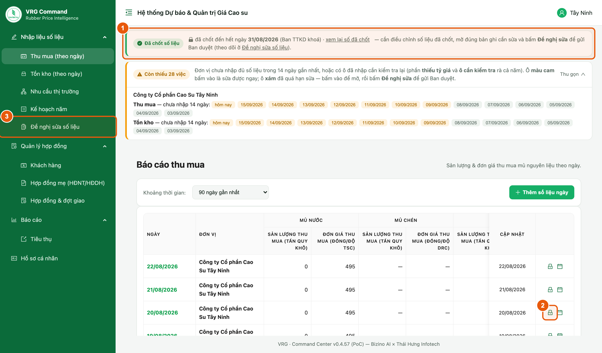

*Hình 1. Dấu hiệu cho biết số liệu ngày đó đã khoá*

1. **Dải xanh “Đã chốt số liệu”** ở đầu màn hình cho biết số liệu đến hết ngày nào đã được chốt. Mọi ngày từ đó trở về trước đều không tự sửa được.
2. **Biểu tượng ổ khoá** ở cuối dòng ngày: ngày đã chốt. Nếu là **hình con mắt** thì ngày đó đã quá hạn tự sửa. Cả hai trường hợp đều bấm vào được để xem lại số và gửi đề nghị.
3. **Đề nghị sửa số liệu** trong menu bên trái là nơi theo dõi mọi đề nghị đơn vị đã gửi.

> - Ngày vẫn còn trong hạn sửa thì cứ mở ra sửa và bấm Lưu như thường ngày, không cần gửi đề nghị.
> - Chỉ tài khoản nhập liệu của đơn vị mới gửi được đề nghị. Tài khoản lãnh đạo đơn vị chỉ xem số liệu.

## 2. Gửi đề nghị sửa ở biểu Thu mua và Tồn kho

**Vị trí:** Menu ▸ Nhập liệu số liệu ▸ Thu mua (theo ngày) hoặc Tồn kho (theo ngày)

Đề nghị sửa được soạn ngay trên biểu quen thuộc: mở đúng ngày, bật chế độ đề nghị, sửa số rồi gửi. Hai màn Thu mua và Tồn kho làm giống hệt nhau.

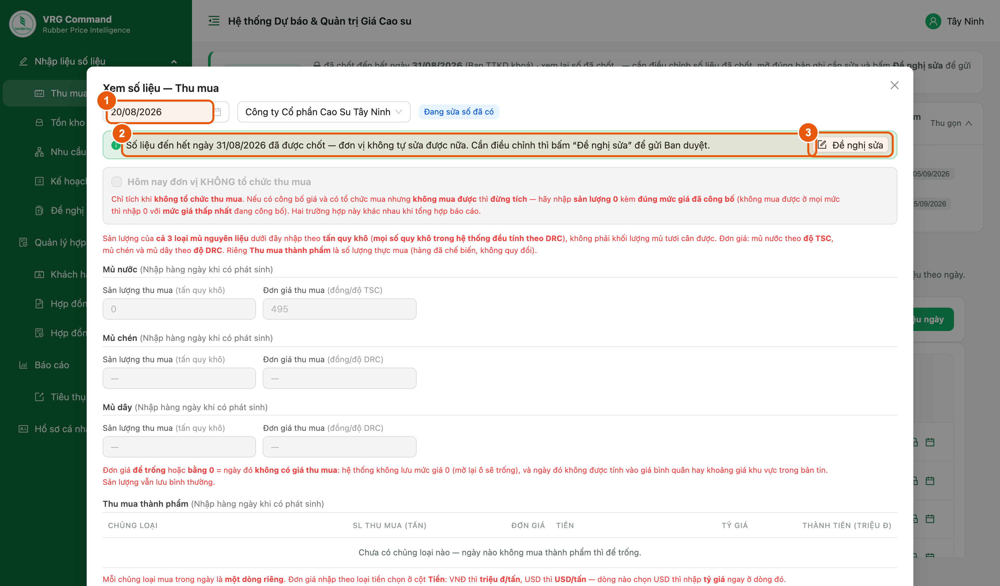

*Hình 2. Mở một ngày đã khoá — dải xanh có nút Đề nghị sửa*

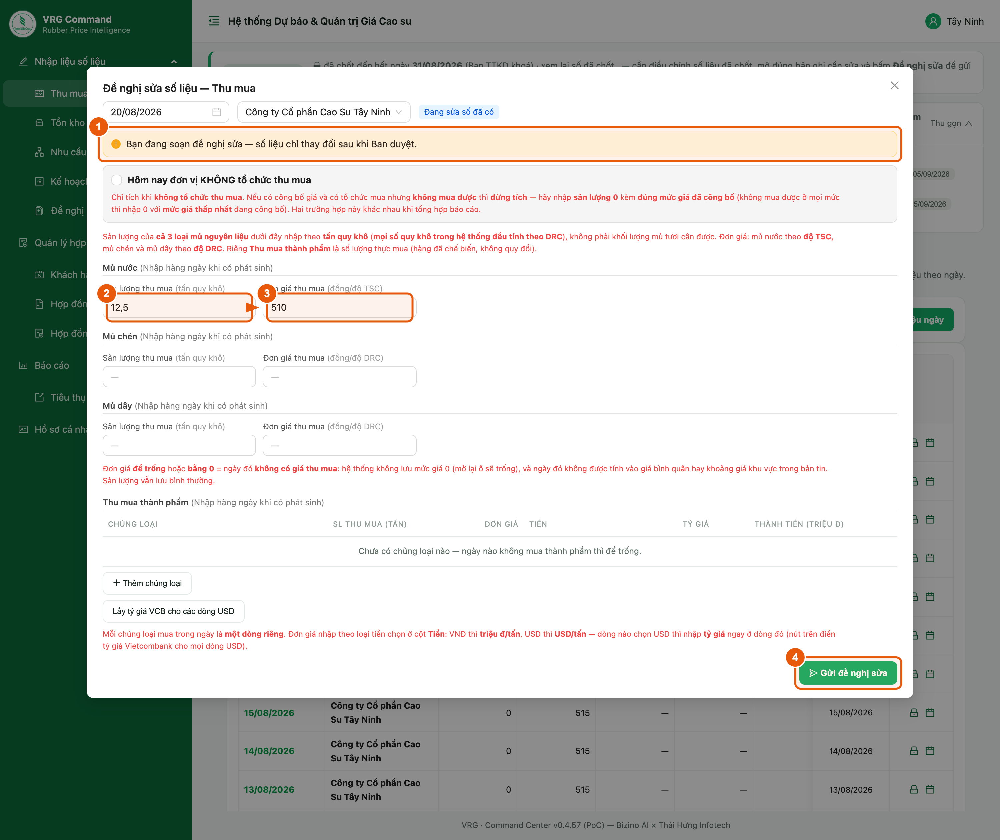

*Hình 3. Biểu ở chế độ đề nghị sửa — dải vàng nhắc số liệu chưa đổi*

1. Trong bảng, bấm vào **dòng của ngày cần sửa** (hoặc biểu tượng ở cuối dòng) để mở phiếu ngày đó. Kiểm tra **ngày** ở góc trên bên trái cho đúng.
2. Đọc **dải xanh**: hệ thống nói rõ ngày này khoá vì đã chốt hay vì quá hạn nhập.
3. Bấm **Đề nghị sửa** ở bên phải dải xanh. Tiêu đề hộp đổi thành “Đề nghị sửa số liệu” và các ô nhập mở ra cho sửa.
4. **Dải vàng** nhắc: số liệu chỉ thay đổi sau khi Ban duyệt. Đây là bản nháp, chưa ảnh hưởng gì đến số đang lưu.
5. Sửa lại **sản lượng** và **đơn giá** cho đúng. Chỉ sửa những ô thật sự sai, các ô khác để nguyên.
6. Bấm **Gửi đề nghị sửa** ở chân biểu để sang bước viết lý do.

> - Nút Gửi đề nghị sửa chỉ sáng lên khi đã có ít nhất một ô được sửa khác số cũ.
> - Đóng hộp giữa chừng thì bản nháp mất, số liệu vẫn nguyên như cũ.

## 3. Viết lý do rồi gửi đề nghị

**Vị trí:** Hộp “Gửi đề nghị sửa số liệu”

Đây là bước cuối. Lý do là phần Ban đọc trước tiên khi xét duyệt, nên viết càng rõ càng nhanh được duyệt.

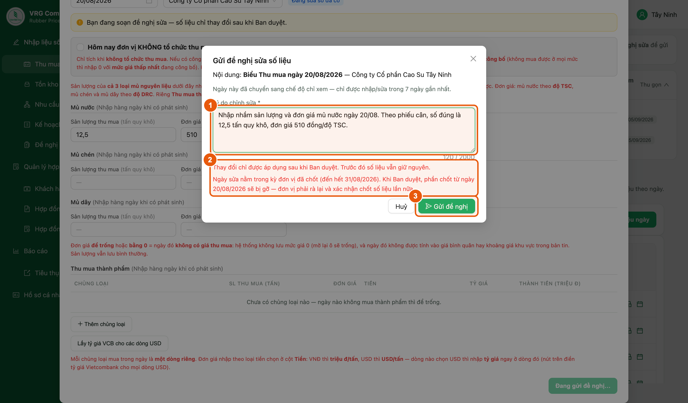

*Hình 4. Hộp gửi đề nghị — lý do bắt buộc và hai lưu ý đỏ*

1. **Lý do chỉnh sửa** là bắt buộc. Viết rõ **sai ở chỗ nào** và **số đúng là bao nhiêu**, kèm căn cứ nếu có. Ví dụ: “Nhập nhầm sản lượng và đơn giá mủ nước ngày 20/08. Theo phiếu cân, số đúng là 12,5 tấn quy khô, đơn giá 510 đồng/độ TSC.”
2. Đọc **hai dòng chữ đỏ** ngay dưới ô lý do trước khi gửi.
3. Bấm **Gửi đề nghị**. Hệ thống báo “Đã gửi đề nghị — chờ Ban duyệt”.

> - Lưu ý đỏ thứ nhất: thay đổi chỉ được áp dụng **sau khi Ban duyệt**. Trước đó số liệu vẫn giữ nguyên, nên đừng dựa vào số mới để làm báo cáo.
> - Lưu ý đỏ thứ hai: nếu ngày cần sửa nằm trong kỳ đơn vị **đã chốt**, thì khi Ban duyệt xong, phần chốt từ ngày đó trở đi **sẽ bị gỡ** — đơn vị phải rà lại số liệu và xác nhận chốt một lần nữa.
> - Chỉ nêu lý do liên quan đến số liệu. Ban không sửa hộ nội dung khác trong đề nghị.

## 4. Đề nghị đổi ngày của bản ghi (nhập nhầm ngày)

**Vị trí:** Menu ▸ Nhập liệu số liệu ▸ Thu mua (theo ngày) · Tồn kho (theo ngày)

Khi số liệu đúng nhưng bị nhập vào nhầm ngày, không cần nhập lại từ đầu. Đơn vị đề nghị chuyển cả bản ghi sang ngày khác.

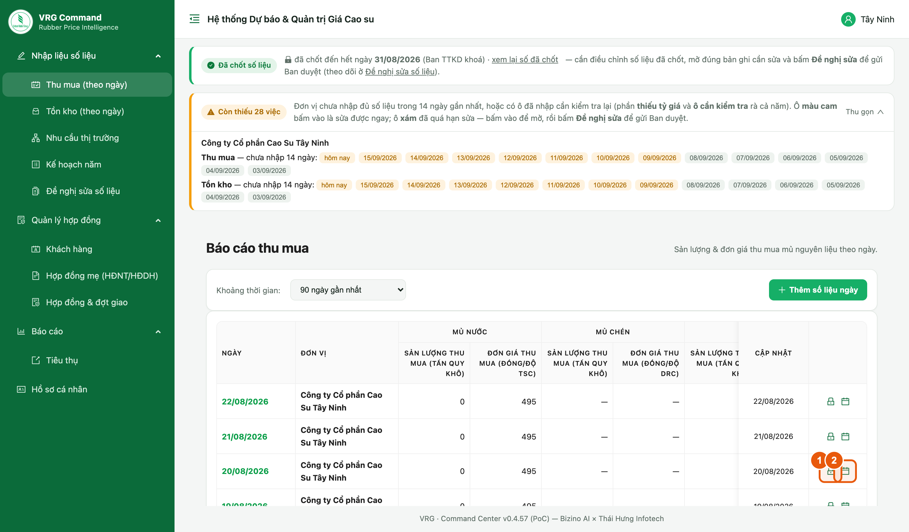

*Hình 5. Hai nút ở cuối dòng: mở phiếu ngày và đổi ngày bản ghi*

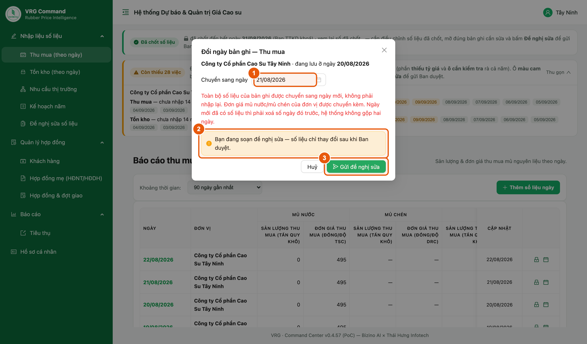

*Hình 6. Hộp đổi ngày ở chế độ đề nghị sửa*

1. Tìm dòng của ngày bị nhập nhầm, bấm **nút hình cuốn lịch** ở cuối dòng.
2. Ở ô **Chuyển sang ngày**, chọn ngày đúng.
3. **Dải vàng** nhắc đây là đề nghị, số liệu chưa chuyển ngay.
4. Bấm **Gửi đề nghị sửa**, rồi viết lý do như ở mục 3.

> - Toàn bộ số liệu của bản ghi được chuyển sang ngày mới, kể cả đơn giá mủ nước và mủ chén. Không phải nhập lại.
> - Nếu ngày mới đã có số liệu thì hệ thống không gộp hai ngày. Phải xoá số của ngày đó trước, rồi mới chuyển sang.

## 5. Đề nghị sửa ở màn Nhu cầu thị trường

**Vị trí:** Menu ▸ Nhập liệu số liệu ▸ Nhu cầu thị trường

Phiếu nhu cầu có **ngày nhận** đã quá hạn sửa vẫn hiện đầy đủ trong bảng, cuối dòng có thêm nút **Đề nghị sửa**. **Kết quả** và **Ghi chú** thì cập nhật thẳng được; các ô còn lại phải gửi đề nghị.

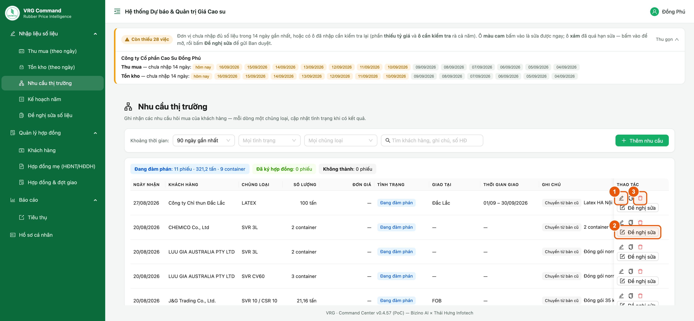

*Hình 7. Dòng nhu cầu quá hạn sửa: bút chì, nút Đề nghị sửa và thùng rác*

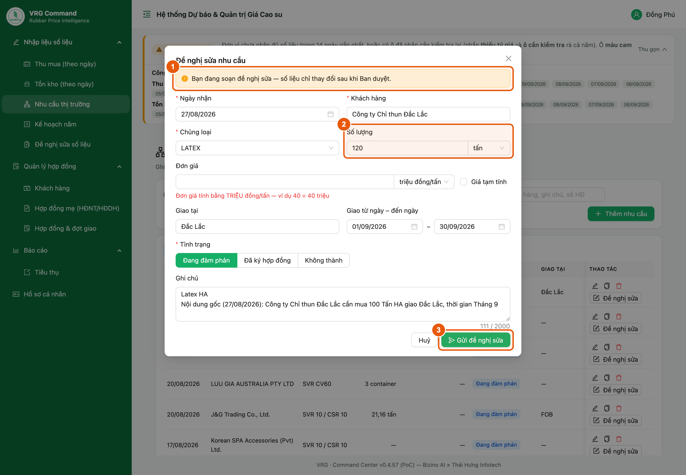

*Hình 8. Phiếu nhu cầu ở chế độ đề nghị sửa*

1. **Chỉ cập nhật kết quả đàm phán?** Bấm **bút chì** ở cuối dòng (Hình 7 · 1). Sửa ô **Kết quả** hoặc **Ghi chú**, rồi bấm **Lưu**. Các ô khác hiện xám. Phiếu lưu ngay, **không cần gửi đề nghị**.
2. **Cần sửa ô khác** (ngày nhận, khách hàng, chủng loại, số lượng, đơn giá, nơi giao, thời gian giao)? Bấm **Đề nghị sửa** ở cuối dòng (Hình 7 · 2).
3. Phiếu mở ra với tiêu đề “Đề nghị sửa nhu cầu” và **mọi ô đều sửa được**. **Dải vàng** (Hình 8 · 1) nhắc: số liệu chỉ thay đổi sau khi Ban duyệt.
4. Sửa đúng những ô sai (Hình 8 · 2), các ô khác để nguyên.
5. Bấm **Gửi đề nghị sửa** (Hình 8 · 3). Hộp lý do hiện ra — viết lý do rồi gửi như ở mục 3.
6. **Phiếu nhập thừa?** Bấm **thùng rác** (Hình 7 · 3) rồi bấm **Xoá**. Phiếu đã quá hạn sửa nên hệ thống mở hộp **đề nghị xoá**. Viết lý do rồi gửi; Ban duyệt xong phiếu mới bị xoá.

> - Phiếu có ngày nhận còn trong hạn sửa không có nút Đề nghị sửa — bấm bút chì là sửa được mọi ô.
> - Ở chế độ đề nghị mà chỉ đổi kết quả hoặc ghi chú, hệ thống lưu thẳng và báo “Đã lưu trực tiếp” — không phải chờ Ban duyệt.
> - Đàm phán không thành thì bấm bút chì, ghi “Không thành” vào ô **Kết quả**, đừng gửi đề nghị xoá.
> - Nhu cầu thị trường không nằm trong phần chốt số liệu, nên duyệt xong không phải chốt lại.

## 6. Đề nghị sửa hoặc xoá hợp đồng và đợt giao

**Vị trí:** Menu ▸ Quản lý hợp đồng ▸ Hợp đồng & đợt giao

Hợp đồng đã giao từ lâu sẽ chuyển sang chỉ xem. Đơn vị vẫn đề nghị sửa hoặc đề nghị xoá được, và vẫn thay file đính kèm được ngay.

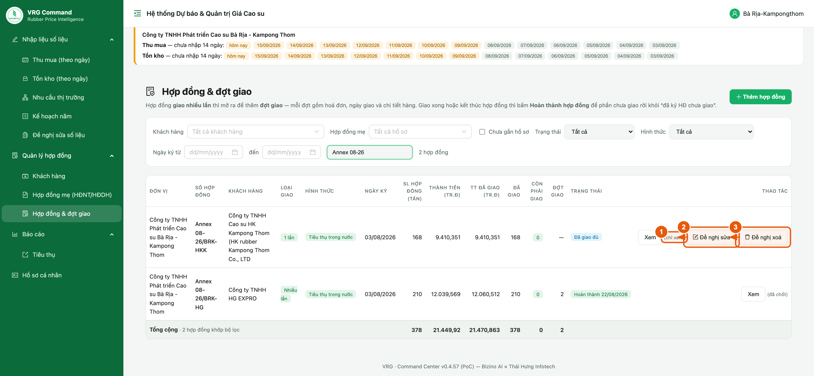

*Hình 9. Dòng “(chỉ xem)” có nút Đề nghị sửa và Đề nghị xoá*

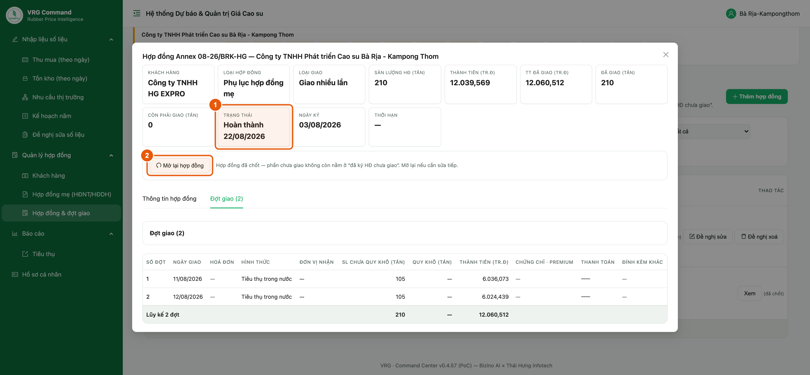

*Hình 10. Hợp đồng đã Hoàn thành — bấm Mở lại hợp đồng trước*

1. Tìm hợp đồng hoặc đợt giao cần sửa. Dòng nào ghi **(chỉ xem)** là đã quá hạn tự sửa.
2. Bấm **Đề nghị sửa** để mở đúng biểu hợp đồng ở chế độ đề nghị, sửa rồi gửi kèm lý do.
3. Bấm **Đề nghị xoá** nếu hợp đồng hoặc đợt giao đó bị nhập thừa. Hệ thống hỏi lại trước khi gửi.
4. Nếu chỉ **thêm hoặc bớt file đính kèm** mà không đụng đến con số, hệ thống lưu thẳng và báo “Đã lưu trực tiếp” — không phải chờ Ban duyệt.
5. Cần đổi **loại giao**? Ô **Loại giao** trên biểu hợp đồng chỉ để xem. Mở hợp đồng ra, bấm **Chuyển sang giao nhiều lần** ở đầu màn chi tiết; hợp đồng đã khoá thì hệ thống cũng mở hộp gửi đề nghị, viết lý do rồi gửi như ở mục 3.

> - Hợp đồng đang ở trạng thái **Hoàn thành** thì khoá hẳn. Mở hợp đồng ra, bấm **Mở lại hợp đồng**, rồi mới đề nghị sửa được.
> - Đơn vị đã sáp nhập không gửi đề nghị cho số liệu cũ được; phần đó chỉ để tra cứu.
> - Thêm hợp đồng hoặc đợt giao mà gõ trùng số đã có, hệ thống báo đỏ ngay trên biểu và nêu bản ghi đang có — chưa mời gửi đề nghị. Là lần giao mới thì đặt số khác (vd Đợt 3). Muốn sửa bản ghi cũ thì mở đúng bản ghi đó rồi bấm Sửa hoặc Đề nghị sửa.
> - Chuyển sang giao nhiều lần thì lần giao đã nhập tự thành **đợt giao đầu tiên** — giữ nguyên ngày giao, hoá đơn, thanh toán và chi tiết hàng, không phải nhập lại. Muốn quay về giao 1 lần thì phải xoá hết các đợt giao trước đã.

## 7. Theo dõi các đề nghị đã gửi

**Vị trí:** Menu ▸ Nhập liệu số liệu ▸ Đề nghị sửa số liệu

Tất cả đề nghị của đơn vị nằm chung một chỗ, xem được đang chờ hay đã có kết quả.

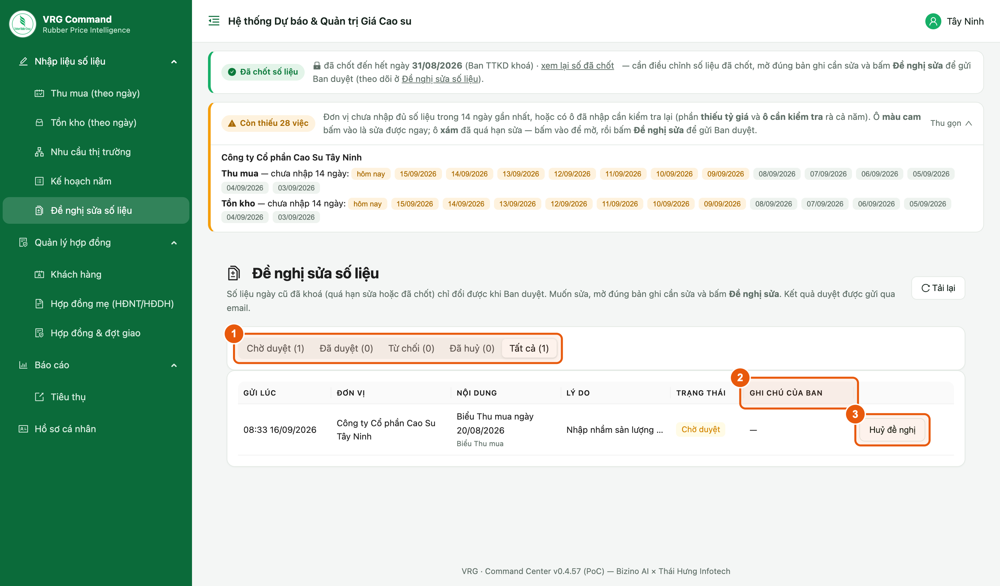

*Hình 11. Màn theo dõi đề nghị sửa số liệu*

1. Chọn **thẻ trạng thái**: Chờ duyệt · Đã duyệt · Từ chối · Đã huỷ · Tất cả. Con số trong ngoặc là số đề nghị của từng nhóm.
2. Bấm vào **một dòng** để xem lại đúng nội dung đã gửi.
3. Cột **Ghi chú của Ban** là lời nhắn của người duyệt, nhất là khi đề nghị bị từ chối.
4. Đề nghị còn **Chờ duyệt** thì bấm **Huỷ đề nghị** để rút lại.

> - Mỗi bản ghi chỉ có một đề nghị đang chờ. Gửi tiếp cho cùng bản ghi thì đề nghị cũ được thay bằng đề nghị mới, hệ thống báo “Đã cập nhật đề nghị đang chờ duyệt”.
> - Đề nghị đã duyệt hoặc đã từ chối thì không sửa được nữa. Cần sửa tiếp thì gửi một đề nghị mới.

## 8. Sau khi Ban duyệt

**Vị trí:** Menu ▸ Nhập liệu số liệu ▸ Đề nghị sửa số liệu

Ban duyệt xong, hệ thống ghi ngay nội dung đề nghị vào số liệu thật của đơn vị và gửi email báo kết quả.

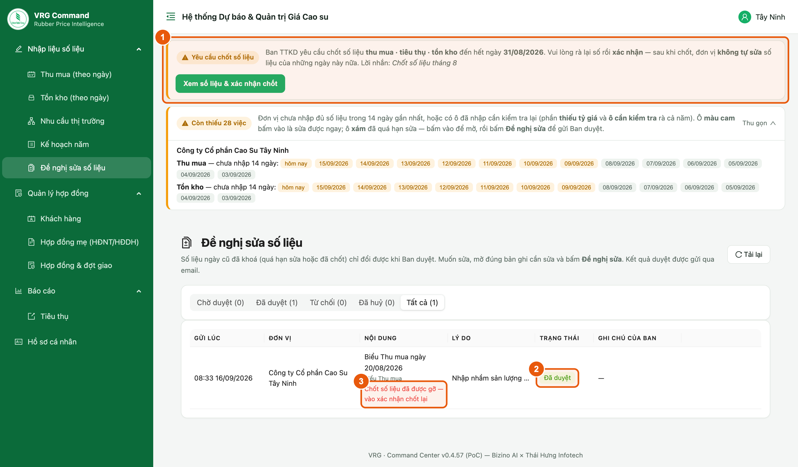

*Hình 12. Đề nghị đã duyệt và lời nhắc xác nhận chốt lại*

1. Mở màn **Đề nghị sửa số liệu**, kiểm tra dòng vừa gửi đã chuyển sang **Đã duyệt**.
2. Nếu dưới nội dung có dòng chữ đỏ **“Chốt số liệu đã được gỡ — vào xác nhận chốt lại”** thì còn một việc phải làm.
3. Lên **dải vàng “Yêu cầu chốt số liệu”** ở đầu màn hình, bấm **Xem số liệu & xác nhận chốt**.
4. Rà lại số liệu của kỳ đó rồi xác nhận chốt một lần nữa.

> - Chưa xác nhận chốt lại thì kỳ đó vẫn bị tính là chưa chốt.
> - Đề nghị bị **Từ chối** thì số liệu giữ nguyên. Đọc ghi chú của Ban trong email hoặc ở cột Ghi chú của Ban, chỉnh lại rồi gửi đề nghị khác.

## 9. Những điều cần nhớ

**Vị trí:** Mọi màn nhập liệu của đơn vị

Vài điểm giúp đỡ mất thời gian chờ không cần thiết.

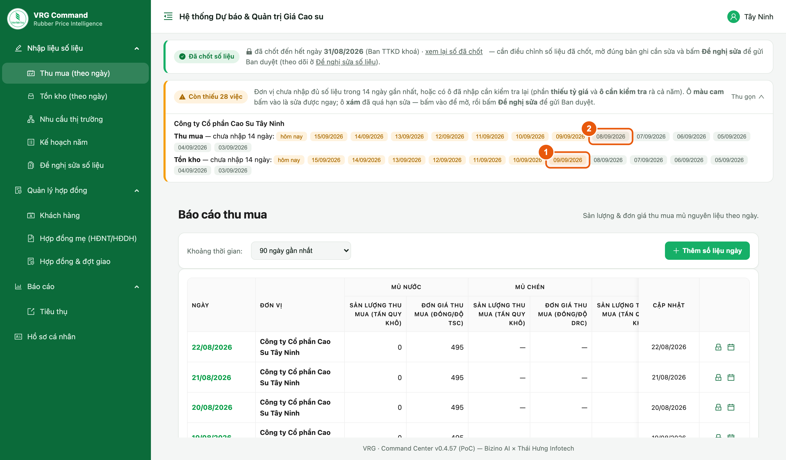

*Hình 13. Ô cam sửa được ngay, ô xám phải gửi đề nghị*

1. Ở dải nhắc việc đầu màn hình, **ô màu cam** là ngày còn sửa thẳng được — bấm vào là nhập ngay.
2. **Ô màu xám** là ngày đã quá hạn sửa — bấm vào để mở ra xem, rồi bấm Đề nghị sửa.
3. Trước khi gửi đề nghị, hãy kiểm tra lại: có đúng là ngày đó đã khoá không, hay chỉ là chọn nhầm ngày.

> - Chỉ tài khoản nhập liệu của đơn vị gửi được đề nghị; tài khoản lãnh đạo đơn vị chỉ xem.
> - Mỗi bản ghi chỉ có một đề nghị đang chờ duyệt.
> - Trong lúc chờ duyệt, số liệu cũ vẫn là số chính thức và vẫn vào báo cáo.
