# Hướng dẫn sử dụng — Duyệt đề nghị sửa số liệu

Tài liệu dành cho **chuyên viên Ban có quyền duyệt đề nghị sửa số liệu**. Đơn vị thành viên gửi đề nghị kèm lý do; số liệu chỉ thay đổi sau khi Ban duyệt.

Việc cần làm ở mỗi đề nghị: đọc lý do và vì sao đơn vị không tự sửa được, **so cột Hiện tại với cột Đề nghị**, xem khối ảnh hưởng chốt số liệu, rồi **Duyệt** (ghi số thật, gỡ chốt) hoặc **Từ chối** (bắt buộc ghi rõ lý do).

> Bản Word đầy đủ (có ảnh chú thích): [Huong-dan-duyet-de-nghi-sua.docx](./Huong-dan-duyet-de-nghi-sua.docx)
> Bản dành cho đơn vị thành viên: [../de-nghi-sua-so-lieu/README.md](../de-nghi-sua-so-lieu/README.md)
> Sửa nội dung: chỉ sửa `spec.json` rồi chạy `python3 render_readme.py` (dựng lại README) và `node build_guide.js spec.json` (dựng lại bản Word).
> Chụp lại bộ ảnh khi giao diện đổi: chạy `./scripts/dev.sh` rồi `cd apps/api && uv run --with playwright python ../../docs/huong-dan/duyet-de-nghi-sua/shoot.py`.

## 1. Ai duyệt được và vào từ đâu

**Vị trí:** Menu ▸ Số liệu đơn vị thành viên ▸ Duyệt đề nghị sửa

Việc duyệt cần một quyền riêng. Quản trị viên luôn có sẵn; chuyên viên thì phải được cấp.

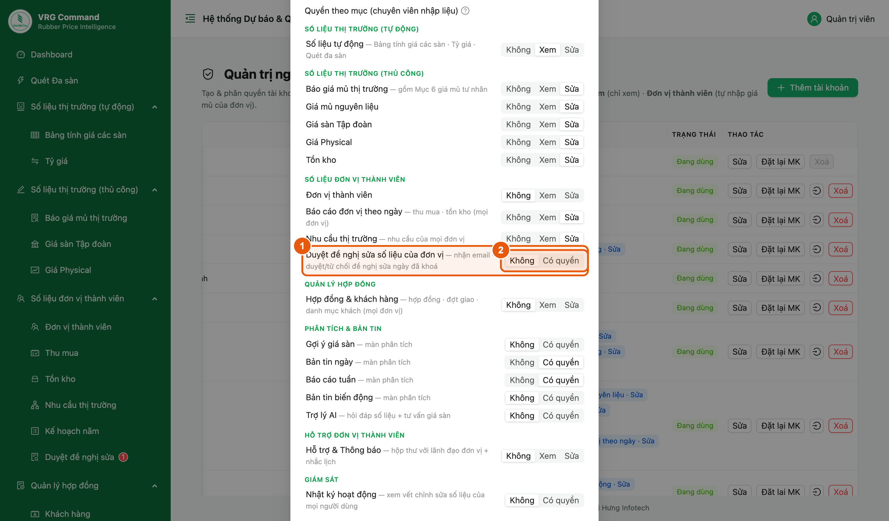

*Hình 1. Quản trị cấp quyền duyệt cho một tài khoản chuyên viên*

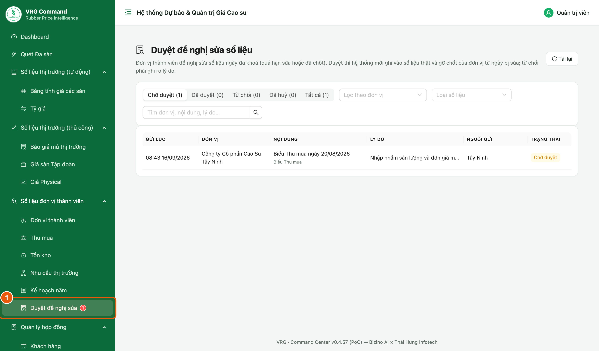

*Hình 2. Mục Duyệt đề nghị sửa kèm số đề nghị đang chờ*

1. Quyền cần có tên là **Duyệt đề nghị sửa số liệu của đơn vị**. Quản trị viên mở trang **Quản trị người dùng**, bấm **Sửa** ở tài khoản cần cấp.
2. Trong phần **Quyền theo mục**, tìm dòng Duyệt đề nghị sửa số liệu của đơn vị và chọn **Có quyền**, rồi lưu.
3. Người đã có quyền sẽ thấy mục **Duyệt đề nghị sửa** trong menu bên trái, kèm **số đỏ** là số đề nghị đang chờ.
4. Mỗi khi đơn vị gửi một đề nghị mới, hệ thống gửi email báo cho những người có quyền này.

> - Số đỏ chỉ đếm các đề nghị **đang chờ duyệt**. Hết việc thì số biến mất.
> - Không có quyền thì không thấy mục này trong menu, và cũng không nhận được email.

## 2. Danh sách đề nghị

**Vị trí:** Menu ▸ Số liệu đơn vị thành viên ▸ Duyệt đề nghị sửa

Màn hình mở ra đã lọc sẵn nhóm Chờ duyệt — đúng phần việc cần làm.

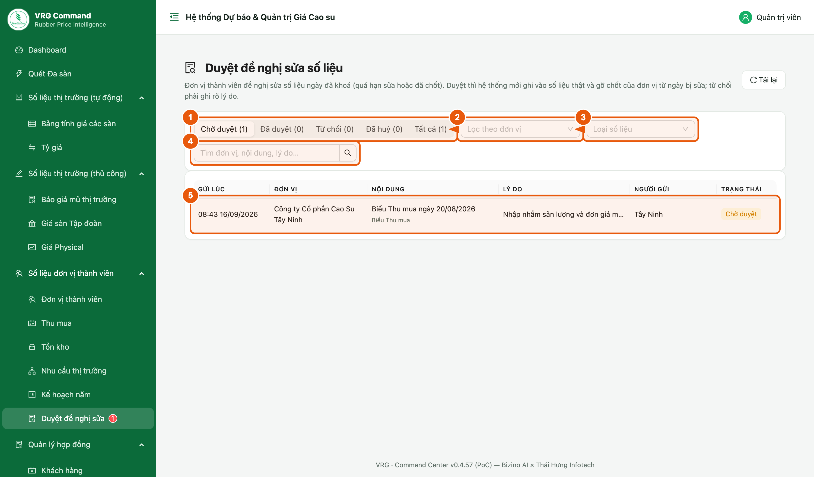

*Hình 3. Danh sách đề nghị và các bộ lọc*

1. **Thẻ trạng thái**: Chờ duyệt · Đã duyệt · Từ chối · Đã huỷ · Tất cả. Con số trong ngoặc là số đề nghị của từng nhóm.
2. **Lọc theo đơn vị** khi chỉ muốn xem đề nghị của một đơn vị.
3. **Loại số liệu** để tách riêng biểu Thu mua, biểu Tồn kho, nhu cầu thị trường hay hợp đồng.
4. **Ô tìm** tra theo tên đơn vị, nội dung hoặc lý do.
5. Bấm vào **một dòng** để mở màn chi tiết và xử lý.

> - Cột Nội dung ghi rõ bản ghi bị đề nghị sửa, ví dụ “Biểu Thu mua ngày 20/08/2026”; dòng nhỏ bên dưới là loại số liệu.
> - Đổi bộ lọc là danh sách quay về trang đầu.

## 3. Đọc phần đầu màn chi tiết

**Vị trí:** Màn chi tiết một đề nghị

Phần đầu trả lời ba câu: ai gửi, muốn sửa gì và vì sao không tự sửa được.

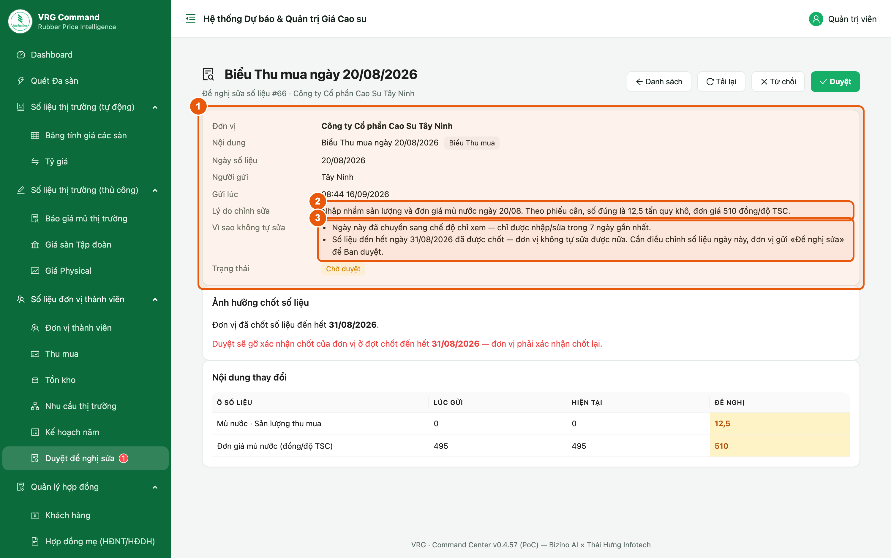

*Hình 4. Thông tin chung của một đề nghị*

1. **Đơn vị · Nội dung · Ngày số liệu · Người gửi · Gửi lúc** cho biết đề nghị đến từ đâu và cho bản ghi nào.
2. **Lý do chỉnh sửa** là phần đơn vị tự viết. Đọc kỹ: lý do không nêu được số đúng và căn cứ thì nên từ chối và yêu cầu ghi lại.
3. **Vì sao không tự sửa** do hệ thống tự ghi: ngày đã quá hạn nhập, hoặc ngày nằm trong kỳ đã chốt. Đây là căn cứ để biết đề nghị có chính đáng không.
4. **Trạng thái** phải là **Chờ duyệt** thì mới còn hai nút Duyệt và Từ chối ở góc trên bên phải.

> - Dòng Gửi lúc có thêm chữ “cập nhật …” nghĩa là đơn vị đã sửa lại nội dung đề nghị sau lần gửi đầu.
> - Nút **Danh sách** quay về danh sách, nút **Tải lại** lấy lại bản mới nhất của đề nghị này.

## 4. Bảng Nội dung thay đổi

**Vị trí:** Màn chi tiết một đề nghị ▸ khối Nội dung thay đổi

Đây là phần quan trọng nhất. Bảng chỉ liệt kê những ô có khác biệt, không bắt đọc lại cả biểu.

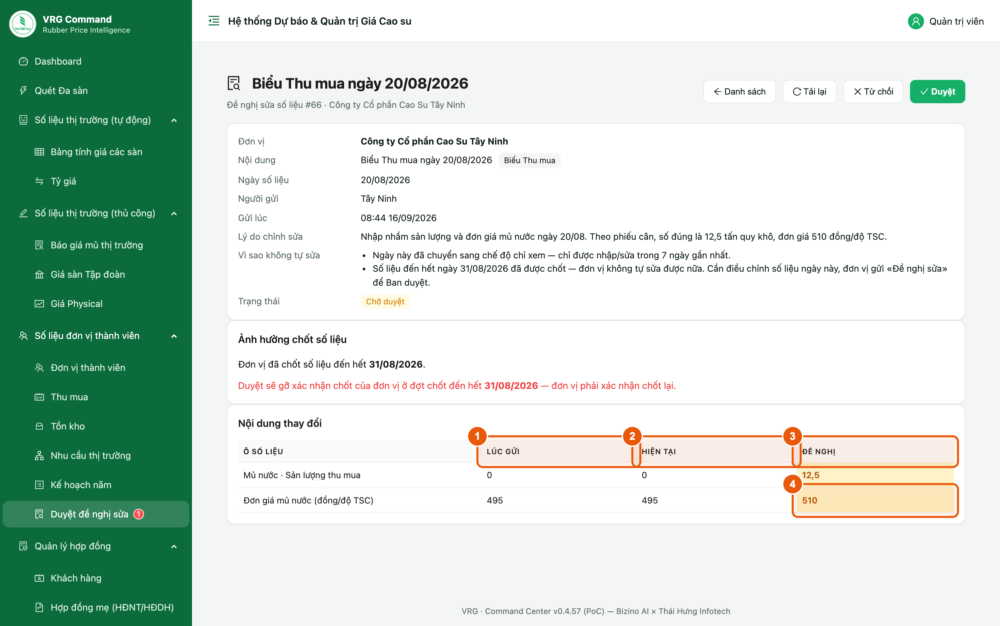

*Hình 5. Ba cột Lúc gửi · Hiện tại · Đề nghị*

1. **Lúc gửi** — số đang lưu tại thời điểm đơn vị bấm gửi đề nghị.
2. **Hiện tại** — số đang lưu ngay lúc này.
3. **Đề nghị** — số đơn vị muốn ghi vào. Ô **tô vàng** là ô sẽ thay đổi khi duyệt.
4. **So cột Hiện tại với cột Đề nghị trước khi duyệt.** Duyệt là ghi đè cột Hiện tại bằng cột Đề nghị.

> - Nếu đề nghị có kèm chứng từ (hợp đồng, hoá đơn), tên file hiện ngay trong bảng — bấm vào để mở xem trước khi quyết định.
> - Cột Lúc gửi và cột Hiện tại giống nhau nghĩa là số liệu chưa ai động vào kể từ khi đơn vị gửi.

## 5. Khối Ảnh hưởng chốt số liệu

**Vị trí:** Màn chi tiết một đề nghị ▸ khối Ảnh hưởng chốt số liệu

Khối này cho biết duyệt xong thì đơn vị có phải chốt lại số liệu hay không.

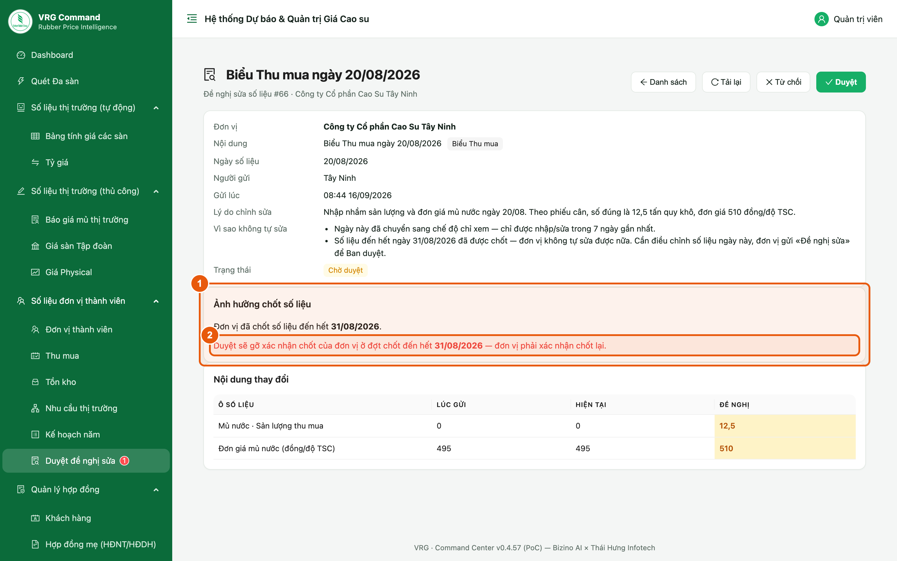

*Hình 6. Duyệt sẽ gỡ xác nhận chốt của đơn vị*

1. Dòng đầu cho biết đơn vị **đã chốt số liệu đến hết ngày nào**.
2. Dòng chữ đỏ liệt kê **những đợt chốt sẽ bị gỡ** nếu duyệt đề nghị này.
3. Đợt chốt bị gỡ thì đơn vị phải rà lại số liệu và **xác nhận chốt một lần nữa** — nhớ nhắc đơn vị sau khi duyệt.
4. Nếu ghi “Duyệt không gỡ đợt chốt nào” thì duyệt xong không phát sinh việc gì thêm cho đơn vị.

> - Chỉ những đợt chốt có mốc từ ngày bị sửa trở về sau mới bị gỡ. Các đợt cũ hơn giữ nguyên.
> - Việc gỡ chốt chỉ áp dụng cho chính đơn vị gửi đề nghị, không ảnh hưởng đơn vị khác.

## 6. Duyệt đề nghị

**Vị trí:** Màn chi tiết một đề nghị ▸ nút Duyệt

Duyệt là ghi số thật. Hệ thống không tự hoàn tác được, nên đọc lại bảng so sánh một lượt trước khi bấm.

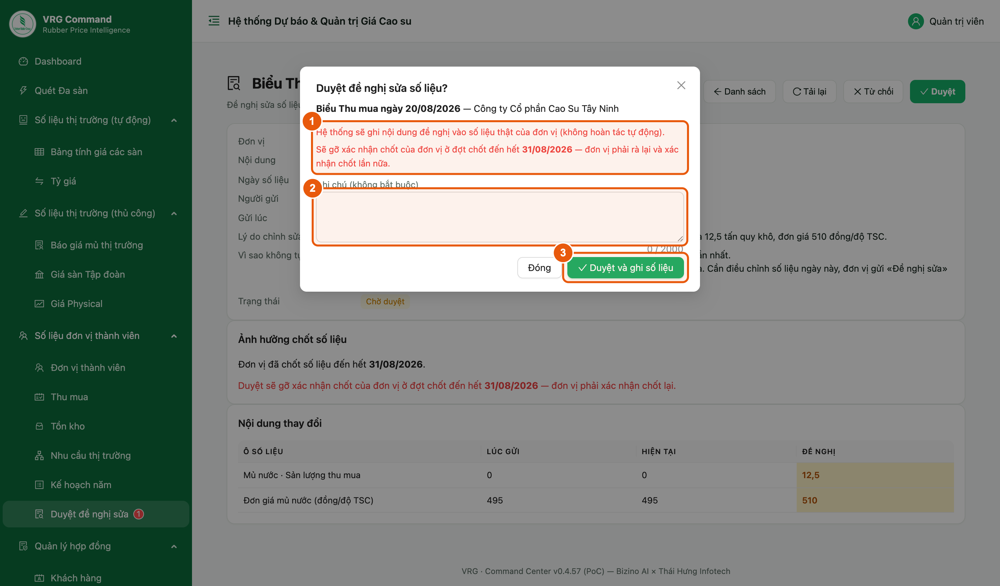

*Hình 7. Hộp xác nhận duyệt*

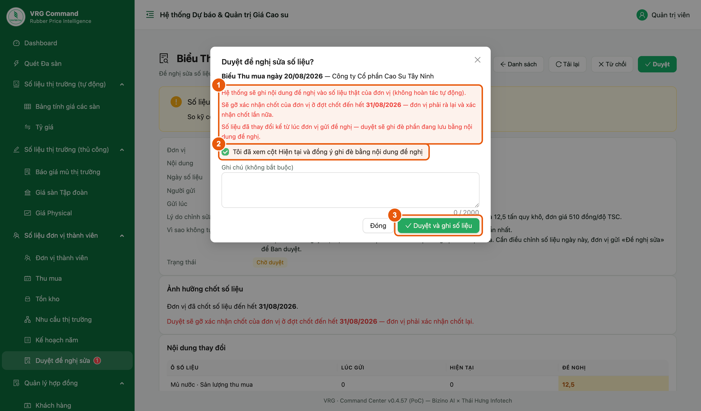

*Hình 8. Khi số liệu đã đổi kể từ lúc đơn vị gửi — phải tích ô đồng ý*

1. Bấm **Duyệt** ở góc trên bên phải. Hộp xác nhận nêu lại: hệ thống sẽ ghi nội dung đề nghị vào số liệu thật, và những đợt chốt nào sẽ bị gỡ.
2. **Ghi chú** không bắt buộc. Viết vài chữ khi muốn dặn thêm đơn vị — nội dung này đơn vị đọc được.
3. Bấm **Duyệt và ghi số liệu**. Hệ thống báo “Đã duyệt — số liệu đã được ghi”.
4. Nếu hộp xác nhận báo **số liệu đã thay đổi kể từ lúc đơn vị gửi**: đóng lại, xem kỹ cột Hiện tại, rồi mới quay lại tích ô **Tôi đã xem cột Hiện tại và đồng ý ghi đè** — chưa tích thì nút duyệt còn mờ.

> - Số liệu ghi vào mang tên người gửi của đơn vị, còn thao tác duyệt ghi tên người duyệt.
> - Duyệt xong mà phát hiện sai thì phải sửa lại bằng tay như một lần nhập liệu bình thường, hoặc yêu cầu đơn vị gửi đề nghị khác.

## 7. Từ chối đề nghị

**Vị trí:** Màn chi tiết một đề nghị ▸ nút Từ chối

Từ chối khi lý do chưa rõ, số đề nghị không khớp chứng từ, hoặc cần đơn vị giải trình thêm.

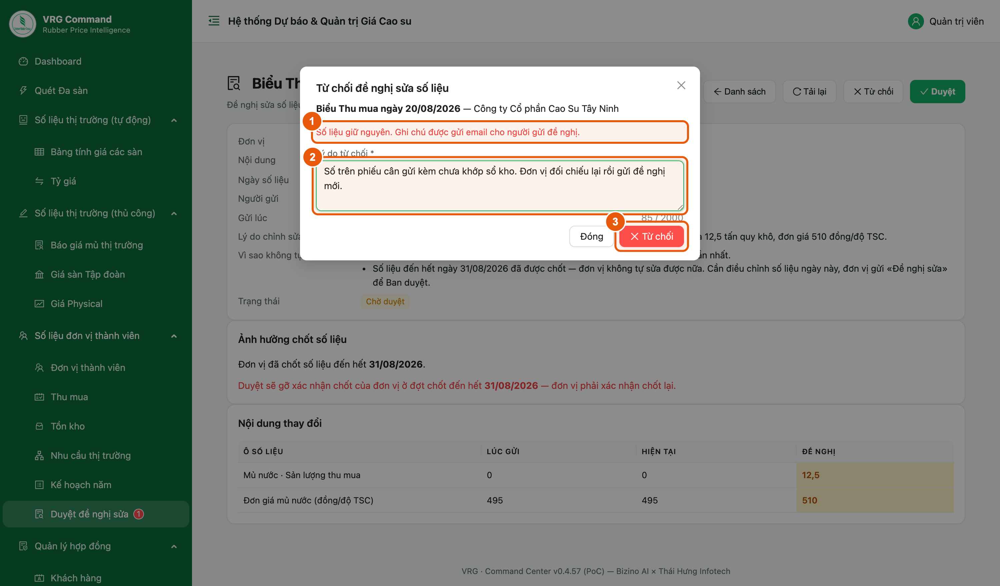

*Hình 9. Hộp từ chối — bắt buộc ghi lý do*

1. Bấm **Từ chối** ở góc trên bên phải.
2. **Lý do từ chối là bắt buộc.** Ghi rõ đơn vị cần bổ sung gì để lần sau gửi lại là duyệt được.
3. Bấm **Từ chối**. Số liệu giữ nguyên, không có gì bị ghi vào.

> - Đơn vị nhận email kèm đúng ghi chú vừa ghi, và đọc lại được ở cột Ghi chú của Ban.
> - Đơn vị vẫn gửi được một đề nghị khác cho cùng bản ghi sau khi chỉnh lại.

## 8. Các tình huống hay gặp

**Vị trí:** Màn chi tiết một đề nghị

Bốn trường hợp thường gặp và cách xử lý.

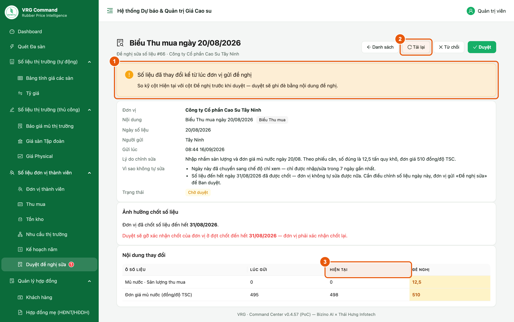

*Hình 10. Cảnh báo số liệu đã thay đổi kể từ lúc đơn vị gửi*

1. **Số liệu đã thay đổi kể từ lúc đơn vị gửi** — có người vừa sửa bản ghi này. Xem lại cột Hiện tại, nếu vẫn muốn ghi theo đề nghị thì tích ô đồng ý ghi đè rồi duyệt.
2. **Đơn vị vừa cập nhật lại đề nghị** — bấm **Tải lại** để lấy bản mới nhất rồi đọc lại trước khi quyết định.
3. **Bản ghi này hiện không còn bị khoá** — hàng rào thời gian đã mở, đơn vị tự sửa được. Có thể duyệt cho nhanh, hoặc từ chối và nhắn đơn vị tự sửa.
4. **Đơn vị tự huỷ đề nghị** — trạng thái chuyển sang Đã huỷ, hai nút Duyệt và Từ chối không còn. Không phải làm gì thêm.

> - Hợp đồng đang ở trạng thái Hoàn thành thì đơn vị phải bấm Mở lại hợp đồng rồi mới gửi đề nghị được. Gặp đề nghị bị vướng chỗ này, nhắn đơn vị làm bước đó trước.
> - Nếu bấm duyệt mà hệ thống báo lỗi, đề nghị vẫn ở trạng thái Chờ duyệt — đọc dòng báo lỗi đỏ rồi xử lý tiếp.

## 9. Sau khi duyệt

**Vị trí:** Màn chi tiết một đề nghị · Menu ▸ Giám sát ▸ Nhật ký hoạt động

Duyệt xong còn một việc nhỏ với đơn vị, và mọi thao tác đều có vết để đối chiếu về sau.

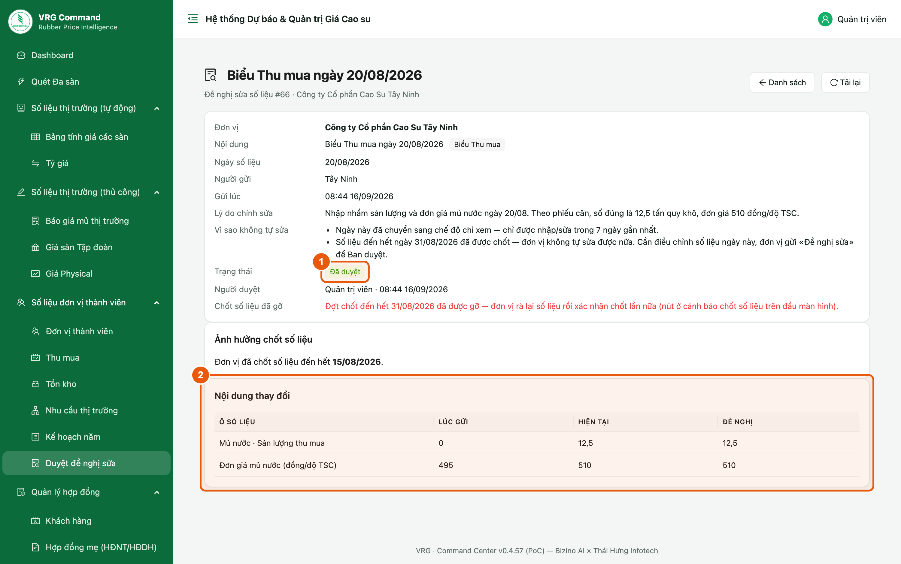

*Hình 11. Đề nghị đã duyệt — ghi rõ đợt chốt đã gỡ*

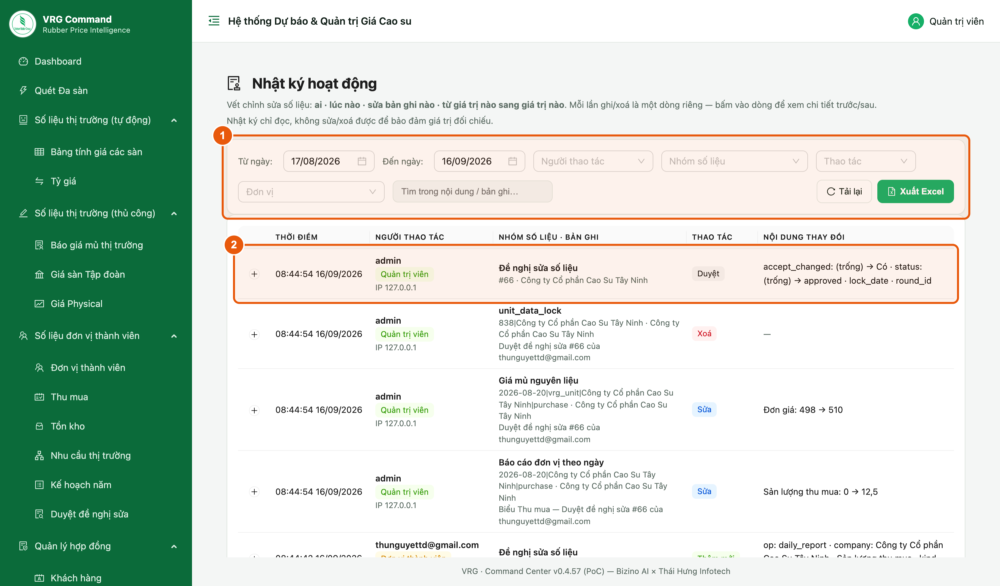

*Hình 12. Nhật ký hoạt động lưu lại thao tác duyệt*

1. Kiểm tra trạng thái đã chuyển sang **Đã duyệt**, có tên người duyệt và thời điểm.
2. Nếu có dòng **Chốt số liệu đã gỡ**, nhắc đơn vị vào rà lại số liệu và **xác nhận chốt lại**.
3. Bảng Nội dung thay đổi lúc này cho thấy cột **Hiện tại** đã bằng cột **Đề nghị** — tức là số đã được ghi.
4. Cần đối chiếu về sau thì mở **Nhật ký hoạt động**: mỗi lần duyệt, từ chối hay ghi số đều là một dòng riêng, ghi rõ ai làm và đổi từ giá trị nào sang giá trị nào.

> - Đơn vị cũng nhận email báo kết quả, kèm ghi chú của Ban nếu có.
> - Nhật ký chỉ đọc, không sửa hay xoá được.
