# Hướng dẫn sử dụng — Lãnh đạo đơn vị thành viên

Tài liệu dành cho **lãnh đạo đơn vị thành viên** VRG trên Hệ thống Dự báo & Quản trị Giá Cao su. Tài khoản lãnh đạo chỉ thấy dữ liệu của chính đơn vị mình.

Ba phần chính: **Hỗ trợ & Thông báo** — nhận và gửi thông tin với Tập đoàn (có báo qua email); **Cảnh báo bất thường** — thấy ngay nhân viên nhập liệu đang sai hoặc thiếu gì để nhắc đúng việc; và **theo dõi số liệu đơn vị** — thu mua, tồn kho, nhu cầu thị trường, kế hoạch năm, khách hàng, hợp đồng, báo cáo tiêu thụ. Lãnh đạo **chỉ xem**, không nhập/sửa số liệu.

> Bản Word đầy đủ (có ảnh chú thích): [Huong-dan-lanh-dao-don-vi.docx](./Huong-dan-lanh-dao-don-vi.docx)
> Sửa nội dung: chỉ sửa `spec.json` rồi chạy `python3 render_readme.py` (dựng lại README) và `node build_guide.js spec.json` (dựng lại bản Word).
> Chụp lại bộ ảnh khi giao diện đổi: chạy `./scripts/dev.sh` rồi `uv run --directory apps/api --with playwright python ../../docs/huong-dan/lanh-dao-don-vi/shoot.py`.

## 1. Tài khoản lãnh đạo đơn vị làm được gì

**Vị trí:** Đăng nhập tại địa chỉ hệ thống, bằng tài khoản Tập đoàn cấp

Sau khi đăng nhập, menu bên trái gồm các phần dưới đây. Chữ “(chỉ xem)” trên tên nhóm nghĩa là phần đó chỉ để theo dõi, không có nút nhập hay sửa.

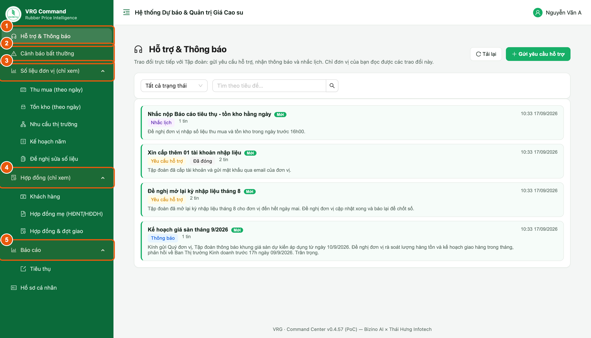

*Hình 1. Menu của tài khoản lãnh đạo đơn vị*

1. **Hỗ trợ & Thông báo** — hộp thư trao đổi hai chiều với Tập đoàn: nhận thông báo, nhận tin nhắc lịch và gửi yêu cầu hỗ trợ.
2. **Cảnh báo bất thường** — những chỗ nhân viên nhập liệu đang nhập sai hoặc còn thiếu (mục 9).
3. **Số liệu đơn vị (chỉ xem)** — Thu mua theo ngày, Tồn kho theo ngày, Nhu cầu thị trường, Kế hoạch năm, Đề nghị sửa số liệu.
4. **Hợp đồng (chỉ xem)** — Khách hàng, Hợp đồng mẹ (HĐNT/HĐDH), Hợp đồng & đợt giao.
5. **Báo cáo** — Báo cáo tiêu thụ của đơn vị, có xuất Excel.
6. Cuối menu là **Hồ sơ cá nhân** để đổi mật khẩu.

> - Lãnh đạo chỉ thấy số liệu của đơn vị mình. Nếu được giao phụ trách nhiều đơn vị, các màn hình có thêm ô chọn đơn vị.
> - Số liệu hằng ngày do tài khoản nhập liệu của đơn vị nhập. Thấy số sai hoặc còn thiếu, báo bộ phận nhập liệu sửa, hoặc gửi yêu cầu lên Tập đoàn theo mục 4.

## 2. Hộp thư trao đổi với Tập đoàn

**Vị trí:** Menu ▸ Hỗ trợ & Thông báo

Đây là nơi Tập đoàn gửi thông báo xuống đơn vị và đơn vị gửi yêu cầu lên Tập đoàn. Mỗi trao đổi là một “thẻ” riêng. Chỉ đơn vị của bạn và Tập đoàn đọc được các thẻ này — đơn vị khác không thấy.

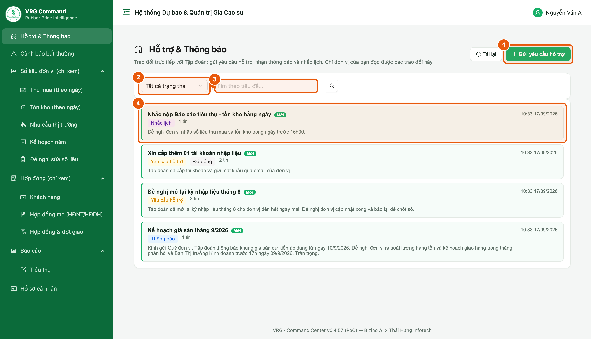

*Hình 2. Danh sách hộp thư*

1. **Gửi yêu cầu hỗ trợ** — mở form soạn tin gửi lên Tập đoàn (xem mục 4).
2. **Lọc trạng thái** — xem tất cả, chỉ tin “Đang mở”, hoặc chỉ tin “Đã đóng”.
3. **Tìm theo tiêu đề** — gõ vài chữ trong tiêu đề để tìm nhanh thẻ cũ.
4. **Một dòng là một thẻ** — bấm vào để mở. Thẻ nền vàng kèm nhãn **Mới** là có tin chưa đọc.

> - Nhãn màu cho biết loại tin: **Thông báo** (Tập đoàn gửi xuống), **Yêu cầu hỗ trợ** (đơn vị gửi lên), **Nhắc lịch** (hệ thống tự phát theo lịch của Tập đoàn).
> - Con số “2 tin” là số lượt trao đổi trong thẻ đó; bên phải là thời điểm của tin mới nhất.

## 3. Đọc thông báo Tập đoàn gửi xuống

**Vị trí:** Hỗ trợ & Thông báo ▸ bấm vào một thẻ

Bấm vào tiêu đề thẻ để mở toàn bộ nội dung. Thẻ được đánh dấu đã đọc ngay khi mở.

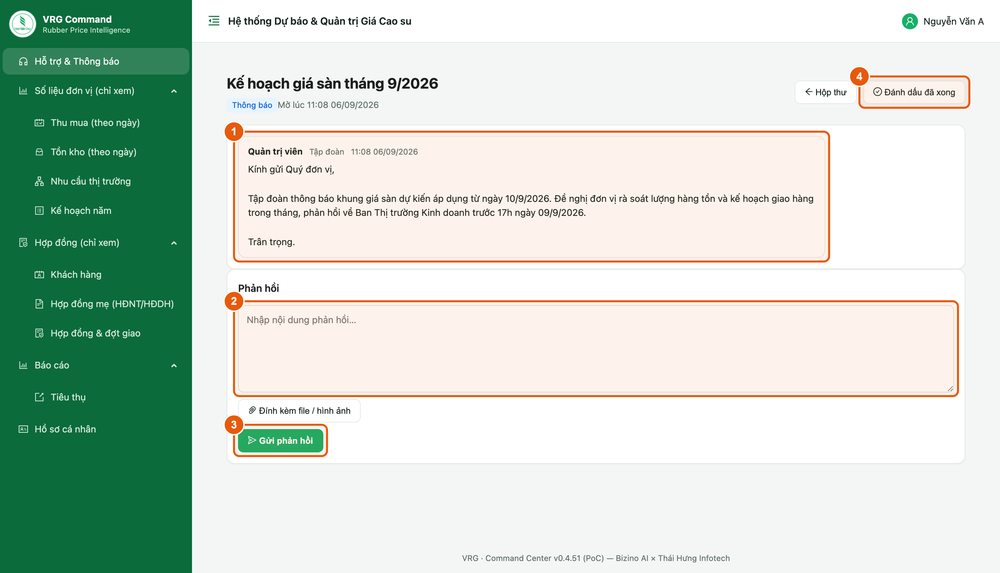

*Hình 3. Nội dung một thông báo và chỗ trả lời*

1. **Nội dung tin** — người gửi, bên gửi (Tập đoàn hoặc tên đơn vị), thời điểm gửi và nội dung. Nếu có tệp đính kèm, tệp nằm ngay dưới nội dung: ảnh xem trực tiếp, tệp khác bấm để tải về.
2. **Ô Phản hồi** — gõ nội dung trả lời Tập đoàn.
3. **Đính kèm file / hình ảnh** — gửi kèm văn bản, bảng tính hoặc ảnh chụp (ngay dưới ô phản hồi).
4. **Gửi phản hồi** — gửi trả lời. Tập đoàn nhận được ngay trong thẻ này.
5. **Đánh dấu đã xong** — khép thẻ khi việc đã giải quyết xong (xem mục 6).

> Trả lời ngay trong thẻ, đừng mở thẻ mới cho cùng một việc — mọi trao đổi của một việc nằm gọn một chỗ để hai bên dễ theo dõi.

## 4. Gửi yêu cầu hỗ trợ lên Tập đoàn

**Vị trí:** Hỗ trợ & Thông báo ▸ nút “Gửi yêu cầu hỗ trợ”

Dùng khi đơn vị cần Tập đoàn xử lý một việc: mở lại kỳ nhập liệu, cấp thêm tài khoản, hỏi về giá sàn, báo sai sót số liệu…

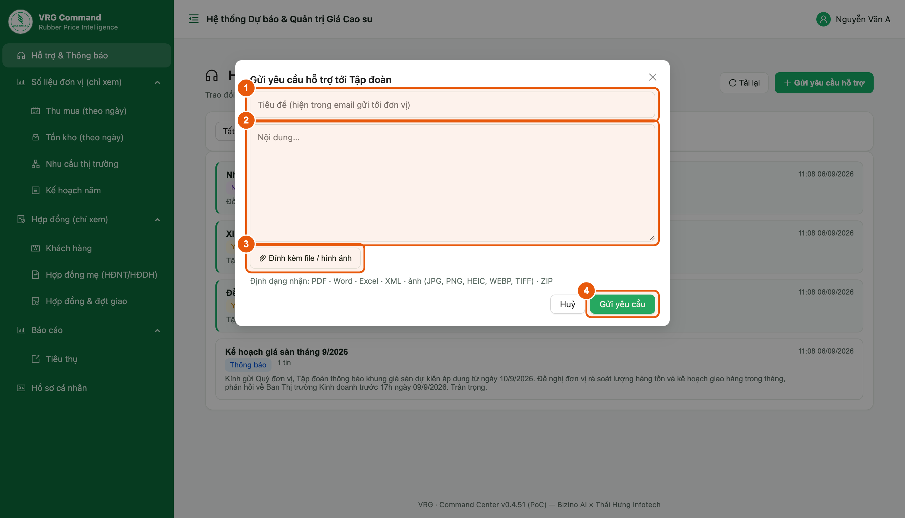

*Hình 4. Form gửi yêu cầu hỗ trợ*

1. **Tiêu đề** (bắt buộc) — nói gọn việc cần xử lý, tối đa 200 ký tự. Tiêu đề này cũng hiện trong email báo tin.
2. **Nội dung** — mô tả rõ việc: ngày nào, số liệu nào, cần Tập đoàn làm gì.
3. **Đính kèm file / hình ảnh** — kèm văn bản hoặc ảnh chụp màn hình nếu có. Nhận PDF · Word · Excel · XML · ảnh (JPG, PNG, HEIC, WEBP, TIFF) · ZIP, tối đa 25 MB mỗi tệp và 10 tệp mỗi tin.
4. **Gửi yêu cầu** — gửi lên Tập đoàn. Hệ thống mở luôn thẻ vừa tạo để bạn theo dõi.

> - Lãnh đạo phụ trách nhiều đơn vị: chọn đúng đơn vị ở ô trên cùng trước khi gửi.
> - Mỗi việc một thẻ. Việc mới thì gửi yêu cầu mới, không nối tiếp vào thẻ của việc cũ.

## 5. Theo dõi Tập đoàn trả lời

**Vị trí:** Hỗ trợ & Thông báo ▸ thẻ đã gửi

Tập đoàn trả lời ngay trong thẻ. Tin của đơn vị nằm bên phải, tin của Tập đoàn nằm bên trái, xếp theo thời gian.

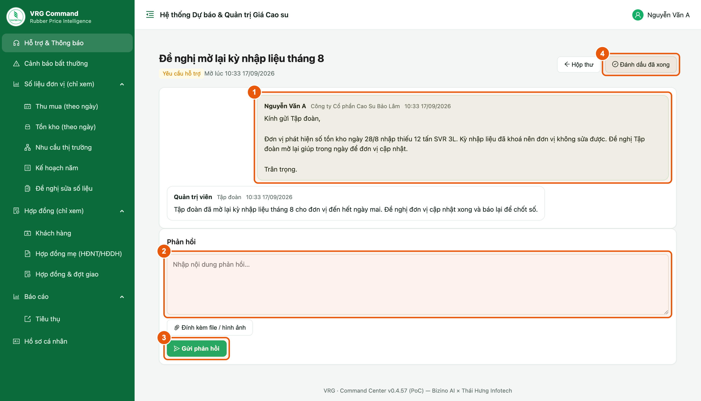

*Hình 5. Trao đổi qua lại trong một thẻ*

1. Đọc trả lời của Tập đoàn ở phần trên.
2. Cần nói thêm thì gõ vào ô **Phản hồi** rồi bấm **Gửi phản hồi**.
3. Việc đã xong thì bấm **Đánh dấu đã xong** để khép thẻ.

> Có tin mới, hệ thống gửi email báo về hòm thư của bạn (xem mục 8) và thẻ hiện nhãn **Mới** trong hộp thư.

## 6. Khép một trường hợp

**Vị trí:** Trong thẻ ▸ nút “Đánh dấu đã xong”

Mỗi thẻ theo dõi đúng một việc. Việc xong thì khép thẻ lại để hộp thư chỉ còn những việc đang chờ xử lý.

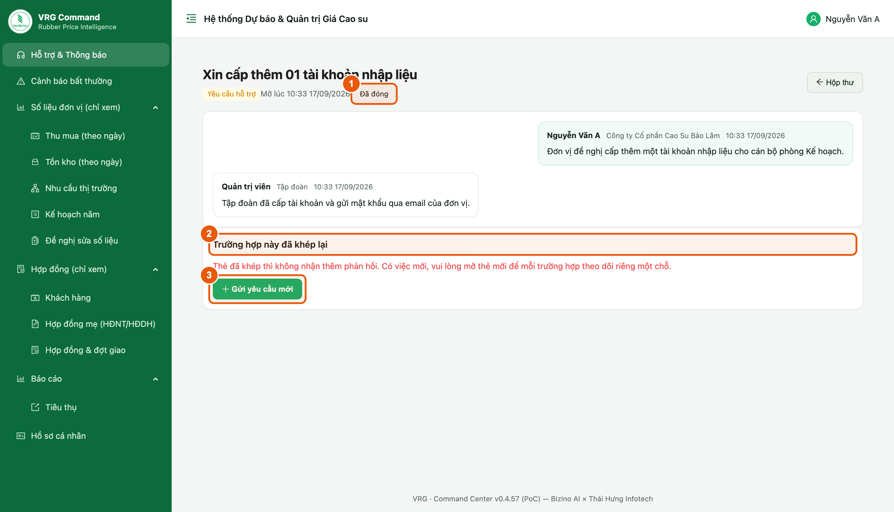

*Hình 6. Thẻ đã khép*

1. Thẻ đã khép mang nhãn **Đã đóng**; nội dung trao đổi vẫn giữ nguyên để tra cứu.
2. Thẻ đã khép **không nhận thêm phản hồi**.
3. Có việc mới, bấm **Gửi yêu cầu mới** ngay tại đây.

> Bấm nhầm nút khép? Đơn vị không tự mở lại được — nhờ Tập đoàn mở lại hộ, hoặc gửi một yêu cầu mới.

## 7. Tin nhắc lịch

**Vị trí:** Hỗ trợ & Thông báo ▸ thẻ mang nhãn “Nhắc lịch”

Tập đoàn đặt lịch nhắc các việc định kỳ (ví dụ nhắc nộp báo cáo trong ngày). Đến giờ, hệ thống tự gửi tin nhắc vào hộp thư của đơn vị và gửi email báo.

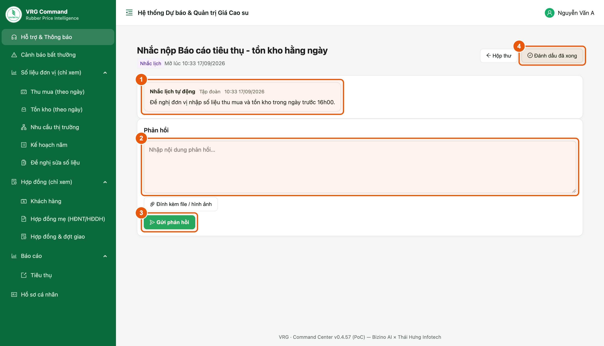

*Hình 7. Một tin nhắc lịch*

1. Mở tin nhắc để xem Tập đoàn yêu cầu việc gì, hạn khi nào.
2. Cần báo lại tình hình thì trả lời ngay trong thẻ như tin thường.
3. Đã làm xong việc được nhắc thì bấm **Đánh dấu đã xong**.

> Lịch nhắc do Tập đoàn đặt và điều chỉnh; đơn vị chỉ nhận tin, không cần cấu hình gì.

## 8. Email báo có tin mới

**Vị trí:** Hòm thư điện tử của lãnh đạo đơn vị

Không cần mở hệ thống suốt ngày: mỗi khi có thông báo mới, có trả lời của Tập đoàn hoặc có tin nhắc lịch, hệ thống gửi một email báo tới địa chỉ đã khai cho tài khoản của bạn.

1. Tiêu đề email có dạng **[VRG] + tiêu đề tin**, nên nhìn tiêu đề là biết việc gì.
2. Thân email ghi tóm tắt nội dung tin.
3. Cuối email có đường dẫn mở thẳng thẻ đó trên hệ thống — bấm vào, đăng nhập là xem và trả lời được ngay.
4. Ở chiều ngược lại, khi đơn vị gửi yêu cầu hoặc phản hồi, Tập đoàn cũng nhận được email báo tương tự.

> - Đây là email tự động, **không trả lời trực tiếp vào email** — phản hồi phải gõ trong thẻ trên hệ thống thì Tập đoàn mới nhận được.
> - Không nhận được email: kiểm tra hộp thư rác, sau đó báo Tập đoàn kiểm tra lại địa chỉ email gắn với tài khoản của bạn.

## 9. Cảnh báo bất thường — nhắc nhân viên đúng việc

**Vị trí:** Menu ▸ Cảnh báo bất thường

Trang này gom những chỗ nhân viên nhập liệu của đơn vị đang nhập sai hoặc còn thiếu. Mở ra là biết cần nhắc ai, sửa gì. Nhóm nghiêm trọng nằm trên cùng.

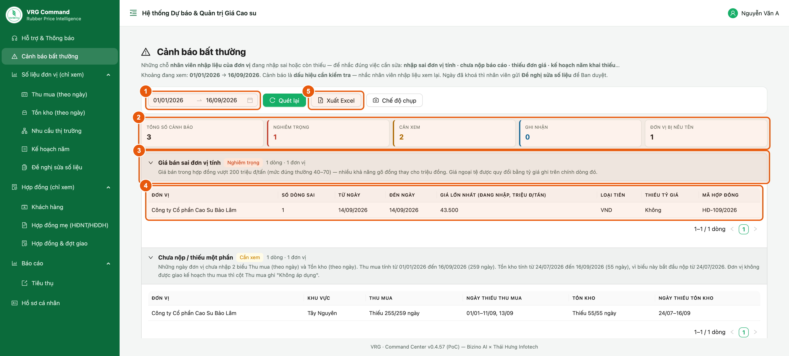

*Hình 8. Cảnh báo bất thường của đơn vị*

1. **Khoảng ngày** — mặc định từ đầu năm đến hôm qua. Đổi ngày xong bấm **Quét lại**.
2. **Thẻ tổng quan** — tổng số cảnh báo, chia theo mức: *Nghiêm trọng* (cần sửa ngay), *Cần xem*, *Ghi nhận*.
3. **Từng nhóm cảnh báo** — tên lỗi, mức độ và một dòng giải thích. Nhóm có việc được mở sẵn; nhóm không có lỗi bị gạch ngang ở cuối trang.
4. **Bảng chi tiết** — ngày, loại mủ, mã hợp đồng… để nhân viên tìm đúng chỗ cần sửa.
5. **Xuất Excel** — tải danh sách gửi nhân viên. Nút **Chế độ chụp** bên cạnh ẩn menu để chụp ảnh gọn gửi qua Zalo; bấm **Esc** để thoát.

> - Trang chỉ có số liệu của đơn vị mình, kể cả đơn vị đã sáp nhập vào đơn vị mình.
> - Cảnh báo là dấu hiệu cần kiểm tra, chưa chắc số đã sai. Nhắc nhân viên xem lại; ngày đã khoá thì nhân viên gửi **Đề nghị sửa số liệu** để Tập đoàn duyệt.
> - Lỗi hay gặp nhất: giá bán gõ đồng thay cho triệu đồng/tấn, giá mủ gõ đồng/kg thay cho đồng/độ, quên nộp biểu ngày, có sản lượng mà quên đơn giá.

## 10. Xem số liệu thu mua theo ngày

**Vị trí:** Menu ▸ Số liệu đơn vị (chỉ xem) ▸ Thu mua (theo ngày)

Sản lượng và đơn giá thu mua mủ nguyên liệu của đơn vị, theo từng ngày.

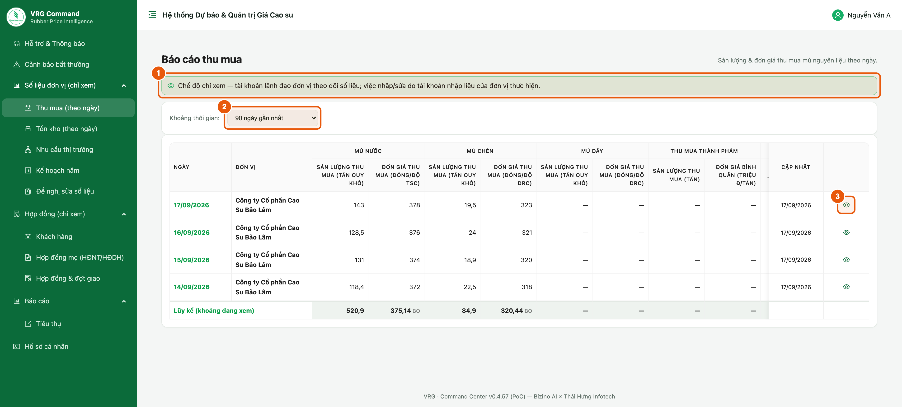

*Hình 9. Báo cáo thu mua theo ngày*

1. Dòng thông báo **“Chế độ chỉ xem”** nhắc rằng màn này chỉ để theo dõi.
2. **Khoảng thời gian** — chọn 30 / 60 / 90 / 180 ngày gần nhất, hoặc tự chọn khoảng ngày.
3. **Biểu tượng con mắt** ở cuối mỗi dòng — mở phiếu của đúng ngày đó để xem chi tiết.
4. Dòng **Lũy kế (khoảng đang xem)** ở cuối bảng cộng toàn bộ khoảng đang chọn.

> - Mục này chỉ hiện với đơn vị được giao kế hoạch thu mua. Đơn vị không tổ chức thu mua sẽ không thấy mục này trong menu.
> - Sản lượng ghi theo **tấn quy khô**; đơn giá mủ nước theo đồng/độ TSC, mủ chén theo đồng/độ DRC.

## 11. Xem tồn kho theo ngày

**Vị trí:** Menu ▸ Số liệu đơn vị (chỉ xem) ▸ Tồn kho (theo ngày)

Ảnh chụp kho của đơn vị theo từng ngày, kèm số tiêu thụ cộng dồn từ các lần giao trên hợp đồng.

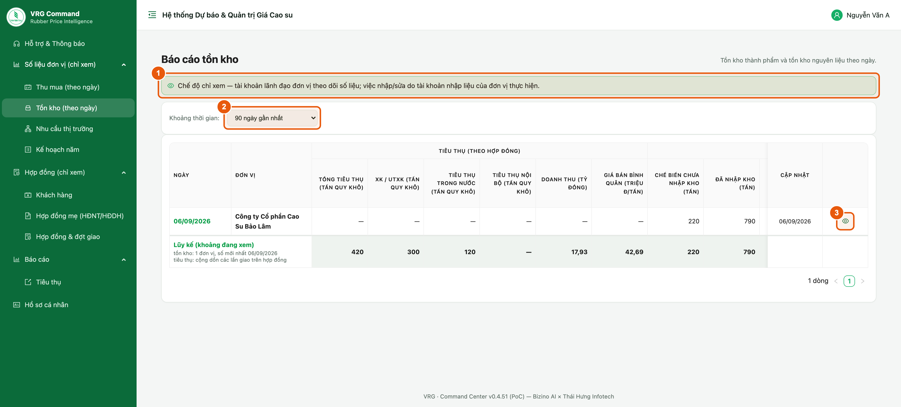

*Hình 10. Báo cáo tồn kho theo ngày*

1. Chọn **Khoảng thời gian** muốn xem.
2. Nhóm cột **Tiêu thụ (theo hợp đồng)** — tổng tiêu thụ, xuất khẩu, trong nước, nội bộ, doanh thu và giá bán bình quân.
3. Hai cột tồn kho — **Chế biến chưa nhập kho** và **Đã nhập kho** (tấn).
4. Bấm **biểu tượng con mắt** để mở phiếu chi tiết của ngày đó, xem tồn theo từng chủng loại.

> - Tồn kho là số tại thời điểm, nên dòng Lũy kế lấy **số mới nhất** của đơn vị, không cộng dồn các ngày.
> - Số tiêu thụ không nhập tay: hệ thống cộng từ các **đợt giao** ghi trên hợp đồng.

## 12. Nhu cầu thị trường

**Vị trí:** Menu ▸ Số liệu đơn vị (chỉ xem) ▸ Nhu cầu thị trường

Các lần khách hỏi mua mà đơn vị ghi nhận. Mỗi dòng là **một phiếu** cho **một chủng loại**, kèm **tình trạng**: đang đàm phán, đã ký hợp đồng hay không thành. Đây là phần thông tin thị trường đơn vị báo về Tập đoàn.

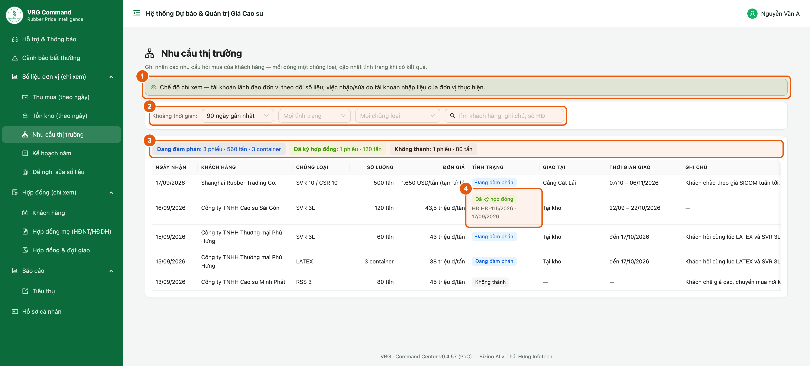

*Hình 11. Phiếu nhu cầu thị trường của đơn vị*

1. Dòng thông báo chế độ chỉ xem.
2. **Thanh lọc** — **Khoảng thời gian** (30 / 60 / 90 / 180 / 365 ngày gần nhất), **Tình trạng**, **Chủng loại**, và ô **Tìm** theo tên khách, số hợp đồng, ghi chú (gõ xong bấm Enter).
3. **Dải tổng hợp** — số phiếu và tổng số lượng của từng tình trạng, tính theo bộ lọc đang chọn. Nhìn đây là biết đơn vị đang đàm phán bao nhiêu, đã ký được bao nhiêu.
4. **Cột Tình trạng** — *Đang đàm phán* (xanh dương), *Đã ký hợp đồng* (xanh lá, kèm số hợp đồng và ngày ký), *Không thành* (xám).

> - Mỗi dòng ghi: ngày nhận, khách hàng, chủng loại, số lượng (tấn hoặc container), đơn giá (triệu đồng/tấn hoặc USD/tấn; *tạm tính* khi giá chưa chốt), nơi giao, thời gian giao và ghi chú. Rê chuột vào ô Ghi chú để đọc hết.
> - Dòng mới nhất ở trên. Khách hỏi nhiều chủng loại thì có nhiều dòng cùng tên khách.
> - Phiếu có nhãn **Chuyển từ bản cũ** là nội dung đơn vị viết dạng chữ trước 17/09/2026, nay đã chuyển thành phiếu. Nguyên văn cũ nằm trong Ghi chú.
> - Phiếu nằm ở *Đang đàm phán* quá lâu thì nhắc bộ phận nhập liệu cập nhật tình trạng.

## 13. Kế hoạch năm

**Vị trí:** Menu ▸ Số liệu đơn vị (chỉ xem) ▸ Kế hoạch năm

Chỉ tiêu cả năm của đơn vị — cơ sở để hệ thống tính phần trăm thực hiện trên các báo cáo.

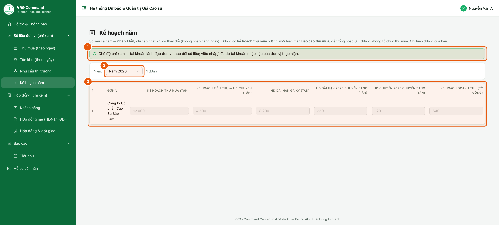

*Hình 12. Kế hoạch năm của đơn vị*

1. Dòng thông báo chế độ chỉ xem.
2. **Năm** — chọn năm muốn xem.
3. Bảng chỉ tiêu: kế hoạch thu mua, kế hoạch tiêu thụ hợp đồng chuyến, hợp đồng dài hạn đã ký, phần chuyển sang từ năm trước và kế hoạch doanh thu (tỷ đồng).

> - Số hiện mờ là do màn hình ở chế độ chỉ xem — đó vẫn là số thật đơn vị đã khai.
> - Chỉ tiêu sai hoặc chưa khai: báo tài khoản nhập liệu của đơn vị cập nhật.

## 14. Danh mục khách hàng

**Vị trí:** Menu ▸ Hợp đồng (chỉ xem) ▸ Khách hàng

Danh sách khách hàng riêng của đơn vị. Mỗi hợp đồng đều gắn với một khách hàng ở danh mục này, nhờ đó báo cáo tách được sản lượng và doanh thu theo từng khách.

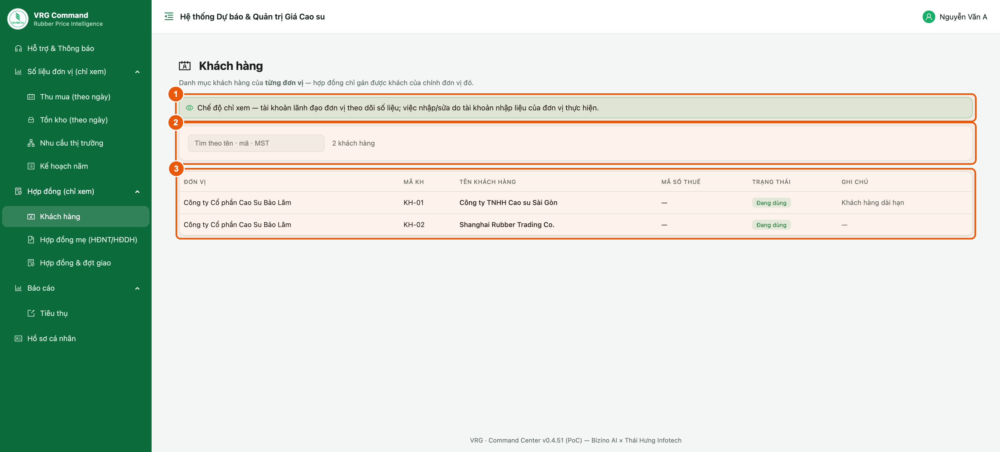

*Hình 13. Danh mục khách hàng của đơn vị*

1. Dòng thông báo chế độ chỉ xem.
2. **Ô tìm kiếm** — tìm theo tên khách, mã khách hoặc mã số thuế.
3. Bảng danh sách: mã khách, tên khách hàng, mã số thuế, trạng thái, ghi chú. Danh sách dài thì chuyển trang ở cuối bảng.

## 15. Hợp đồng mẹ (HĐNT/HĐDH)

**Vị trí:** Menu ▸ Hợp đồng (chỉ xem) ▸ Hợp đồng mẹ (HĐNT/HĐDH)

Hồ sơ hợp đồng nguyên tắc / hợp đồng dài hạn ký với khách: sản lượng cam kết, công thức giá, thời hạn. Các hợp đồng bán cụ thể là phụ lục thuộc hồ sơ này.

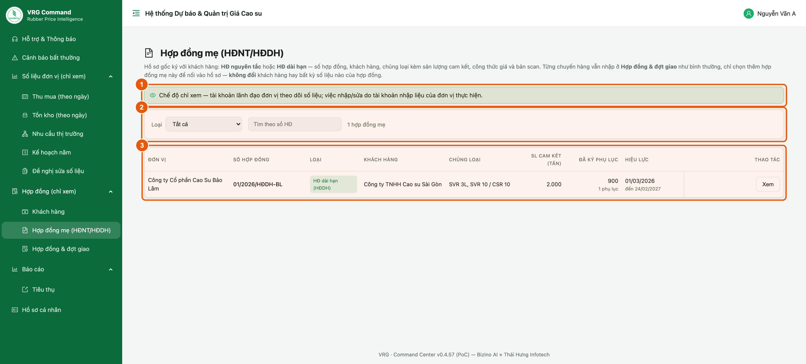

*Hình 14. Danh sách hợp đồng mẹ*

1. Dòng thông báo chế độ chỉ xem.
2. Khối bộ lọc — chọn **Loại** hồ sơ (HĐ nguyên tắc / HĐ dài hạn) hoặc gõ số hợp đồng vào ô tìm.
3. Bảng hồ sơ: số hợp đồng, loại, khách hàng, chủng loại, **SL cam kết**, số phụ lục **đã ký** và **hiệu lực** đến ngày nào. Bấm **Xem** để mở chi tiết hồ sơ.

> Hồ sơ mẹ chỉ ghi cam kết, không tính vào sản lượng tiêu thụ. Sản lượng thật nằm ở các hợp đồng và đợt giao (mục 16).

## 16. Hợp đồng & đợt giao

**Vị trí:** Menu ▸ Hợp đồng (chỉ xem) ▸ Hợp đồng & đợt giao

Toàn bộ hợp đồng bán của đơn vị và tiến độ giao hàng của từng hợp đồng.

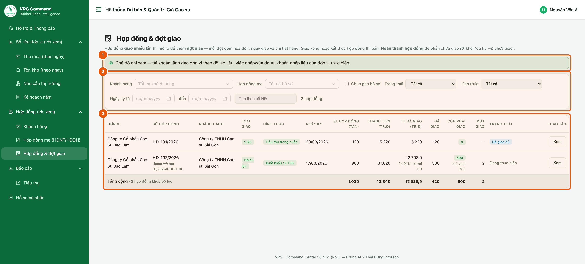

*Hình 15. Hợp đồng và tiến độ giao hàng*

1. Dòng thông báo chế độ chỉ xem.
2. Khối bộ lọc — khách hàng, hồ sơ hợp đồng mẹ, trạng thái, hình thức tiêu thụ, ngày ký, số hợp đồng.
3. Bảng hợp đồng: sản lượng, thành tiền, phần đã giao, còn phải giao, số đợt giao và trạng thái. Dòng **Tổng cộng** tính trên toàn bộ hợp đồng khớp bộ lọc, không chỉ trang đang xem.
4. Bấm **Xem** ở cuối dòng để mở chi tiết hợp đồng và danh sách các đợt giao.

> Trạng thái thường gặp: **Đã giao đủ**, **Đang thực hiện**. Cột *Còn phải giao* là phần đã ký nhưng chưa giao.

## 17. Báo cáo tiêu thụ

**Vị trí:** Menu ▸ Báo cáo ▸ Tiêu thụ

Bức tranh tiêu thụ của đơn vị theo kỳ: giao bao nhiêu, cho ai, doanh thu bao nhiêu, còn phải giao bao nhiêu. Số liệu cộng từ các lần giao ghi trên hợp đồng.

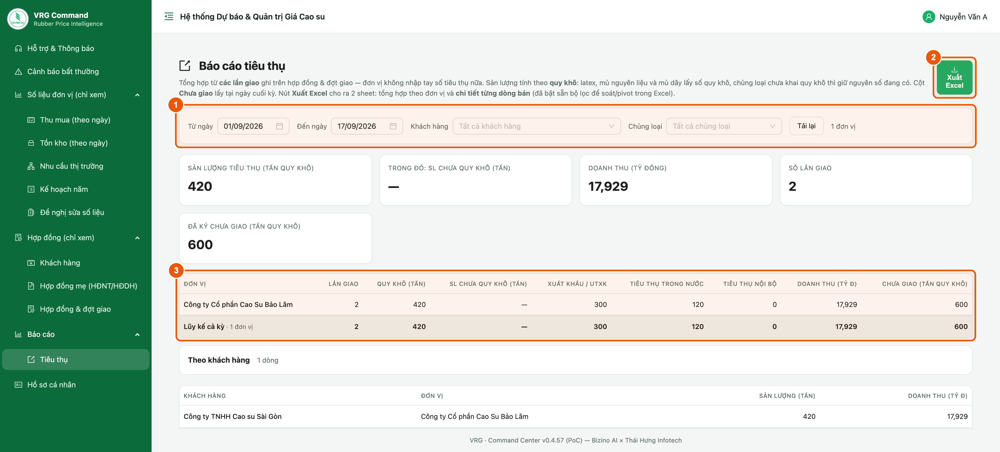

*Hình 16. Báo cáo tiêu thụ theo kỳ*

1. Chọn kỳ ở **Từ ngày** – **Đến ngày** (mặc định từ đầu tháng đến hôm nay), lọc thêm theo khách hàng hoặc chủng loại nếu cần.
2. **Xuất Excel** — tải file gồm 2 sheet: tổng hợp theo đơn vị và chi tiết từng dòng bán.
3. Các ô số lớn ở giữa: sản lượng tiêu thụ, doanh thu, số lần giao và phần **đã ký chưa giao** tại ngày cuối kỳ.
4. Bảng bên dưới tách theo hình thức: xuất khẩu, trong nước, nội bộ; kèm dòng lũy kế cả kỳ.

> - Sản lượng tính theo **quy khô**. Doanh thu tính theo tỷ đồng.
> - Số ở đây luôn khớp với mục *Hợp đồng & đợt giao* vì cùng lấy từ các lần giao.

## 18. Đổi mật khẩu

**Vị trí:** Menu ▸ Hồ sơ cá nhân

Nên đổi mật khẩu ngay sau lần đăng nhập đầu tiên.

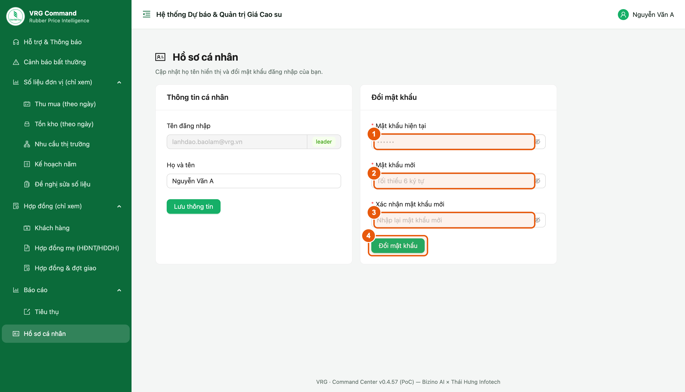

*Hình 17. Đổi mật khẩu*

1. Nhập **Mật khẩu hiện tại**.
2. Nhập **Mật khẩu mới** (tối thiểu 6 ký tự).
3. Nhập lại ở ô **Xác nhận mật khẩu mới**.
4. Bấm **Đổi mật khẩu**.

> - Khối bên trái là **Thông tin cá nhân** — sửa họ tên hiển thị rồi bấm *Lưu thông tin*. Tên đăng nhập do Tập đoàn cấp, không tự đổi được.
> - Quên mật khẩu: liên hệ quản trị hệ thống của Tập đoàn để được cấp lại.

## 19. Những tình huống hay gặp

Các câu hỏi lãnh đạo đơn vị hay gặp khi mới dùng hệ thống.

| Hiện tượng | Nguyên nhân & cách xử lý |
|---|---|
| Không thấy nút Lưu / Sửa ở màn số liệu | Đúng thiết kế: tài khoản lãnh đạo chỉ theo dõi. Việc nhập/sửa do tài khoản nhập liệu của đơn vị thực hiện. |
| Số liệu của ngày hôm nay còn trống | Đơn vị chưa nhập. Nhắc bộ phận nhập liệu; hạn nhập trong ngày theo quy định của Tập đoàn. |
| Cảnh báo báo “chưa nộp” nhưng nhân viên nói đã nộp | Cột ghi số ngày còn thiếu trên tổng số ngày của khoảng đang xem. Mở Thu mua hoặc Tồn kho theo ngày để xem đúng ngày nào còn trống. |
| Cảnh báo báo giá sai nhưng số thật sự đúng | Cảnh báo chỉ là dấu hiệu cần kiểm tra. Nếu đã đối chiếu và số đúng thì báo Tập đoàn qua Hỗ trợ & Thông báo. |
| Muốn sửa số đã nhập nhưng kỳ đã khoá | Nhắc nhân viên nhập liệu gửi **Đề nghị sửa số liệu**; Tập đoàn duyệt xong số mới được cập nhật. |
| Không nhận được email báo tin mới | Xem hộp thư rác trước; vẫn không có thì báo Tập đoàn kiểm tra địa chỉ email gắn với tài khoản. |
| Lỡ bấm “Đánh dấu đã xong” khi việc chưa xong | Đơn vị không tự mở lại được; nhờ Tập đoàn mở lại hoặc gửi yêu cầu mới. |
| Không thấy mục Thu mua trong menu | Đơn vị không được giao kế hoạch thu mua nên hệ thống ẩn mục này. |
| Đơn vị vừa sáp nhập, muốn xem số cũ | Số liệu trước sáp nhập vẫn còn trong hệ thống và được gộp vào đơn vị nhận; cần bóc tách riêng thì đề nghị Tập đoàn hỗ trợ. |
