# Hướng dẫn sử dụng — Lãnh đạo Tập đoàn

Tài liệu dành cho **lãnh đạo Tập đoàn** trên Hệ thống Dự báo & Quản trị Giá Cao su (https://price.vrg.vn).

Tài khoản Lãnh đạo Tập đoàn xem được toàn bộ **báo cáo, thống kê, số liệu thị trường, số liệu đơn vị, hợp đồng** và dùng **Trợ lý AI**. Tài khoản **chỉ xem**, không nhập/sửa số liệu.

> Bản Word đầy đủ (có ảnh chú thích): [Huong-dan-lanh-dao-tap-doan.docx](./Huong-dan-lanh-dao-tap-doan.docx)
> Sửa nội dung: chỉ sửa `spec.json` rồi chạy `python3 render_readme.py` (dựng lại README) và `node build_guide.js spec.json` (dựng lại bản Word).
> Chụp lại bộ ảnh khi giao diện đổi: chạy `./scripts/dev.sh` rồi `uv run --directory apps/api --with playwright python ../../docs/huong-dan/lanh-dao-tap-doan/shoot.py`.

## 1. Tài khoản Lãnh đạo Tập đoàn làm được gì

**Vị trí:** Đăng nhập tại https://price.vrg.vn bằng tài khoản được cấp

Tài khoản xem được toàn bộ báo cáo, thống kê, số liệu thị trường, số liệu đơn vị, hợp đồng và dùng Trợ lý AI. Tài khoản chỉ để xem: không nhập, sửa hay xoá số liệu. Menu bên trái gồm các phần sau.

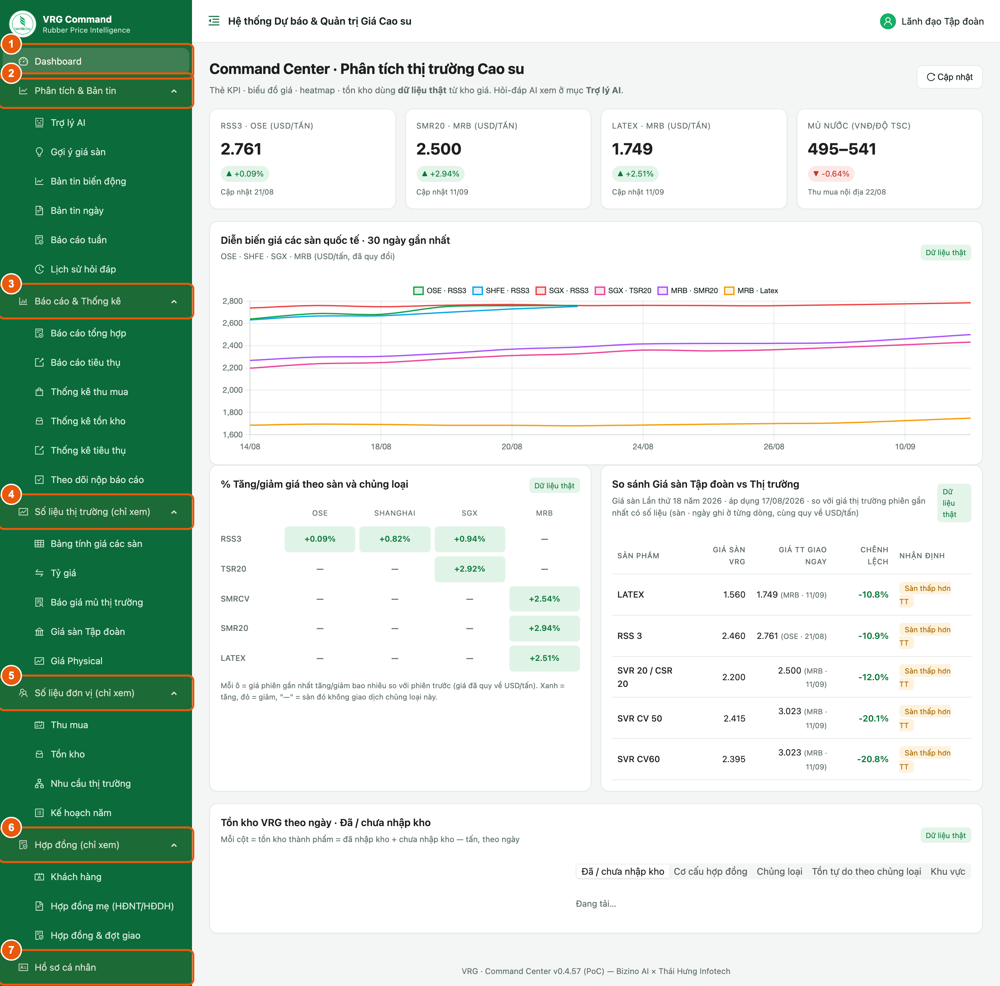

*Hình 1. Menu của tài khoản Lãnh đạo Tập đoàn*

1. **Dashboard** — bức tranh thị trường và tồn kho trong một màn.
2. **Phân tích & Bản tin** — Trợ lý AI, Gợi ý giá sàn, Bản tin biến động, Bản tin ngày, Báo cáo tuần, Lịch sử hỏi đáp.
3. **Báo cáo & Thống kê** — báo cáo tổng hợp, báo cáo tiêu thụ, thống kê thu mua · tồn kho · tiêu thụ, theo dõi nộp báo cáo.
4. **Số liệu thị trường (chỉ xem)** — giá các sàn, tỷ giá, báo giá mủ, giá sàn Tập đoàn, giá physical.
5. **Số liệu đơn vị (chỉ xem)** — thu mua, tồn kho, nhu cầu thị trường, kế hoạch năm của các đơn vị.
6. **Hợp đồng (chỉ xem)** — khách hàng, hợp đồng mẹ, hợp đồng và đợt giao.
7. **Hồ sơ cá nhân** — đổi mật khẩu.

> - Chữ “(chỉ xem)” trên tên nhóm nghĩa là màn đó không có nút nhập hay sửa.
> - Thấy số liệu sai hoặc thiếu: báo chuyên viên Ban TTKD phụ trách mục đó.

## 2. Dashboard — xem nhanh thị trường

**Vị trí:** Menu ▸ Dashboard (màn mở ra ngay sau khi đăng nhập)

Một màn gom giá quốc tế, giá sàn so với thị trường và tồn kho Tập đoàn.

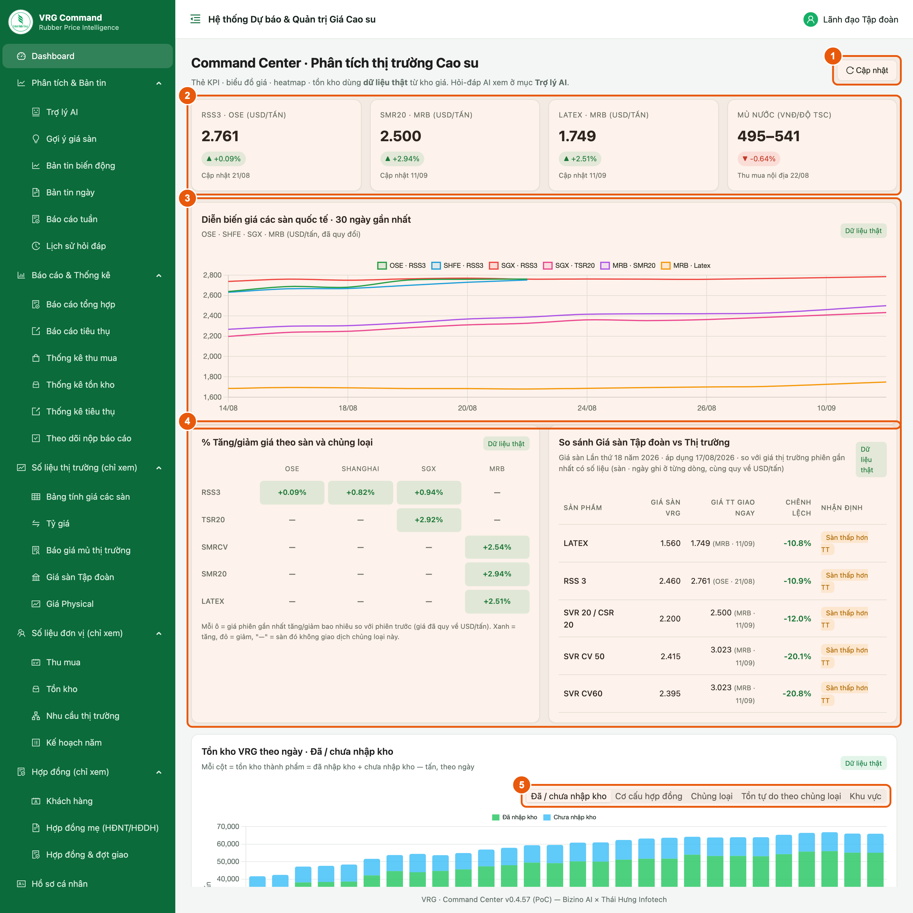

*Hình 2. Dashboard*

1. **Cập nhật** — tải lại trang để lấy số mới nhất.
2. **Bốn thẻ giá chính** — giá, mức tăng/giảm so với phiên trước và ngày cập nhật.
3. **Diễn biến giá 30 ngày** — rê chuột lên đường giá để xem số từng ngày.
4. **% tăng/giảm theo sàn** (ô xanh = tăng, đỏ = giảm) và **So sánh giá sàn Tập đoàn với thị trường** — cột Nhận định ghi “Sàn cao hơn TT”, “Sàn thấp hơn TT” hoặc “Sát thị trường”.
5. **Tồn kho theo ngày** — chọn cách xem: đã/chưa nhập kho, cơ cấu hợp đồng, chủng loại, tồn tự do, khu vực.

> - Nhãn “Dữ liệu thật” nghĩa là số lấy từ hệ thống, không phải số minh hoạ.
> - Dấu “—” trong bảng % nghĩa là sàn đó không giao dịch chủng loại này.

## 3. Hỏi Trợ lý AI

**Vị trí:** Menu ▸ Phân tích & Bản tin ▸ Trợ lý AI

Hỏi bằng tiếng Việt về giá, tồn kho, thu mua, hợp đồng, giá sàn. Trợ lý trả lời từ số liệu thật trong hệ thống, kèm bảng hoặc biểu đồ.

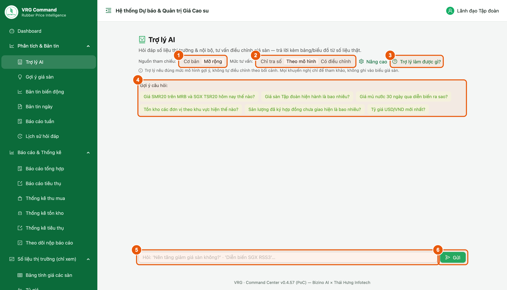

*Hình 3. Màn Trợ lý AI trước khi hỏi*

1. **Nguồn tham chiếu** — “Cơ bản”: chỉ tra thị trường thế giới và giá sàn. “Mở rộng” (mặc định): thêm số liệu nội bộ, đơn vị thành viên, hợp đồng.
2. **Mức tư vấn** — “Chỉ tra số”: chỉ trả số liệu. “Theo mô hình” (mặc định): nêu đúng đề xuất nâng/giữ/hạ của mô hình. “Có điều chỉnh”: được đề xuất khác mô hình nhưng phải nêu lý do.
3. **Trợ lý làm được gì?** — xem trợ lý tra được những gì và chưa làm được gì.
4. **Gợi ý câu hỏi** — bấm một câu để hỏi ngay.
5. **Ô hỏi** — gõ câu hỏi. Bấm Enter để gửi, Shift+Enter để xuống dòng.
6. **Gửi** — gửi câu hỏi. Chờ vài giây đến vài chục giây để trợ lý tra số liệu.

> - Mọi khuyến nghị của trợ lý chỉ để tham khảo, không làm thay đổi biểu giá sàn.
> - Muốn bắt đầu cuộc hỏi mới: tải lại trang.

## 4. Đọc câu trả lời của Trợ lý AI

**Vị trí:** Trợ lý AI ▸ sau khi gửi câu hỏi

Câu hỏi nằm bên phải, câu trả lời nằm bên trái. Hỏi tiếp ngay bên dưới, trợ lý nhớ nội dung đang trao đổi.

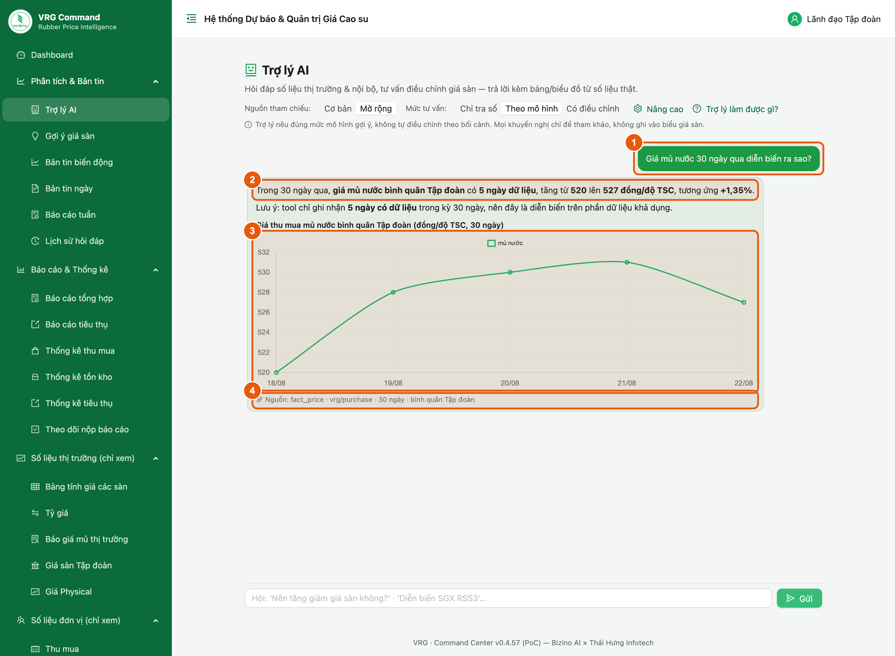

*Hình 4. Câu trả lời có biểu đồ và nguồn số liệu*

1. **Câu hỏi** bạn đã gửi.
2. **Phần trả lời** — con số chính được in đậm.
3. **Biểu đồ hoặc bảng** trợ lý dựng từ số liệu thật.
4. **Nguồn** — nhóm số liệu trợ lý đã dùng để trả lời.

> - Trợ lý không dự báo giá tương lai và không đọc tin tức vĩ mô ngoài hệ thống.
> - Mỗi câu hỏi tra tối đa khoảng 400 ngày số liệu.

## 5. Xem lại lịch sử hỏi đáp

**Vị trí:** Menu ▸ Phân tích & Bản tin ▸ Lịch sử hỏi đáp

Lưu lại các phiên bạn đã hỏi Trợ lý AI. Chỉ bạn xem được lịch sử của mình.

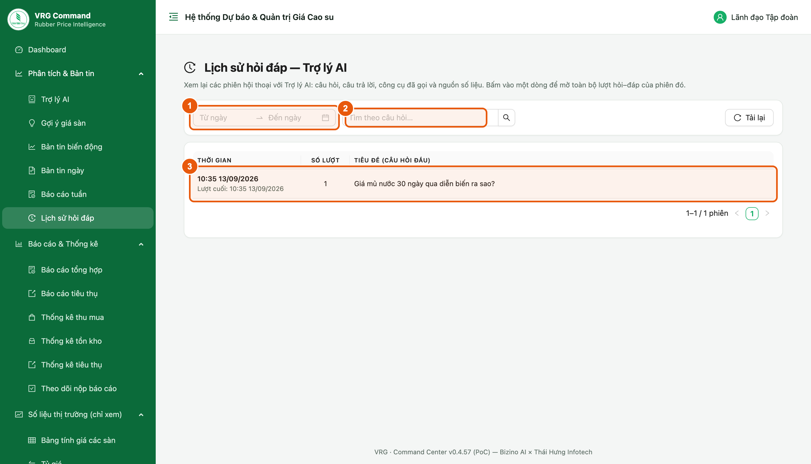

*Hình 5. Lịch sử hỏi đáp*

1. **Khoảng ngày** — lọc các phiên trong khoảng thời gian cần xem.
2. **Tìm theo câu hỏi** — gõ vài chữ trong câu hỏi để tìm.
3. **Một dòng là một phiên** — bấm vào để đọc lại toàn bộ câu hỏi và câu trả lời.

> Khi đọc lại, câu trả lời hiện dạng chữ, không kèm biểu đồ.

## 6. Gợi ý giá sàn

**Vị trí:** Menu ▸ Phân tích & Bản tin ▸ Gợi ý giá sàn

Mô hình so giá sàn với rổ giá thị trường (MRB SMR20 · SGX TSR20 · SHFE · OSE RSS3) để đề xuất nâng, giữ hay hạ giá sàn từng chủng loại, kèm lý do và độ tin cậy.

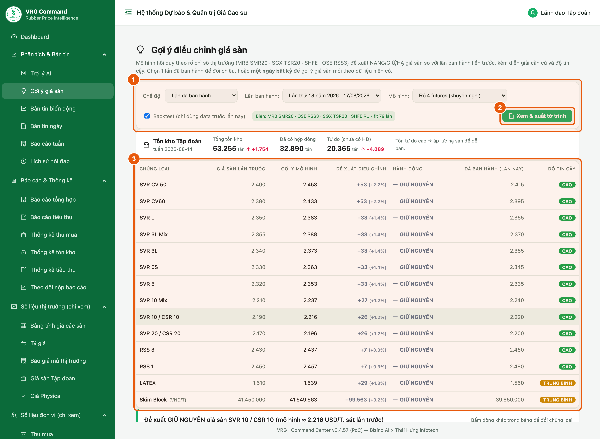

*Hình 6. Gợi ý điều chỉnh giá sàn*

1. **Thanh chọn** — “Chế độ”: xem lại một lần đã ban hành, hoặc chọn một ngày bất kỳ để có gợi ý mới. “Mô hình”: nên để “Rổ 4 futures (khuyến nghị)”.
2. **Xem & xuất tờ trình** — mở bản tờ trình điều chỉnh giá sàn; bấm “In / Xuất PDF” để in hoặc lưu file.
3. **Bảng gợi ý** — mỗi dòng một chủng loại: giá sàn lần trước, mức mô hình gợi ý, đề xuất điều chỉnh, **Hành động** (nâng/giữ/hạ) và **Độ tin cậy**.

> - Bấm vào một dòng trong bảng để xem diễn giải chi tiết của chủng loại đó ở phía dưới.
> - Kéo xuống dưới có: ma trận kịch bản Giảm/Cơ sở/Tăng, kiểm định mô hình trên các lần đã ban hành (sai số MAPE ≤ 6% là tốt) và biểu đồ tương quan giá sàn với các sàn.
> - Gợi ý chỉ để tham khảo, không tự thay đổi giá sàn.

## 7. Bản tin biến động và nhận định AI

**Vị trí:** Menu ▸ Phân tích & Bản tin ▸ Bản tin biến động

Một màn gom mọi nhóm số liệu (giá sàn, physical, tỷ giá, thu mua, tồn kho, tiêu thụ) dạng biểu đồ. Trên cùng là ô nhận định do AI viết.

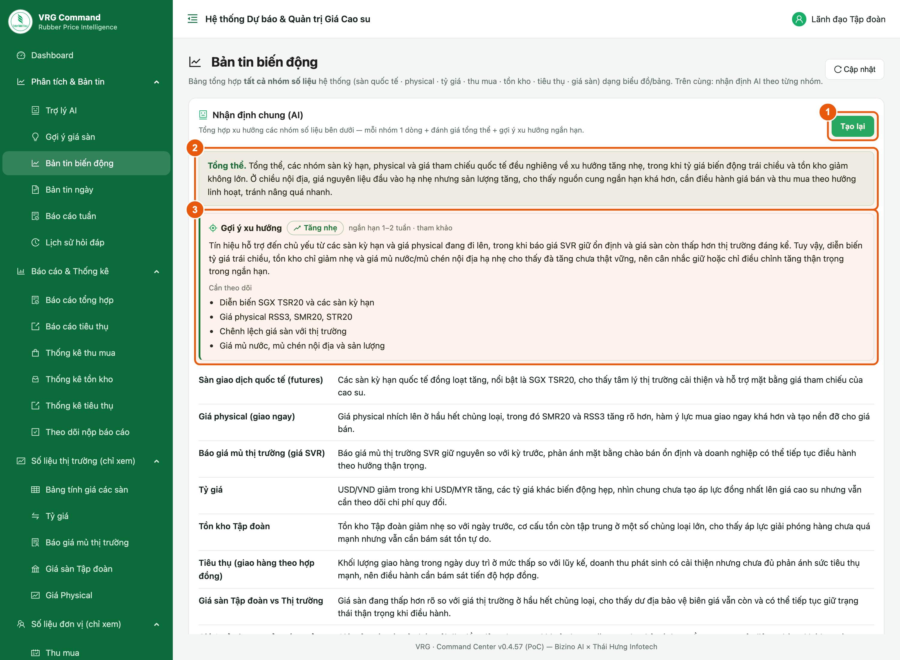

*Hình 7. Nhận định chung do AI tổng hợp*

1. **Tạo nhận định bằng AI** — bấm để AI đọc số liệu và viết nhận định (sau lần đầu nút đổi thành “Tạo lại”).
2. **Tổng thể** — đánh giá chung toàn bộ các nhóm số liệu.
3. **Gợi ý xu hướng** — hướng đi ngắn hạn 1–2 tuần và các điểm cần theo dõi. Bên dưới là nhận định từng nhóm số liệu.

> - Nhận định KHÔNG được lưu: rời trang là mất, lần sau bấm tạo lại.
> - AI tổng hợp từ số liệu hệ thống — cần rà soát trước khi đưa vào văn bản trình.

## 8. Bản tin ngày — danh sách

**Vị trí:** Menu ▸ Phân tích & Bản tin ▸ Bản tin ngày

Danh sách các bản tin ngày Ban TTKD đã xuất bản, mới nhất ở trên.

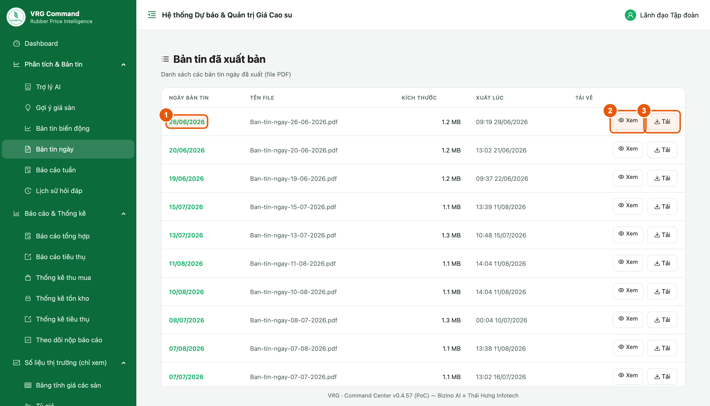

*Hình 8. Danh sách bản tin đã xuất bản*

1. **Ngày bản tin** — bấm để mở bản tin.
2. **Xem** — đọc bản tin ngay trên màn hình.
3. **Tải** — tải file PDF về máy.

## 9. Đọc một bản tin ngày

**Vị trí:** Bản tin ngày ▸ bấm Xem

Bản tin gồm bốn phần: giá cao su thế giới, giá vật chất (Reuters), giá sàn VRG và thông tin thị trường.

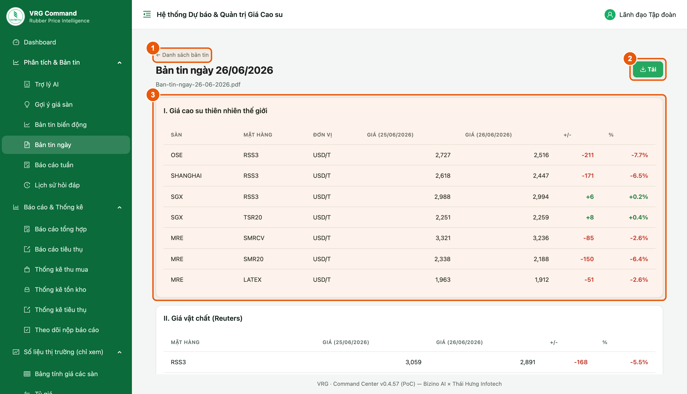

*Hình 9. Nội dung một bản tin ngày*

1. **Danh sách bản tin** — quay lại danh sách.
2. **Tải** — tải file PDF của bản tin này.
3. **Nội dung** — kéo xuống để đọc lần lượt từng phần.

## 10. Báo cáo phân tích thị trường tuần

**Vị trí:** Menu ▸ Phân tích & Bản tin ▸ Báo cáo tuần

Báo cáo tuần do chuyên viên soạn: tóm tắt, diễn biến giá, yếu tố vĩ mô, dự báo và khuyến nghị.

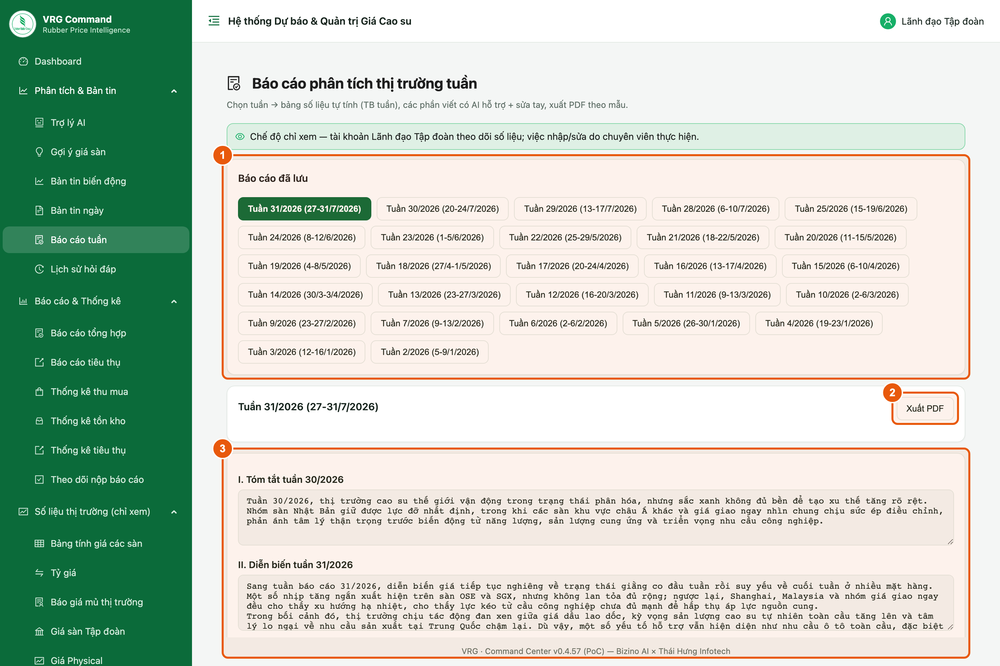

*Hình 10. Báo cáo tuần*

1. **Báo cáo đã lưu** — bấm vào tuần cần xem.
2. **Xuất PDF** — tải báo cáo tuần đang mở thành file PDF.
3. **Nội dung** — kéo xuống để đọc các phần I đến VI.

> Chỉ các tuần chuyên viên đã soạn và lưu mới hiện trong danh sách.

## 11. Báo cáo tổng hợp

**Vị trí:** Menu ▸ Báo cáo & Thống kê ▸ Báo cáo tổng hợp

Cộng số liệu hằng ngày của các đơn vị theo tuần, tháng, năm hoặc khoảng tự chọn. Mỗi dòng một đơn vị, cuối bảng là dòng Tổng cộng.

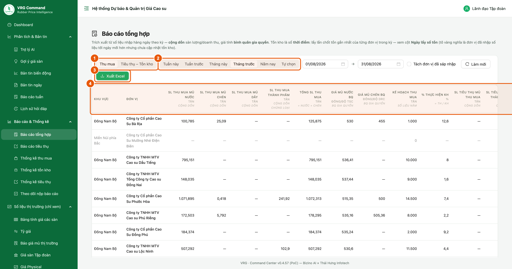

*Hình 11. Báo cáo tổng hợp*

1. **Loại báo cáo** — Thu mua, hoặc Tiêu thụ – Tồn kho.
2. **Kỳ báo cáo** — Tuần này, Tuần trước, Tháng này, Tháng trước, Năm nay, hoặc Tự chọn rồi nhập từ ngày – đến ngày.
3. **Xuất Excel** — tải báo cáo đúng kỳ đang xem.
4. **Tiêu đề cột** — ghi đơn vị tính và cách tính: “cộng dồn” (cộng cả kỳ), “BQ gia quyền” (bình quân theo sản lượng), “thời điểm” (số tại ngày chốt).

> - Dòng mờ là đơn vị chưa có số liệu trong kỳ.
> - Cột “Ngày lấy số tồn” tô vàng: đơn vị đã nhập số ngày mới hơn nhưng chưa cập nhật tồn kho.

## 12. Báo cáo tiêu thụ

**Vị trí:** Menu ▸ Báo cáo & Thống kê ▸ Báo cáo tiêu thụ

Sản lượng và doanh thu bán ra, tính từ các lần giao hàng ghi trên hợp đồng.

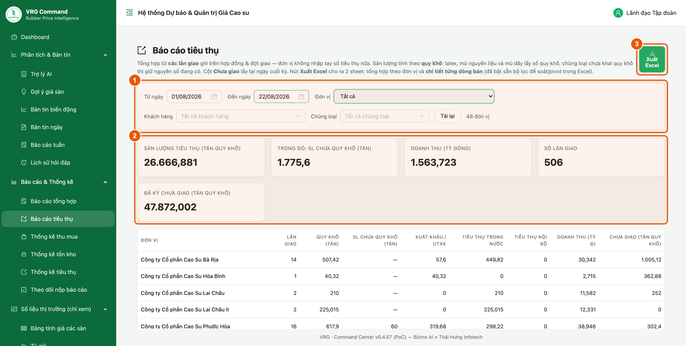

*Hình 12. Báo cáo tiêu thụ*

1. **Bộ lọc** — Từ ngày, Đến ngày, Đơn vị, Khách hàng, Chủng loại; bấm “Tải lại” sau khi đổi.
2. **Thẻ tổng** — sản lượng tiêu thụ (tấn quy khô), doanh thu (tỷ đồng), số lần giao, sản lượng đã ký chưa giao.
3. **Xuất Excel** — file gồm 2 sheet: tổng hợp theo đơn vị và chi tiết từng dòng bán.

> - Kéo xuống có thêm bảng theo đơn vị, theo khách hàng và lịch sử từng đợt giao.
> - Doanh thu hiện “—” khi hợp đồng bán bằng ngoại tệ chưa có tỷ giá.

## 13. Thống kê thu mua (và thống kê tiêu thụ)

**Vị trí:** Menu ▸ Báo cáo & Thống kê ▸ Thống kê thu mua

Xem sản lượng và giá thu mua theo tầng: Toàn Tập đoàn → khu vực → đơn vị → ngày → loại mủ. Màn Thống kê tiêu thụ dùng cùng cách.

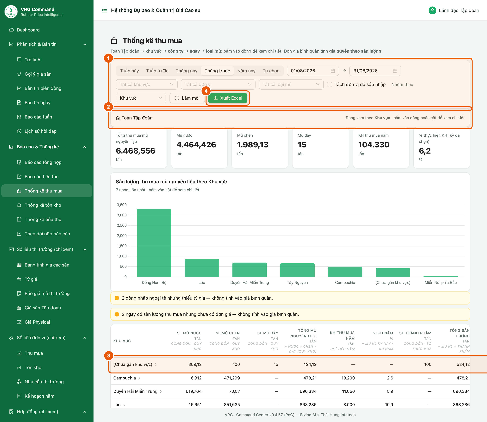

*Hình 13. Thống kê thu mua*

1. **Bộ lọc** — chọn kỳ, khu vực, đơn vị, loại mủ và “Nhóm theo” (khu vực, đơn vị, ngày, loại mủ, chủng loại); bấm “Làm mới”.
2. **Đường dẫn** — cho biết đang xem ở tầng nào; bấm “Toàn Tập đoàn” để quay về tầng đầu.
3. **Bấm vào một dòng** (hoặc một cột biểu đồ) để xem chi tiết tầng dưới.
4. **Xuất Excel** — tải bảng đang xem.

> - Mủ nguyên liệu tính theo tấn quy khô. Giá mủ nước đồng/độ TSC, mủ chén và mủ dây đồng/độ DRC.
> - “% KH năm” so sản lượng trong kỳ với kế hoạch cả năm, nên kỳ ngắn sẽ ra số nhỏ.
> - Thống kê tiêu thụ có thêm lọc theo loại hợp đồng, hình thức, và các cột kế hoạch, doanh thu, giá bán bình quân.

## 14. Thống kê tồn kho

**Vị trí:** Menu ▸ Báo cáo & Thống kê ▸ Thống kê tồn kho

Ảnh chụp tồn kho tại MỘT ngày chốt. Tồn kho là số thời điểm, không cộng dồn các ngày.

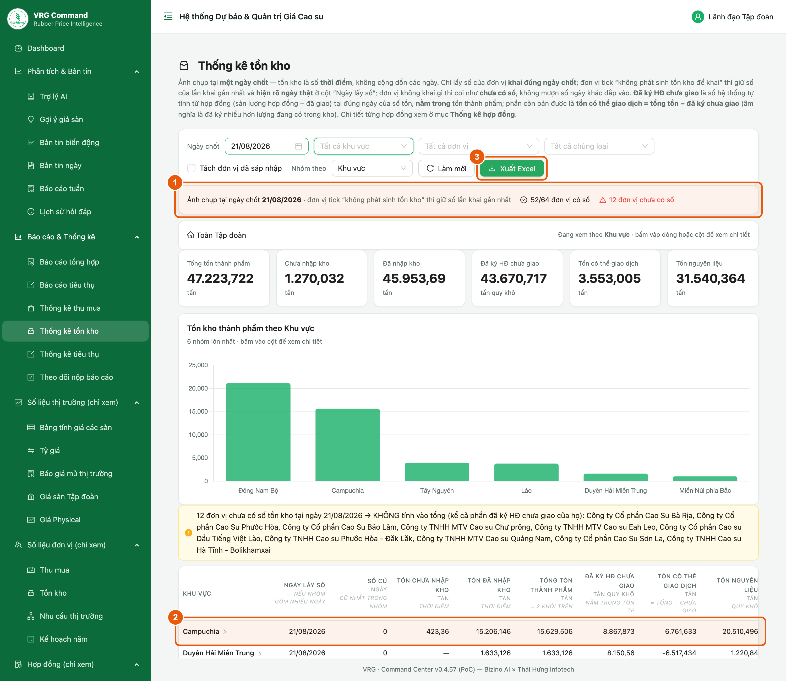

*Hình 14. Thống kê tồn kho tại ngày chốt*

1. **Thanh độ phủ** — ngày chốt đang xem, số đơn vị đã có số và số đơn vị chưa có số (rê chuột lên chữ đỏ để xem tên).
2. **Bấm vào một dòng** để xem chi tiết từng đơn vị trong khu vực.
3. **Xuất Excel** — tải bảng đang xem.

> - Đổi ô “Ngày chốt” để xem ngày khác. Số hôm nay có thể chưa đủ vì đơn vị chưa nhập — nên xem ngày hôm trước.
> - “Tồn có thể giao dịch” = tổng tồn − đã ký hợp đồng chưa giao. Số âm nghĩa là đã ký bán nhiều hơn lượng đang có trong kho.

## 15. Theo dõi nộp báo cáo

**Vị trí:** Menu ▸ Báo cáo & Thống kê ▸ Theo dõi nộp báo cáo

Bảng đơn vị × ngày cho biết đơn vị nào chưa nhập số liệu ngày nào.

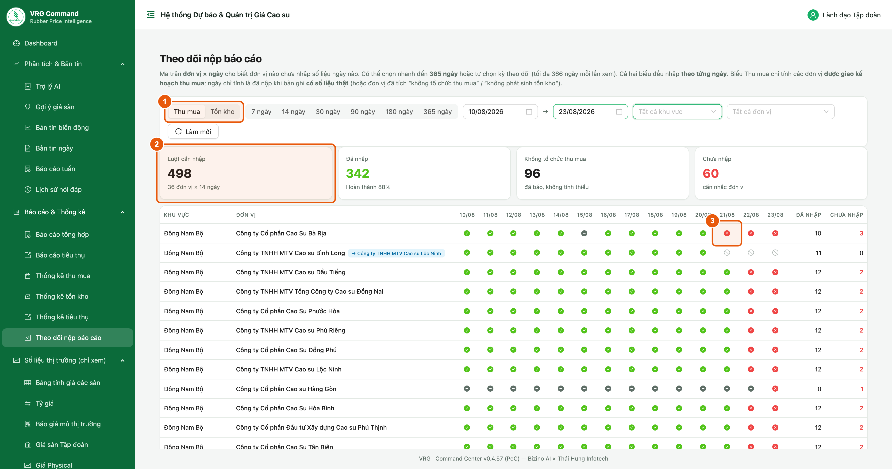

*Hình 15. Theo dõi nộp báo cáo*

1. **Biểu cần theo dõi** — Thu mua hoặc Tồn kho. Bên cạnh là chọn nhanh 7 đến 365 ngày, hoặc nhập khoảng ngày.
2. **Thẻ tổng** — số lượt cần nhập, đã nhập, không tổ chức thu mua, chưa nhập.
3. **Mỗi ô là một ngày của một đơn vị** — dấu tích xanh: đã nhập · dấu gạch xám: đã báo không tổ chức thu mua · dấu X đỏ: chưa nhập.

> - Rê chuột lên ô để xem ý nghĩa.
> - Biểu Thu mua chỉ tính các đơn vị được giao kế hoạch thu mua.

## 16. Số liệu thị trường — Bảng tính giá các sàn

**Vị trí:** Menu ▸ Số liệu thị trường (chỉ xem) ▸ Bảng tính giá các sàn

Giá hằng ngày trên các sàn OSE · SHANGHAI · SGX · MRB theo tiền gốc, tỷ giá và quy về USD/tấn. Màn Tỷ giá, Báo giá mủ thị trường và Giá Physical xem theo cùng cách.

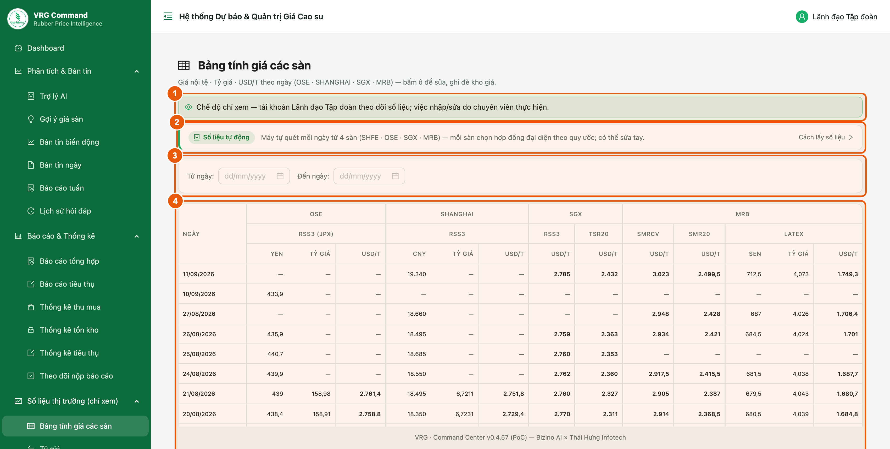

*Hình 16. Bảng tính giá các sàn*

1. **Dòng chỉ xem** — nhắc màn này chỉ để theo dõi.
2. **Cách lấy số liệu** — bấm để xem số liệu lấy từ đâu và tính thế nào.
3. **Từ ngày / Đến ngày** — để trống là 30 ngày gần nhất.
4. **Bảng giá** — mỗi dòng một ngày.

> - Giá “NT” (No Trading) nghĩa là phiên đó sàn không giao dịch.
> - Ở màn Báo giá mủ thị trường: bấm vào một ngày trong “Các phiếu đã có” để mở phiếu báo giá của ngày đó.

## 17. Số liệu thị trường — Giá sàn Tập đoàn

**Vị trí:** Menu ▸ Số liệu thị trường (chỉ xem) ▸ Giá sàn Tập đoàn

Các biểu giá sàn Tập đoàn đã ban hành, mỗi “lần” một công văn.

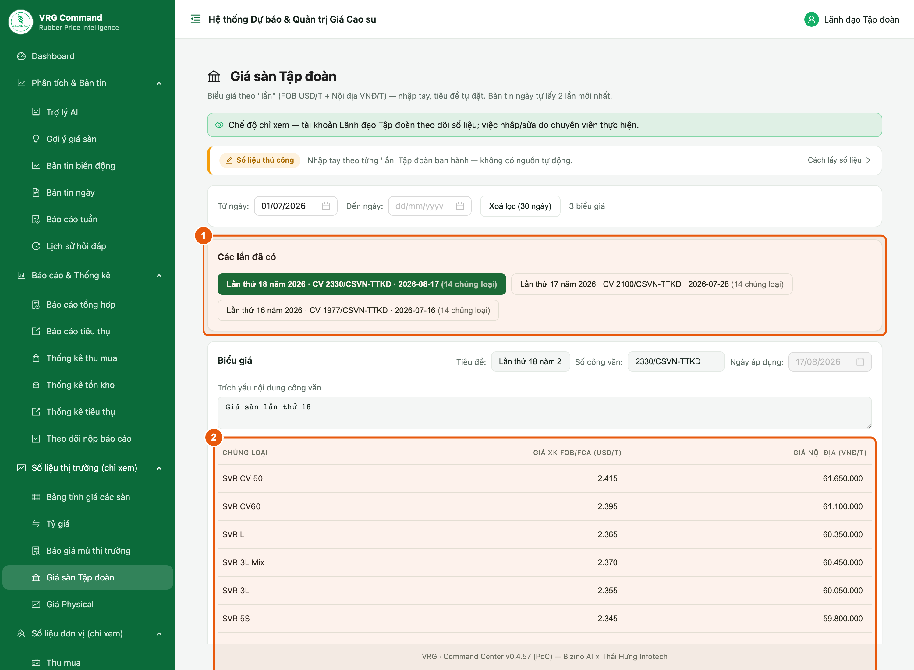

*Hình 17. Giá sàn Tập đoàn*

1. **Các lần đã có** — bấm vào lần cần xem (ghi số lần, số công văn, ngày áp dụng). Có thể lọc theo ngày ở ô phía trên.
2. **Biểu giá** — giá xuất khẩu FOB/FCA (USD/tấn) và giá nội địa (VNĐ/tấn) từng chủng loại.

## 18. Số liệu đơn vị (chỉ xem)

**Vị trí:** Menu ▸ Số liệu đơn vị (chỉ xem) ▸ Thu mua · Tồn kho · Nhu cầu thị trường · Kế hoạch năm

Xem số liệu các đơn vị thành viên tự nhập hằng ngày. Hình dưới là màn Tồn kho; màn Thu mua dùng cùng cách.

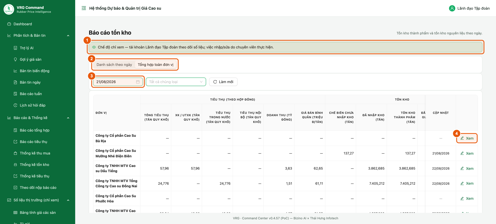

*Hình 18. Báo cáo tồn kho của các đơn vị*

1. **Dòng chỉ xem** — số liệu do đơn vị nhập, lãnh đạo chỉ theo dõi.
2. **Cách xem** — “Tổng hợp toàn đơn vị”: mỗi dòng một đơn vị tại một ngày. “Danh sách theo ngày”: từng ngày đã nhập.
3. **Ngày** — chọn ngày cần xem.
4. **Xem** — mở chi tiết số liệu của đơn vị trong ngày đó.

> - Nhu cầu thị trường: mỗi dòng là một phiếu khách hỏi mua mà đơn vị ghi nhận — khách hàng, chủng loại, số lượng, đơn giá và tình trạng (đang đàm phán, đã ký hợp đồng kèm số hợp đồng, không thành). Lọc theo khoảng 30–365 ngày, đơn vị, tình trạng, chủng loại. Dải tổng hợp ở đầu bảng đếm số phiếu của từng tình trạng.
> - Kế hoạch năm: chọn năm để xem kế hoạch thu mua, tiêu thụ, doanh thu của từng đơn vị.

## 19. Hợp đồng (chỉ xem)

**Vị trí:** Menu ▸ Hợp đồng (chỉ xem) ▸ Khách hàng · Hợp đồng mẹ · Hợp đồng & đợt giao

Xem hợp đồng bán hàng của các đơn vị và tiến độ giao hàng.

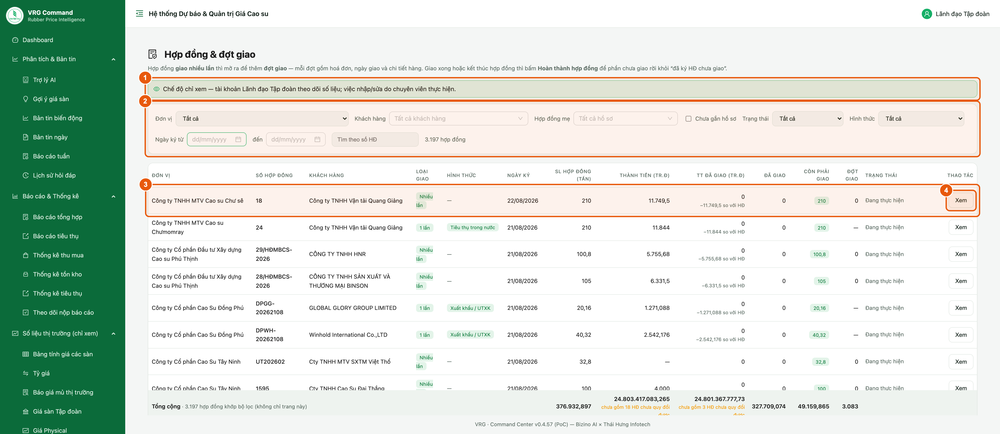

*Hình 19. Hợp đồng & đợt giao*

1. **Dòng chỉ xem** — hợp đồng do đơn vị và chuyên viên nhập.
2. **Bộ lọc** — đơn vị, khách hàng, hợp đồng mẹ, trạng thái, hình thức, ngày ký, số hợp đồng.
3. **Một dòng là một hợp đồng** — sản lượng, thành tiền, đã giao, còn phải giao. Dòng Tổng cộng cuối bảng tính cho mọi hợp đồng khớp bộ lọc.
4. **Xem** — mở chi tiết hợp đồng: dòng hàng và các đợt giao.

> - Màn Khách hàng: tìm theo tên, mã hoặc mã số thuế.
> - Màn Hợp đồng mẹ: bấm Xem để mở hồ sơ hợp đồng mẹ, bản scan đã ký và các phụ lục.

## 20. Đổi mật khẩu

**Vị trí:** Menu ▸ Hồ sơ cá nhân

Nên đổi mật khẩu ngay lần đăng nhập đầu tiên.

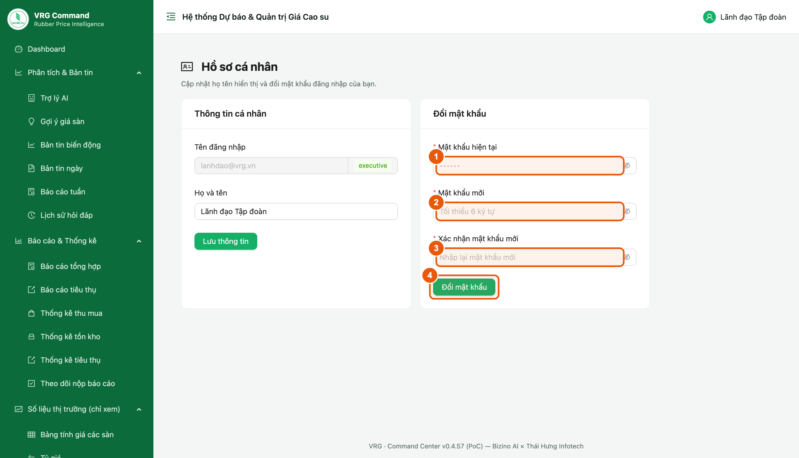

*Hình 20. Đổi mật khẩu*

1. **Mật khẩu hiện tại** — mật khẩu đang dùng.
2. **Mật khẩu mới** — tối thiểu 6 ký tự.
3. **Xác nhận mật khẩu mới** — gõ lại mật khẩu mới.
4. **Đổi mật khẩu** — lưu. Lần đăng nhập sau dùng mật khẩu mới.

> Quên mật khẩu: liên hệ quản trị hệ thống để đặt lại.

## 21. Những tình huống hay gặp

| Hiện tượng | Nguyên nhân & cách xử lý |
|---|---|
| Không thấy nút Thêm, Lưu, Xoá | Tài khoản Lãnh đạo Tập đoàn chỉ để xem. Việc nhập, sửa số liệu do chuyên viên Ban TTKD thực hiện. |
| Thấy số liệu sai hoặc còn thiếu | Báo chuyên viên Ban TTKD phụ trách mục đó để kiểm tra, sửa. |
| Ô số liệu hiện “—” | Ngày hoặc kỳ đó chưa có số liệu. Thử chọn ngày hôm trước hoặc kỳ dài hơn. |
| Giá hiện “NT” | Sàn không giao dịch phiên đó (No Trading). |
| Trợ lý AI báo “Xin lỗi, có lỗi khi xử lý câu hỏi” | Hỏi lại ngắn gọn hơn. Vẫn lỗi thì báo quản trị hệ thống. |
| Trợ lý AI không trả lời được | Trợ lý chỉ tra số liệu có trong hệ thống. Bấm “Trợ lý làm được gì?” để xem phạm vi. |
| Báo cáo tuần chưa có tuần mới nhất | Chuyên viên chưa soạn xong tuần đó. |
| Giao diện vẫn như cũ sau khi hệ thống cập nhật | Bấm Ctrl+Shift+R (máy Mac: Cmd+Shift+R) để tải lại trang. |
| Đang xem thì bị đưa về trang đăng nhập | Phiên đăng nhập đã hết hạn. Đăng nhập lại. |
