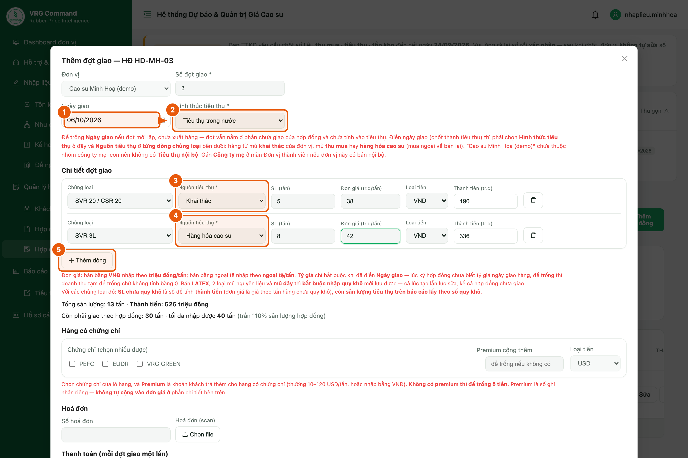
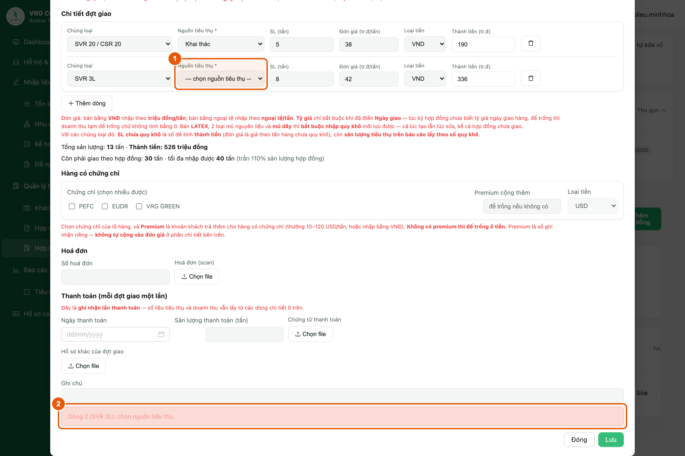
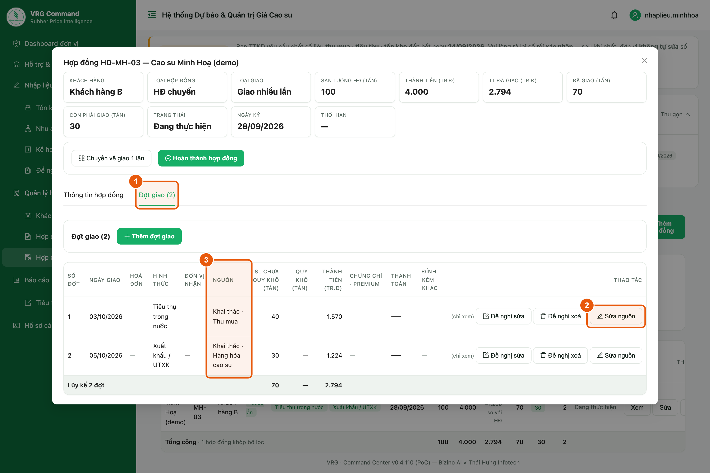
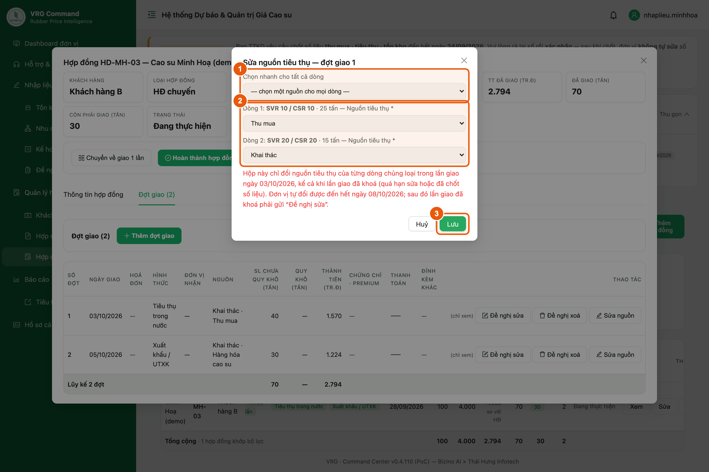
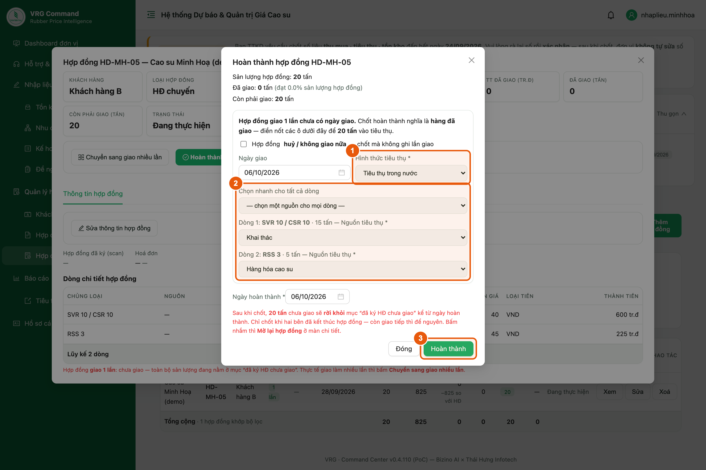
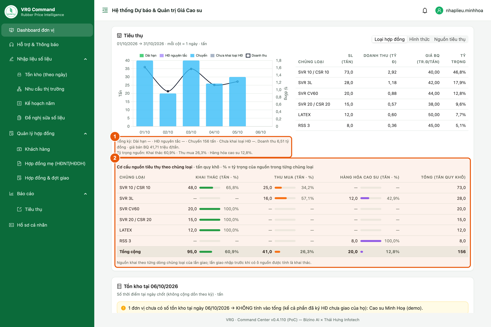
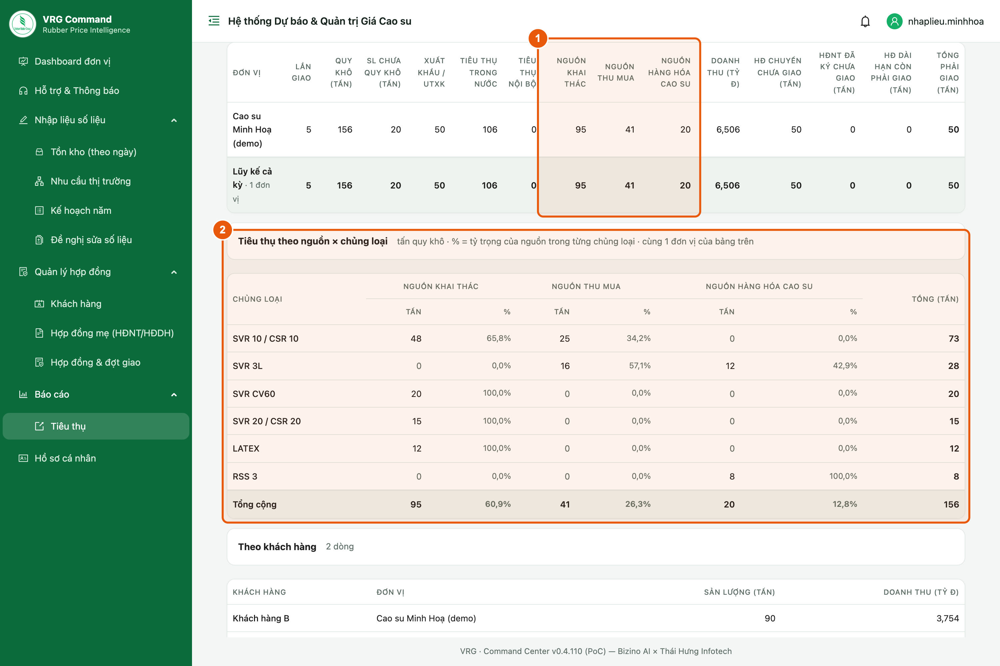

# Hướng dẫn sử dụng — Nguồn tiêu thụ theo chủng loại

Tài liệu dành cho **tài khoản nhập liệu của đơn vị thành viên**. Từ ngày 06/10/2026, mỗi dòng chủng loại của một lần giao hàng phải ghi rõ nguồn: **Khai thác**, **Thu mua** hoặc **Hàng hóa cao su**.

Cách làm chung: khi điền **Ngày giao** thì chọn **Nguồn tiêu thụ** ở từng dòng chủng loại. Các lần giao đã nhập trước đó được tạm ghi là Khai thác; dòng nào không đúng thì bấm **Sửa nguồn** để sửa (đến hết ngày 08/10/2026).

> Bản Word đầy đủ (có ảnh chú thích): [Huong-dan-nguon-tieu-thu.docx](./Huong-dan-nguon-tieu-thu.docx)
> Sổ tay nhập liệu chung: [../nhap-lieu-don-vi-thanh-vien/README.md](../nhap-lieu-don-vi-thanh-vien/README.md)
> Sửa nội dung: chỉ sửa `spec.json` rồi chạy `python3 render_readme.py` (dựng lại README) và `NODE_PATH="$(npm root -g)" node ~/.claude/skills/screenshot-annotate/scripts/build_guide.js spec.json` (dựng lại bản Word).
> Chụp lại bộ ảnh khi giao diện đổi: xem hướng dẫn ở đầu `seed.py` và `shoot.py`.

## 1. Ba nguồn tiêu thụ

Mỗi dòng chủng loại của một lần giao phải ghi rõ hàng đó lấy từ nguồn nào. Có 3 nguồn:

1. **Khai thác**: mủ từ vườn cây của chính đơn vị.
2. **Thu mua**: mủ đơn vị mua vào.
3. **Hàng hóa cao su**: thành phẩm đơn vị mua ngoài về bán lại.

> - Một lần giao có nhiều chủng loại thì mỗi dòng chọn nguồn riêng. Ví dụ: SVR 10 là Khai thác, SVR 3L là Thu mua.
> - Các lần giao nhập trước ngày 05/10/2026 được tạm ghi là **Khai thác**. Dòng nào không đúng thì sửa theo mục 4 và 5.

## 2. Chọn nguồn khi nhập lần giao

**Vị trí:** Menu ▸ Quản lý hợp đồng ▸ Hợp đồng & đợt giao

Áp dụng cho phiếu **Thêm đợt giao** (hợp đồng giao nhiều lần) và phiếu hợp đồng **giao 1 lần**.

*Hình 1. Phiếu đợt giao — mỗi dòng chủng loại có ô Nguồn tiêu thụ*

1. Điền **Ngày giao** khi hàng đã giao xong.
2. Chọn **Hình thức tiêu thụ**.
3. Ở dòng chủng loại, chọn **Nguồn tiêu thụ**: Khai thác, Thu mua hoặc Hàng hóa cao su.
4. Có thêm chủng loại thì chọn nguồn cho từng dòng. Mỗi dòng có thể khác nguồn.
5. Bấm **Thêm dòng** để thêm chủng loại. Dòng mới tự lấy nguồn của dòng trên, khác thì đổi lại. Xong bấm **Lưu** ở cuối phiếu.

> - Đợt mới lập, chưa điền Ngày giao thì chưa cần chọn nguồn.
> - Hợp đồng giao nhiều lần: nguồn chọn ở từng **đợt giao**. Phần chi tiết của hợp đồng không có ô nguồn.

## 3. Khi quên chọn nguồn

**Vị trí:** Phiếu đợt giao hoặc phiếu hợp đồng giao 1 lần, sau khi bấm Lưu

*Hình 2. Thiếu nguồn ở một dòng — hệ thống báo đúng dòng đó*

1. Dòng còn trống ô **Nguồn tiêu thụ** thì phiếu không lưu được.
2. Thông báo ở cuối phiếu ghi rõ dòng nào thiếu, ví dụ “Dòng 2 (SVR 3L): chọn nguồn tiêu thụ.”. Chọn nguồn cho dòng đó rồi bấm **Lưu** lại.

## 4. Mở lần giao cần sửa nguồn (đến hết 08/10/2026)

**Vị trí:** Menu ▸ Quản lý hợp đồng ▸ Hợp đồng & đợt giao ▸ Xem

Nút **Sửa nguồn** dùng được cả với lần giao đã khoá (đang hiện “(chỉ xem)”).

*Hình 3. Hợp đồng giao nhiều lần — tab Đợt giao, cột Nguồn và nút Sửa nguồn*

1. Mở hợp đồng bằng nút **Xem**. Hợp đồng giao nhiều lần thì chọn tab **Đợt giao**.
2. Bấm **Sửa nguồn** ở lần giao cần sửa. Hợp đồng giao 1 lần thì nút nằm ở tab **Thông tin hợp đồng**.
3. Cột **Nguồn** cho biết lần giao đang tính nguồn nào. Lần giao nhiều nguồn hiện đủ, ví dụ “Khai thác · Thu mua”.

> - Nút **Sửa nguồn** chỉ có đến hết ngày **08/10/2026**. Sau đó, lần giao đã khoá phải gửi **Đề nghị sửa**.
> - Sửa nguồn không làm đổi sản lượng hay doanh thu, chỉ đổi cách chia theo nguồn.

## 5. Chọn nguồn từng dòng rồi lưu

**Vị trí:** Hộp «Sửa nguồn tiêu thụ»

*Hình 4. Hộp Sửa nguồn — chọn nguồn cho từng dòng chủng loại*

1. Cả lần giao cùng một nguồn: chọn ở ô **Chọn nhanh cho tất cả dòng**.
2. Các dòng khác nguồn nhau: chọn nguồn cho từng dòng.
3. Bấm **Lưu**. Cột **Nguồn** trong bảng đổi ngay.

## 6. Hoàn thành hợp đồng giao 1 lần chưa nhập ngày giao

**Vị trí:** Menu ▸ Quản lý hợp đồng ▸ Hợp đồng & đợt giao ▸ Xem ▸ Hoàn thành hợp đồng

Chốt hoàn thành hợp đồng giao 1 lần chưa có ngày giao cũng là ghi nhận **đã giao**. Màn hình hỏi thêm hình thức và nguồn của từng dòng.

*Hình 5. Hoàn thành hợp đồng — chọn nguồn cho từng dòng*

1. Chọn **Hình thức tiêu thụ**. Ô Ngày giao để sẵn bằng ngày hoàn thành, khác thì sửa lại.
2. Chọn **Nguồn tiêu thụ** cho từng dòng, hoặc dùng ô **Chọn nhanh cho tất cả dòng**.
3. Bấm **Hoàn thành**.

> Hợp đồng huỷ, không giao nữa thì tích ô **huỷ / không giao nữa**. Khi đó không cần chọn nguồn.

## 7. Xem tỷ trọng nguồn trên Dashboard đơn vị

**Vị trí:** Menu ▸ Dashboard đơn vị ▸ khối Tiêu thụ

*Hình 6. Dashboard đơn vị — tỷ trọng nguồn và cơ cấu nguồn theo chủng loại*

1. Dòng **Tỷ trọng nguồn** dưới biểu đồ cho biết cả kỳ bao nhiêu phần trăm từ mỗi nguồn.
2. Bảng **Cơ cấu nguồn tiêu thụ theo chủng loại**: mỗi chủng loại bao nhiêu tấn từ mỗi nguồn, chiếm bao nhiêu phần trăm.

> - Ở biểu đồ Tiêu thụ, chọn **Nguồn tiêu thụ** (góc trên bên phải) để xem từng ngày theo nguồn.
> - Số tính bằng **tấn quy khô**.

## 8. Xem tiêu thụ theo nguồn trong Báo cáo tiêu thụ

**Vị trí:** Menu ▸ Báo cáo ▸ Tiêu thụ

*Hình 7. Báo cáo tiêu thụ — cột nguồn và bảng nguồn × chủng loại*

1. Bảng theo đơn vị có 3 cột **Nguồn khai thác**, **Nguồn thu mua**, **Nguồn hàng hóa cao su**.
2. Bảng **Tiêu thụ theo nguồn × chủng loại** ngay bên dưới: tấn và tỷ trọng của từng nguồn trong mỗi chủng loại.

> Nút **Xuất Excel** ở đầu trang tải file có thêm sheet **Nguồn × chủng loại**, cùng số với bảng.

## 9. Những lỗi hay gặp

| Hiện tượng | Nguyên nhân & cách xử lý |
|---|---|
| Báo “Dòng N (…): chọn nguồn tiêu thụ.” | Phiếu đã có Ngày giao mà dòng đó chưa chọn nguồn. Chọn nguồn cho dòng đó rồi bấm Lưu. |
| Không thấy ô Nguồn ở từng dòng | Trình duyệt còn giữ bản cũ. Bấm Cmd+Shift+R (Mac) hoặc Ctrl+F5 (Windows) để tải lại. |
| Không thấy nút Sửa nguồn | Đã quá ngày 08/10/2026, hoặc lần giao chưa có Ngày giao. Lần giao đã khoá thì gửi Đề nghị sửa. |
| Báo “Số dòng chủng loại không khớp” | Hợp đồng vừa được sửa ở nơi khác. Đóng hộp, tải lại trang rồi làm lại. |
| Hợp đồng giao nhiều lần không có ô Nguồn ở phần chi tiết | Đúng như vậy: nguồn chọn ở từng đợt giao. |
