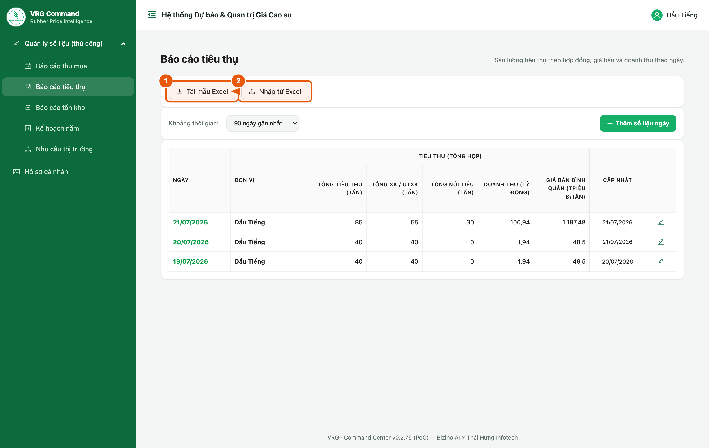
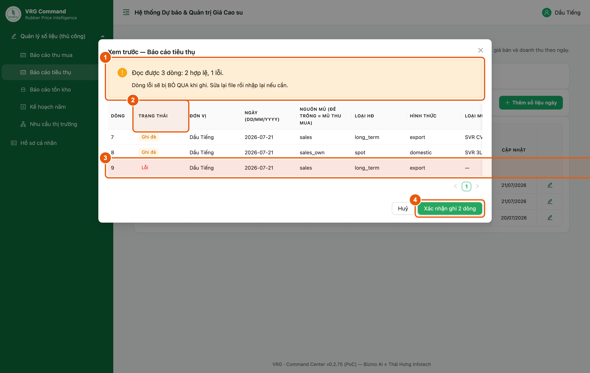

# Hướng dẫn nhập liệu bằng Excel

Thay vì gõ tay từng ngày trên web, có thể tải file Excel mẫu về điền rồi nhập lên. Tài liệu này mô tả ba biểu mẫu — Thu mua, Tiêu thụ, Tồn kho — kèm ý nghĩa từng cột và cách xử lý dòng lỗi. Ba file mẫu đính kèm trong thư mục 'mau'. Tài liệu bám theo phiên bản 0.2.75.

> Bản Word đầy đủ (có ảnh chú thích): [Huong-dan-nhap-lieu-bang-Excel.docx](./Huong-dan-nhap-lieu-bang-Excel.docx)
> File mẫu: [Thu mua](mau/mau-thu-mua.xlsx) · [Tiêu thụ](mau/mau-tieu-thu.xlsx) · [Tồn kho](mau/mau-ton-kho.xlsx)

## 1. Quy trình chung — bốn bước

**Vị trí:** Màn Báo cáo thu mua / Báo cáo tiêu thụ / Báo cáo tồn kho / Kế hoạch năm

Bốn màn báo cáo đều có cùng hai nút ở đầu trang. Quy trình giống nhau cho cả ba biểu mẫu: tải mẫu về, điền số, nhập lên xem trước, rồi mới xác nhận ghi.

*Hình 1. Hai nút Tải mẫu Excel và Nhập từ Excel*

1. **Tải mẫu Excel** — luôn tải mẫu MỚI từ nút này trước khi điền.
2. Điền số vào file vừa tải. **Không đổi tên cột, không xoá dòng tiêu đề** — hệ thống dò cột theo đúng tên tiêu đề.
3. **Nhập từ Excel** → chọn file đã điền. Hệ thống đọc file và mở bảng **xem trước** (chưa ghi gì cả).
4. Soát bảng xem trước rồi bấm **Xác nhận ghi** — chỉ khi đó số liệu mới vào hệ thống.

> - **Đừng dùng lại file tải từ lần trước** — mẫu có thể đã thêm cột; file cũ thiếu cột sẽ nhập thiếu số mà không báo gì.
> - File mẫu đính kèm tài liệu này chỉ để tham khảo và tập điền. **File chuẩn luôn là file tải từ nút Tải mẫu Excel** trên hệ thống.
> - Tài khoản đơn vị thành viên tải về sẽ **không có cột 'Đơn vị'** — hệ thống tự gán đúng đơn vị của tài khoản. Tài khoản chuyên viên thì có cột này và phải điền tên đơn vị đúng như trong danh mục.
> - Dữ liệu bắt đầu từ **dòng 7** của file mẫu (dòng 5 là tiêu đề, dòng 6 là đơn vị tính). Điền từ dòng 7 trở xuống, mỗi dòng một bản ghi.

## 2. Đọc bảng xem trước và xử lý dòng lỗi

**Vị trí:** Sau khi chọn file ở nút Nhập từ Excel

Bảng xem trước cho biết hệ thống đọc được gì TRƯỚC khi ghi. Đây là bước quan trọng nhất — soát ở đây rẻ hơn nhiều so với sửa số đã ghi.

*Hình 2. Bảng xem trước — 2 dòng hợp lệ, 1 dòng lỗi*

1. **Dòng tóm tắt** — đọc được bao nhiêu dòng, bao nhiêu hợp lệ, bao nhiêu lỗi.
2. **Cột Trạng thái** — *Tạo mới* (ngày đó chưa có số) hoặc *Ghi đè* (đã có số, nhập lên sẽ thay).
3. **Dòng lỗi** tô đỏ; cột **Ghi chú** ở cuối bảng (kéo ngang để xem) nói rõ sai ở đâu, vd *Loại mủ: 'SVR 99' không hợp lệ*.
4. **Xác nhận ghi N dòng** — số N chỉ đếm dòng HỢP LỆ. Dòng lỗi bị bỏ qua, không ghi gì.

> - Sửa dòng lỗi ngay trong file Excel rồi nhập lại — dòng đã ghi đúng sẽ được ghi đè, **không bị nhân đôi**.
> - Cột **Dòng** là số dòng trong file Excel, dùng để tìm nhanh chỗ cần sửa.
> - Bảng xem trước hiện **giá trị hệ thống** của các cột chọn từ danh sách (vd *sales* / *sales_own*, *long_term*, *export*) chứ không phải nhãn tiếng Việt. Đây chỉ là cách hiển thị; số liệu ghi vào vẫn đúng.
> - Nhập biểu Tiêu thụ **không** làm mất số Tồn kho của cùng ngày và ngược lại.

## 3. Mẫu Thu mua

**Vị trí:** Báo cáo thu mua → Tải mẫu Excel  ·  file đính kèm: mau/mau-thu-mua.xlsx

Mỗi dòng = một đơn vị trong một ngày. Đơn giá mủ nước và mủ chén nhập ở đây đồng thời ghi vào kho 'Giá mủ nguyên liệu'.

**Các cột (dấu * = bắt buộc):**

1. **Đơn vị** * — chỉ có ở mẫu của chuyên viên; mẫu của đơn vị thành viên không có cột này.
2. **Ngày** * — dd/mm/yyyy.
3. **SL thu mua mủ nước** · **SL thu mua mủ chén** — tấn (quy khô).
4. **Đơn giá mủ nước** — đồng/độ TSC.
5. **Đơn giá mủ chén** — đồng/độ; đơn vị tính phụ thuộc cột kế bên.
6. **Đơn giá mủ chén tính theo** — chọn *Độ TSC* hoặc *Độ DRC*; để trống hiểu là **Độ TSC**.
7. **SL thu mua thành phẩm** — tấn (mua lại mủ đã chế biến).
8. **Đơn giá thành phẩm (VNĐ)** — triệu đ/tấn.  **Đơn giá thành phẩm (ngoại tệ)** — USD/tấn.

> - Ngày đơn vị **không tổ chức thu mua** thì không nhập bằng Excel — vào form trên web tích ô 'Hôm nay đơn vị KHÔNG tổ chức thu mua', vì đó là tình huống khác với 'có mua nhưng mua được 0 tấn'.
> - Sản lượng tiêu thụ và doanh thu **không còn ở biểu Thu mua** — đã chuyển sang biểu Tiêu thụ.

## 4. Mẫu Tiêu thụ

**Vị trí:** Báo cáo tiêu thụ → Tải mẫu Excel  ·  file đính kèm: mau/mau-tieu-thu.xlsx

Mỗi dòng = một hợp đồng bán. Cùng một đơn vị và một ngày có thể có nhiều dòng, hệ thống tự cộng lại.

**Các cột (dấu * = bắt buộc):**

1. **Đơn vị** * · **Ngày** * — như mẫu Thu mua.
2. **Nguồn mủ** — chọn *Mủ thu mua* hoặc *Mủ khai thác*; để trống hiểu là **Mủ thu mua**. Hai nguồn lưu riêng nhưng mọi số tổng cộng chung.
3. **Loại HĐ** * (*Dài hạn* / *Chuyến*) · **Hình thức** * (*XK / UTXK* / *Nội tiêu*) · **Loại mủ** * — phải chọn đúng giá trị trong danh sách.
4. **Số lượng** — tấn.
5. **Giá bán** — đơn vị tuỳ cột kế bên: **triệu đ/tấn** khi VND, **USD/tấn** khi USD.
6. **Giá bán bằng** — *VND* hoặc *USD*, chọn cho **TỪNG DÒNG**. Trong một ngày vừa bán USD vừa bán VNĐ vẫn nhập chung một file.
7. **Ngày xuất kho** · **Ngày xuất hoá đơn** — dd/mm/yyyy, chưa có thì để trống.

> - File Tiêu thụ **ghi đè toàn bộ** phần tiêu thụ của ngày đó, **cả mủ thu mua lẫn mủ khai thác**. Dòng nào đã nhập trên web mà không có trong file sẽ bị xoá — hãy chép đủ cả hai nguồn vào file trước khi nhập.
> - Dòng bán bằng **USD** cần tỷ giá USD/VNĐ mới tính được doanh thu. Tỷ giá nhập trên web (màn Báo cáo tiêu thụ, nút *Lấy tỷ giá VCB*), Excel không mang theo. Thiếu tỷ giá thì dòng đó chưa được cộng vào doanh thu và hệ thống sẽ báo lại.
> - **Ba file đính kèm — bộ Hợp đồng · phiếu xuất kho · hoá đơn — phải tải lên trên web**, file Excel không mang theo file đính kèm được.

## 5. Mẫu Tồn kho

**Vị trí:** Báo cáo tồn kho → Tải mẫu Excel  ·  file đính kèm: mau/mau-ton-kho.xlsx

Mỗi dòng = một dòng tồn kho. Tồn kho là số tại thời điểm cuối ngày, KHÔNG cộng dồn giữa các ngày, đơn vị tính là tấn.

**Các cột (dấu * = bắt buộc):**

1. **Đơn vị** * · **Ngày** * — như trên.
2. **Nhóm** * — chọn một trong ba: *Chế biến chưa nhập kho* · *Đã nhập kho* · *Đã ký HĐ*.
3. **Chủng loại** * — chọn đúng giá trị trong danh sách.
4. **Số lượng** — tấn.
5. **Đơn giá** và **Đơn giá bằng** (*VND* / *USD*) — chỉ dùng cho nhóm *Đã ký HĐ*.
6. **Lịch giao** — dd/mm/yyyy, chỉ dùng cho nhóm *Đã ký HĐ*.
7. **Tồn kho nguyên liệu chưa sản xuất (quy khô)** — tấn; điền ở MỘT dòng bất kỳ của ngày đó là đủ.

> - Nhóm *Đã ký HĐ* là **cam kết giao hàng**, đứng riêng — không cộng vào và không trừ khỏi tồn kho thành phẩm, nên ký nhiều hơn lượng đang có cũng không sao.
> - **File Hợp đồng đã ký scan** phải đính kèm trên web, Excel không mang theo được.
> - Chủng loại tách theo từng loại giống bảng Giá sàn Tập đoàn — **SVR CV 50** và **SVR CV60** là hai loại riêng.

## 6. Lỗi thường gặp

Các lỗi hay gặp nhất khi nhập file, và cách xử lý.

**Đối chiếu thông báo ở cột Ghi chú:**

1. *Ngày: ngày không hợp lệ* — ô ngày đang là chữ. Định dạng ô theo **Date** hoặc gõ đúng dd/mm/yyyy.
2. *Loại mủ: '…' không hợp lệ* — gõ sai tên chủng loại. Dùng ô chọn sẵn (dropdown) trong file mẫu, đừng gõ tay.
3. *Đơn vị '…' không có trong danh mục* — sai tên đơn vị; lấy đúng tên trong ô chọn của file mẫu.
4. *Đơn vị '…' không thuộc quyền của tài khoản* — đang nhập cho đơn vị khác. Tài khoản đơn vị chỉ nhập được cho chính mình.
5. *File thiếu cột bắt buộc* — đang dùng file cũ hoặc đã sửa tên cột. Tải lại mẫu mới và chép số sang.
6. *… không phải số* — ô có chữ hoặc ký tự lạ (dấu cách, đơn vị tính). Chỉ để lại con số.

> - Chỉ nhập được ngày hôm nay và một số ngày gần nhất theo quy định; ngày cũ hơn hệ thống sẽ từ chối ghi.
> - Nhập lại cùng một ngày là **ghi đè**, không nhân đôi — cứ sửa file rồi nhập lại cho tới khi đúng.
