# Hướng dẫn nhập liệu — Đơn vị thành viên

Tài liệu dành cho cán bộ đơn vị thành viên VRG nhập số liệu trên Hệ thống Dự báo & Quản trị Giá Cao su. Tài khoản đơn vị chỉ thấy và chỉ nhập được số liệu của chính đơn vị mình.

Từ **30/07/2026**, số tiêu thụ **không còn nhập tay theo ngày** — hệ thống tự tính từ các lần giao ghi trên hợp đồng. Đơn vị nhập 4 mục theo ngày/năm và quản lý hợp đồng bán hàng của mình; hai mục còn lại chỉ để xem.

> Bản Word đầy đủ (có ảnh chú thích): [Huong-dan-nhap-lieu-don-vi-thanh-vien.docx](./Huong-dan-nhap-lieu-don-vi-thanh-vien.docx)
> Dựng lại ảnh khi giao diện đổi: `uv run --directory apps/api --with playwright python ../../docs/huong-dan/nhap-lieu-don-vi-thanh-vien/shoot.py`

## 1. Có gì thay đổi so với cách làm cũ

Đơn vị đã quen hệ thống trước 30/07 cần nắm 4 thay đổi sau.

1. **Không còn phiếu nhập tiêu thụ theo ngày.** Trước đây mỗi ngày khai các dòng bán; nay mỗi lần giao hàng được ghi thành **một phụ lục của hợp đồng**, hệ thống tự cộng vào tiêu thụ đúng ngày giao.
2. **Không còn khối “đã ký HĐ chưa giao” trong phiếu tồn kho.** Số này nay **tự tính** từ các đợt giao đã mở nhưng chưa tới ngày giao. Phiếu tồn kho còn đúng 3 khối nhập tay.
3. **Có thêm danh mục Khách hàng.** Mỗi hợp đồng phải gắn một khách hàng của đơn vị — nhờ đó báo cáo tách được sản lượng và doanh thu theo từng khách.
4. **Hợp đồng nhập trước 30/07 chuyển sang mục “Hợp đồng cũ”**, chỉ để tra cứu, không sửa được. Số liệu cũ vẫn còn nguyên.

> Số tiêu thụ của các kỳ trước 30/07 chỉ hiện lại trên báo cáo sau khi Ban TTKD chạy chuyển đổi dữ liệu. Trong lúc chờ, báo cáo có dòng cảnh báo màu vàng nói rõ phần nào chưa được tính.

## 2. Đăng nhập và các mục trên menu

**Vị trí:** Menu bên trái

Sau khi đăng nhập bằng tài khoản đơn vị, menu bên trái hiển thị đúng các mục đơn vị cần làm, chia thành 3 nhóm. Số liệu nhập vào luôn tự gắn với đơn vị của tài khoản — không cần và không thể chọn đơn vị khác.

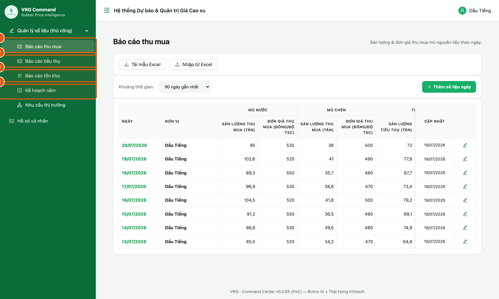

*Hình 1. Menu của tài khoản đơn vị thành viên*

1. **Nhập liệu số liệu** — Thu mua (theo ngày) · Tồn kho (theo ngày) · Nhu cầu thị trường · Kế hoạch năm.
2. **Quản lý hợp đồng** — Khách hàng · Hợp đồng & phụ lục. Đây là nơi ghi việc bán hàng.
3. **Báo cáo** — Tiêu thụ (số hệ thống tự tính) · Hợp đồng cũ trước 30/07 (chỉ tra cứu).

> - Đơn vị **không được giao kế hoạch thu mua** sẽ không thấy mục *Thu mua* và *Kế hoạch năm*.
> - Chỉ nhập/sửa được ngày hôm nay và một số ngày gần nhất theo quy định; ngày cũ hơn chỉ để xem.

## 3. Màn hình danh sách và nút thao tác

**Vị trí:** Nhập liệu số liệu → Thu mua (các màn khác bố trí tương tự)

Mỗi màn nhập theo ngày đều có danh sách các ngày đã nhập kèm dòng luỹ kế.

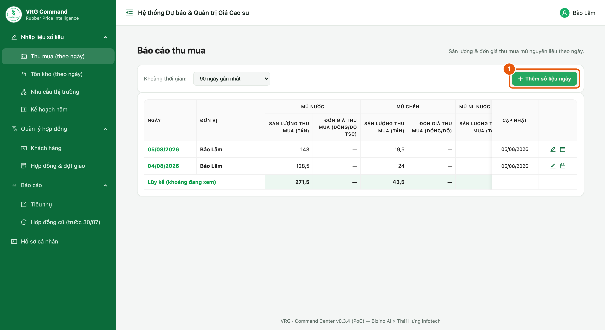

*Hình 2. Danh sách theo ngày và các nút thao tác*

1. **Thêm số liệu ngày** — mở phiếu nhập cho một ngày mới.
2. **Biểu tượng bút** ở cuối mỗi dòng — mở lại phiếu của ngày đó để sửa.

> - Danh sách chỉ hiện những ngày **đã có số liệu**; ngày chưa nhập sẽ không xuất hiện.
> - Chọn **Khoảng thời gian** ở góc trái để xem xa hơn 90 ngày.

## 4. Nhập Thu mua

**Vị trí:** Nhập liệu số liệu → Thu mua → Thêm số liệu ngày

Phiếu chia theo loại mủ, mỗi loại nhập sản lượng và đơn giá đi liền nhau.

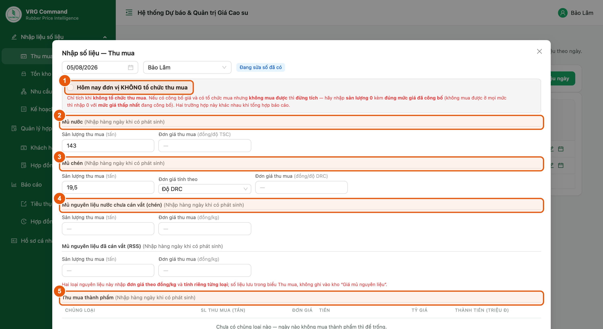

*Hình 3. Phiếu Thu mua theo ngày*

1. **Hôm nay đơn vị KHÔNG tổ chức thu mua** — chỉ tích khi thật sự không tổ chức mua. Có công bố giá và có tổ chức mua nhưng không mua được thì **đừng tích**: nhập sản lượng 0 kèm đúng mức giá đã công bố. Hai trường hợp này khác nhau khi tổng hợp báo cáo.
2. **Mủ nước** — sản lượng (tấn, quy khô) và đơn giá (đồng/độ TSC).
3. **Mủ chén** — sản lượng, chọn **Đơn giá tính theo** *Độ TSC* hay *Độ DRC*; nhãn ô đơn giá đổi theo lựa chọn này.
4. **Mủ nguyên liệu nước chưa cán vắt (chén)** và **Mủ nguyên liệu đã cán vắt (RSS)** — hai loại này nhập **đơn giá theo đồng/kg**, tính riêng từng loại.
5. **Thu mua thành phẩm** — bảng nhập, **mỗi chủng loại mua trong ngày là một dòng riêng**: Chủng loại · SL · Đơn giá · Loại tiền · Tỷ giá (chỉ hiện khi dòng chọn ngoại tệ). Cột Thành tiền tự tính.

> - Ngày nào không phát sinh loại nào thì để trống loại đó, không nhập số 0.
> - Nút **Lấy tỷ giá VCB cho các dòng USD** điền tỷ giá Vietcombank cho mọi dòng đang chọn USD.

## 5. Nhập Tồn kho

**Vị trí:** Nhập liệu số liệu → Tồn kho → Thêm số liệu ngày

Tồn kho là **số tại thời điểm cuối ngày**, không cộng dồn giữa các ngày. Phiếu còn đúng 3 khối nhập tay.

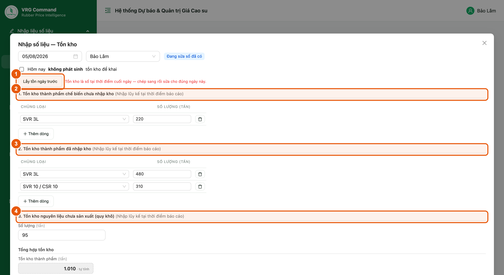

*Hình 4. Phiếu Tồn kho theo ngày*

1. **Lấy tồn ngày trước** — chép số tồn của ngày gần nhất sang rồi sửa cho đúng ngày này.
2. **Khối 1 — Tồn kho thành phẩm chế biến chưa nhập kho**: mỗi chủng loại một dòng.
3. **Khối 2 — Tồn kho thành phẩm đã nhập kho**: mỗi chủng loại một dòng.
4. **Khối 3 — Tồn kho nguyên liệu chưa sản xuất (quy khô)**: một ô tổng.

> - Ô **Tồn kho thành phẩm** ở cuối phiếu là số **tự tính** = khối 1 + khối 2.
> - Sản lượng **đã ký hợp đồng nhưng chưa giao** không còn nhập ở đây — hệ thống tự tính từ hợp đồng, xem ở cột *Chưa giao* trên màn Báo cáo tiêu thụ.
> - Tích **Hôm nay không phát sinh tồn kho để khai** nếu ngày đó đơn vị không có gì để báo.

## 6. Khách hàng

**Vị trí:** Quản lý hợp đồng → Khách hàng

Danh mục khách hàng **riêng của từng đơn vị** — đơn vị khác không thấy danh mục của đơn vị mình. Phải có khách hàng trước thì mới lập được hợp đồng.

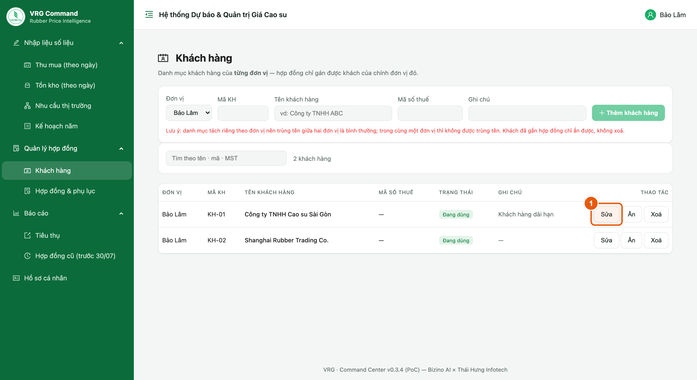

*Hình 5. Danh mục khách hàng của đơn vị*

1. **Thêm khách hàng** — nhập tên khách, mã khách (tuỳ chọn) và ghi chú.
2. **Sửa / Xoá** ở cuối mỗi dòng.

> - Trùng tên trong cùng một đơn vị sẽ bị chặn; hai đơn vị khác nhau được phép trùng tên khách.
> - Khách hàng đang có hợp đồng thì không xoá được — hãy ngưng sử dụng thay vì xoá.

## 7. Hợp đồng & phụ lục — danh sách

**Vị trí:** Quản lý hợp đồng → Hợp đồng & phụ lục

Danh sách các **hợp đồng mẹ** kèm tiến độ giao hàng.

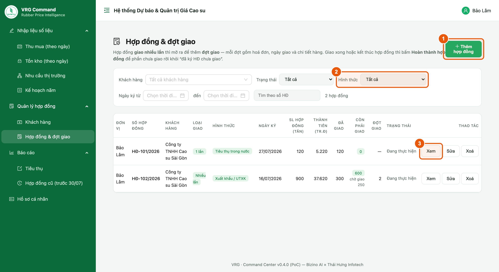

*Hình 6. Danh sách hợp đồng và tiến độ giao*

1. **Thêm hợp đồng** — lập hợp đồng mới (xem mục 8).
2. **Xem / Sửa / Xoá** ở cuối mỗi dòng. Bấm **Xem** để mở màn chi tiết (mục 9).

Ý nghĩa các cột tiến độ:

- **Cam kết** — tổng sản lượng ghi trên hợp đồng.
- **Đã giao** — tổng của các phụ lục đã điền ngày giao.
- **Chờ giao** — đợt đã mở nhưng chưa tới ngày giao; đây chính là phần “đã ký HĐ chưa giao”.
- **Chưa mở đợt** — phần cam kết chưa được chia thành phụ lục nào.

## 8. Thêm hợp đồng

**Vị trí:** Quản lý hợp đồng → Hợp đồng & phụ lục → Thêm hợp đồng

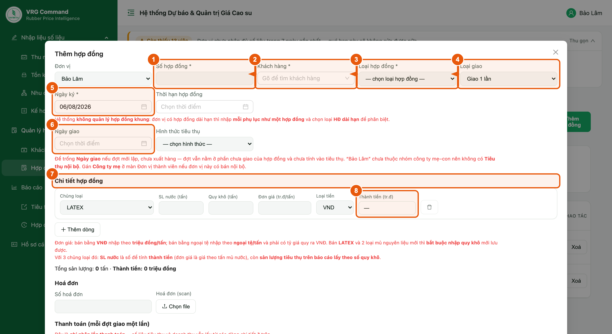

*Hình 7. Phiếu thêm hợp đồng*

1. **Số hợp đồng** — bắt buộc, không trùng trong cùng đơn vị.
2. **Khách hàng** — bắt buộc, chọn từ danh mục ở mục 6.
3. **Loại hợp đồng** — bắt buộc: *HĐ dài hạn* hay *HĐ chuyến*. Đây là chỉ tiêu của báo cáo, **khác** với Loại giao bên dưới.
4. **Loại giao** — *Giao 1 lần* (cả hợp đồng giao trọn một lần) hay *Giao nhiều lần* (chia thành nhiều phụ lục).
5. **Ngày ký** — bắt buộc.
6. **Ngày bắt đầu (mở đợt)** — ngày hàng bắt đầu gom vào kho cho đợt này; chỉ hiện với hợp đồng giao 1 lần.
7. **Chi tiết hợp đồng** — mỗi chủng loại một dòng. Ô **Quy khô** chỉ hiện với latex và mủ nguyên liệu; ô **Tỷ giá** chỉ hiện khi dòng bán bằng ngoại tệ.

> - Bán bằng **VNĐ** nhập đơn giá theo **triệu đồng/tấn**; bán bằng **ngoại tệ** nhập theo **ngoại tệ/tấn** và **phải có tỷ giá** quy ra VNĐ, nếu không doanh thu sẽ hiện “—”.
> - Bán **LATEX** và 2 loại mủ nguyên liệu thì **bắt buộc nhập quy khô** mới lưu được.
> - Hợp đồng **giao 1 lần**: điền **Ngày giao** ngay trên hợp đồng khi đã giao xong.
> - Hợp đồng **giao nhiều lần**: không tự đánh dấu đã giao — mỗi lần giao nhập một phụ lục.

## 9. Màn chi tiết hợp đồng

**Vị trí:** Quản lý hợp đồng → Hợp đồng & phụ lục → bấm **Xem** ở dòng hợp đồng

Nơi theo dõi tiến độ một hợp đồng và nhập các lần giao của nó.

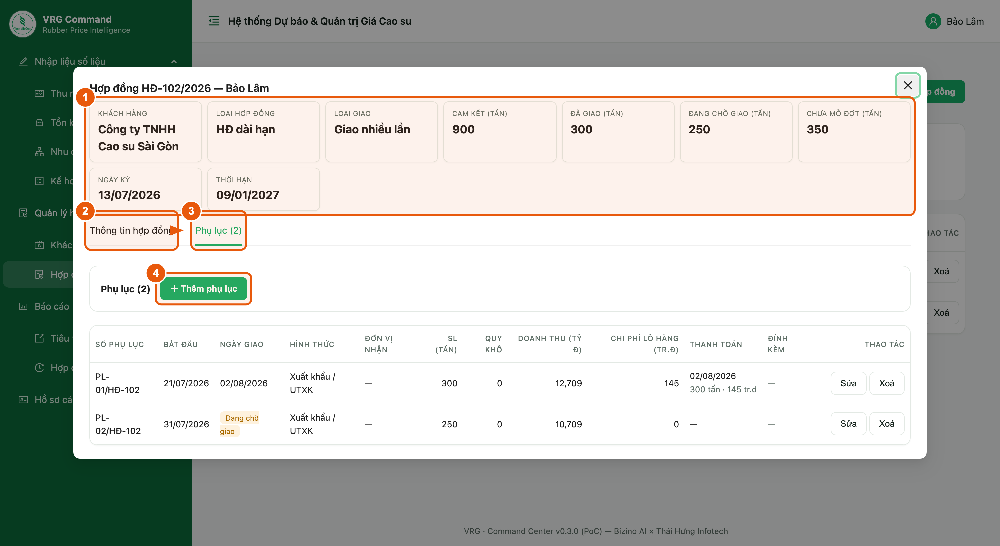

*Hình 8. Màn chi tiết hợp đồng*

1. **Hàng số liệu** — khách hàng, loại hợp đồng, sản lượng cam kết, đã giao, đang chờ giao, chưa mở đợt. Luôn hiện dù đang ở tab nào.
2. **Tab Thông tin hợp đồng** — sửa hợp đồng, file scan, ghi chú và các dòng chi tiết đã ký.
3. **Tab Phụ lục** — danh sách các lần giao; hợp đồng giao nhiều lần mở thẳng vào tab này.
4. **Thêm phụ lục** — ghi một lần giao mới (xem mục 10).

> - Hợp đồng **giao 1 lần** không có tab Phụ lục: chính hợp đồng là một lần giao.
> - Nút Thêm phụ lục mờ đi khi đã giao đủ sản lượng cam kết.

## 10. Thêm phụ lục — mỗi phụ lục là một lần giao

**Vị trí:** Màn chi tiết hợp đồng (mục 9) → tab Phụ lục → Thêm phụ lục

Mỗi phụ lục = **một đợt giao + một lần thanh toán**. Đây là cách ghi nhận tiêu thụ của cơ chế mới.

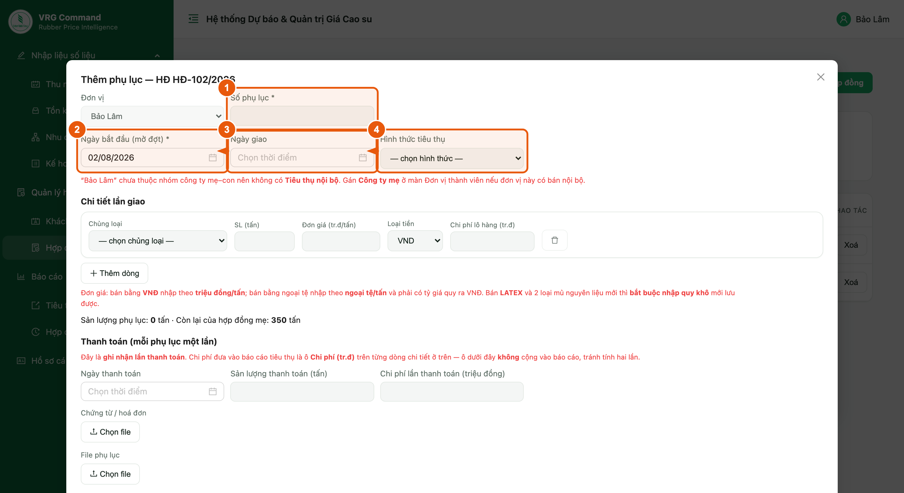

*Hình 9. Phiếu thêm phụ lục*

1. **Số phụ lục** — bắt buộc.
2. **Ngày bắt đầu (mở đợt)** — bắt buộc; từ ngày này hàng của đợt nằm ở “đã ký HĐ chưa giao”.
3. **Ngày giao** — để trống nghĩa là **đang chờ giao**; điền vào là đợt đã giao xong và **tính ngay vào tiêu thụ của ngày đó**.
4. **Hình thức tiêu thụ** — *Xuất khẩu / UTXK* · *Tiêu thụ trong nước* · *Tiêu thụ nội bộ*. Bắt buộc khi đã giao.
5. **Chi tiết lần giao** — chủng loại, sản lượng, đơn giá thực tế của lần giao này. Ô Quy khô và Tỷ giá chỉ hiện khi áp dụng, giống phiếu hợp đồng.
6. **Thanh toán** — ngày thanh toán, sản lượng và chi phí của lần thanh toán, kèm chứng từ/hoá đơn.

> - Tổng sản lượng các phụ lục **không được vượt** cam kết của hợp đồng mẹ; phiếu hiện sẵn dòng *Còn lại của hợp đồng mẹ*.
> - **Tiêu thụ nội bộ** chỉ hiện khi đơn vị thuộc một nhóm công ty mẹ–con, và chỉ chọn được đơn vị trong cùng nhóm.
> - Chi phí đưa vào báo cáo là ô **Chi phí** trên từng dòng chi tiết; ô chi phí ở khối Thanh toán **không** cộng vào báo cáo.
> - Lần giao đã ghi quá **số ngày cho phép sửa** sẽ chuyển sang **chỉ xem** (dòng hiện “(chỉ xem)” thay cho nút Sửa/Xoá) — kỳ báo cáo đã chốt thì không sửa lùi được nữa. Hợp đồng mẹ **không** bị khoá, vẫn thêm phụ lục mới bình thường.

## 11. Báo cáo tiêu thụ

**Vị trí:** Báo cáo → Tiêu thụ

Bảng **chỉ để xem** — số do hệ thống tổng hợp từ các lần giao, đơn vị không nhập tay.

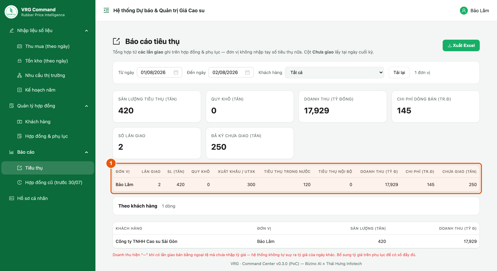

*Hình 10. Báo cáo tiêu thụ theo kỳ*

1. **Bảng tổng hợp** — Lần giao · SL · Quy khô · Xuất khẩu · Trong nước · Nội bộ · Doanh thu · Chi phí · **Chưa giao**.

> - Chọn **Từ ngày / Đến ngày** để đổi kỳ; lọc thêm theo **Khách hàng** nếu cần.
> - Cột **Chưa giao** là số **tại ngày cuối kỳ**, không phải số cộng dồn.
> - Khối **Theo khách hàng** bên dưới tách sản lượng và doanh thu theo từng khách.
> - **Xuất Excel** để lấy đúng bảng đang xem.
> - Doanh thu hiện “—” khi có lần giao bán ngoại tệ mà chưa nhập tỷ giá — bổ sung tỷ giá trên phụ lục để có số đầy đủ.

## 12. Nhu cầu thị trường

**Vị trí:** Nhập liệu số liệu → Nhu cầu thị trường

Ghi nhận nhu cầu và tín hiệu thị trường của đơn vị, **nhập tự do bằng chữ** theo ngày.

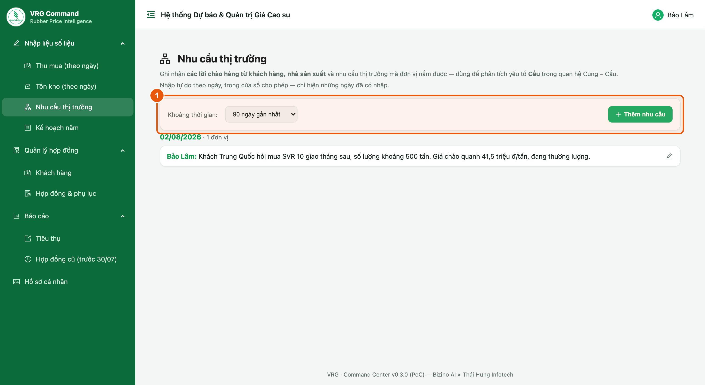

*Hình 11. Nhu cầu thị trường theo ngày*

1. Chọn ngày rồi viết nội dung: khách hỏi mua gì, số lượng, mức giá chào, tình hình thương lượng.

> Viết ngắn gọn nhưng có **con số cụ thể** (chủng loại, sản lượng, mức giá) — Ban TTKD dùng thông tin này để đối chiếu với diễn biến giá sàn.

## 13. Kế hoạch năm

**Vị trí:** Nhập liệu số liệu → Kế hoạch năm

Số liệu nhập **một lần cho cả năm**, cập nhật khi có điều chỉnh.

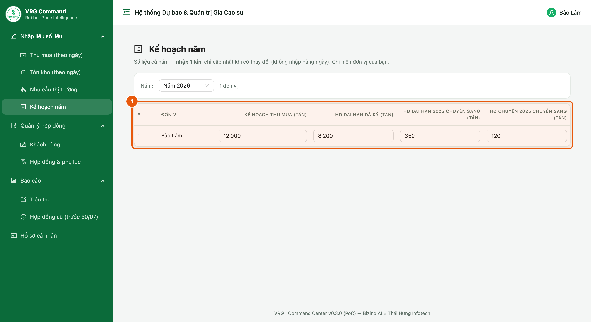

*Hình 12. Kế hoạch năm của đơn vị*

1. **Kế hoạch thu mua** (tấn) — dùng để tính % hoàn thành kế hoạch trên báo cáo.
2. **HĐ dài hạn đã ký** (tấn) trong năm.
3. **HĐ dài hạn / HĐ chuyến năm trước chuyển sang** (tấn).

## 14. Hợp đồng cũ (trước 30/07)

**Vị trí:** Báo cáo → Hợp đồng cũ (trước 30/07)

Toàn bộ hợp đồng đã ký nhập theo cách cũ, **kể cả hợp đồng đã giao**. Màn này **chỉ để tra cứu** — không có nút sửa.

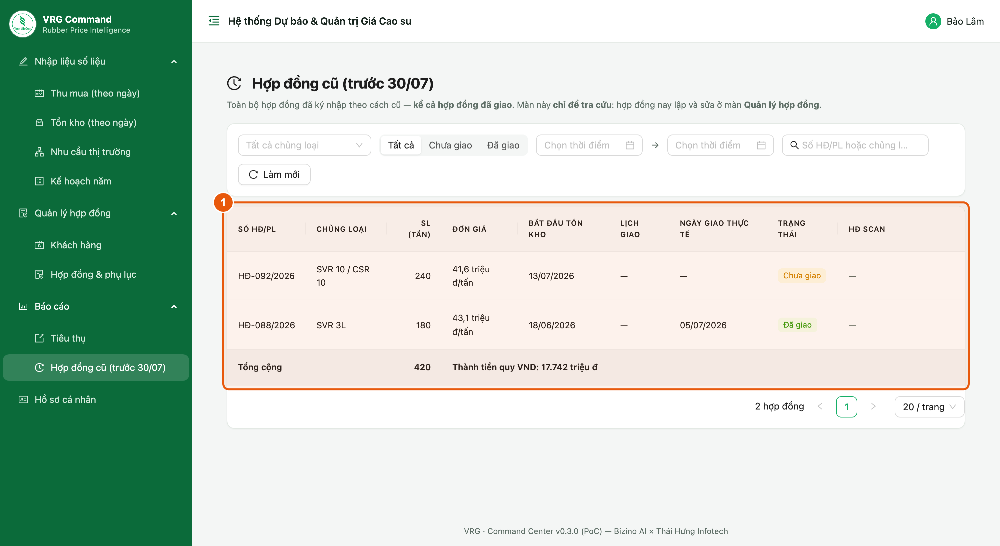

*Hình 13. Tra cứu hợp đồng cũ*

1. Lọc theo khu vực, đơn vị, chủng loại, trạng thái giao và khoảng thời gian; tìm nhanh theo số HĐ.

> - Hợp đồng phát sinh từ 30/07 trở đi nằm ở mục **Hợp đồng & phụ lục**, không nằm ở đây.
> - Cần sửa một hợp đồng cũ thì báo Ban TTKD.

## 15. Những lỗi hay gặp

| Hiện tượng | Nguyên nhân & cách xử lý |
|---|---|
| Không lưu được hợp đồng, báo thiếu loại hợp đồng | Chưa chọn **HĐ dài hạn / HĐ chuyến** — đây là ô bắt buộc. |
| Doanh thu trên báo cáo hiện “—” | Có lần giao bán ngoại tệ chưa nhập tỷ giá. Mở phụ lục, điền tỷ giá quy ra VNĐ. |
| Báo cáo tiêu thụ ra 0 dù đơn vị có bán | Ngày giao nằm ngoài kỳ đang xem, hoặc phụ lục **chưa điền Ngày giao** (vẫn đang chờ giao). |
| Không thấy “Tiêu thụ nội bộ” | Đơn vị chưa thuộc nhóm công ty mẹ–con. Báo Ban TTKD gán Công ty mẹ. |
| Không lưu được phụ lục, báo vượt sản lượng | Tổng các phụ lục vượt cam kết của hợp đồng mẹ. Kiểm lại dòng *Còn lại của hợp đồng mẹ*. |
| Không sửa được số liệu ngày cũ | Ngoài cửa sổ sửa cho phép. Báo Ban TTKD nếu cần mở lại. |
| Phụ lục hiện “(chỉ xem)”, không có nút Sửa | Lần giao đã quá số ngày cho phép sửa. Báo Ban TTKD nếu thật sự cần chỉnh. |
