# Hướng dẫn nhập liệu — Đơn vị thành viên

Tài liệu dành cho cán bộ đơn vị thành viên VRG nhập số liệu trên Hệ thống Dự báo & Quản trị Giá Cao su. Tài khoản đơn vị chỉ thấy và chỉ nhập được số liệu của chính đơn vị mình.

Số tiêu thụ **không còn nhập tay theo ngày** — hệ thống tự tính từ các **đợt giao** ghi trên hợp đồng. Đơn vị nhập 4 mục theo ngày/năm và quản lý hợp đồng bán hàng của mình; hai mục còn lại chỉ để xem.

> Bản Word đầy đủ (có ảnh chú thích): [Huong-dan-nhap-lieu-don-vi-thanh-vien.docx](./Huong-dan-nhap-lieu-don-vi-thanh-vien.docx)
> Sửa nội dung: chỉ sửa `spec.json` rồi chạy `python3 render_readme.py` (dựng lại README) và `node build_guide.js spec.json` (dựng lại bản Word).
> Dựng lại ảnh khi giao diện đổi: `uv run --directory apps/api --with playwright python ../../docs/huong-dan/nhap-lieu-don-vi-thanh-vien/shoot.py` — thêm tham số để chụp lại vài ảnh, vd `… shoot.py 05` chỉ chụp màn Khách hàng.

## 1. Có gì thay đổi so với cách làm cũ

Đơn vị đã quen hệ thống trước 30/07 cần nắm 5 thay đổi sau.

1. **Không còn phiếu nhập tiêu thụ theo ngày.** Trước đây mỗi ngày khai các dòng bán; nay mỗi lần giao hàng được ghi thành **một đợt giao của hợp đồng**, hệ thống tự cộng vào tiêu thụ đúng ngày giao.
2. **Không còn khối “đã ký HĐ chưa giao” trong phiếu tồn kho.** Số này nay **tự tính** = sản lượng hợp đồng − đã giao. Phiếu tồn kho còn đúng 3 khối nhập tay.
3. **Có thêm danh mục Khách hàng.** Mỗi hợp đồng phải gắn một khách hàng của đơn vị — nhờ đó báo cáo tách được sản lượng và doanh thu theo từng khách.
4. **Hợp đồng nhập trước 30/07 chuyển sang mục “Hợp đồng cũ”**, chỉ để tra cứu, không sửa được. Số liệu cũ vẫn còn nguyên.
5. **Hợp đồng dài hạn có thể lập hồ sơ HỢP ĐỒNG MẸ.** Đơn vị ký HĐ nguyên tắc (HĐNT) hoặc HĐ dài hạn (HĐDH) thì lập một **hồ sơ hợp đồng mẹ** rồi nối các hợp đồng chuyến hàng vào đó — xem mục 9. Việc này **không bắt buộc**: không lập hồ sơ thì nhập hợp đồng y như trước.

> - Từ 05/08/2026 gọi là **đợt giao** thay cho “phụ lục”, và mỗi đợt ghi thêm **số hoá đơn** kèm file scan. Hợp đồng đã nhập trước đó giữ nguyên, chỉ đổi tên gọi trên màn hình.
> - **“Đã ký HĐ chưa giao” nay tính trên cả hợp đồng** (trước chỉ tính phần đã chia thành đợt) nên con số này sẽ lớn hơn trước — đó là phần hàng đã ký bán mà chưa giao, kể cả chưa sản xuất.
> - Từ 06/08/2026, **thêm/sửa khách hàng nhập trong popup**: trang Khách hàng chỉ còn nút **Thêm khách hàng**, bấm vào mới hiện ô nhập. Cách nhập và các quy tắc không đổi.
> - Từ 06/08/2026, mọi màn của đơn vị có thêm **bảng nhắc “còn thiếu gì”** ở đầu trang — xem mục 3. Đơn vị không phải tự dò xem mình đã nộp đủ chưa.
> - **Từ 22/08/2026 — tỷ giá chỉ bắt buộc khi đã điền Ngày giao.** Lúc ký hợp đồng chưa ai biết tỷ giá ngày giao hàng, nên ô này để trống vẫn lưu được; ô ghi *“khi giao”* thay vì *“bắt buộc”*. Khi chưa có tỷ giá thì **doanh thu tạm để trống**, không tính bằng 0.
> - **Từ 24/08/2026 — có thêm mục Hợp đồng mẹ (HĐNT/HĐDH)** trong nhóm Quản lý hợp đồng (mục 9). Màn *Hợp đồng & đợt giao* giữ nguyên như cũ, chỉ thêm **một ô chọn hợp đồng mẹ**; nối hồ sơ **không đổi** khách hàng hay bất kỳ số liệu nào của hợp đồng.
> - **Từ 24/08/2026 — Kế hoạch năm có thêm ô Kế hoạch doanh thu (tỷ đồng)** — xem mục 17.

## 2. Đăng nhập và các mục trên menu

**Vị trí:** Menu bên trái

Sau khi đăng nhập bằng tài khoản đơn vị, menu bên trái hiển thị đúng các mục đơn vị cần làm, chia thành 3 nhóm. Số liệu nhập vào luôn tự gắn với đơn vị của tài khoản — không cần và không thể chọn đơn vị khác.

*Hình 1. Menu của tài khoản đơn vị thành viên*

1. **Nhập liệu số liệu** — Thu mua (theo ngày) · Tồn kho (theo ngày) · Nhu cầu thị trường · Kế hoạch năm.
2. **Quản lý hợp đồng** — Khách hàng · Hợp đồng & đợt giao. Đây là nơi ghi việc bán hàng.
3. **Báo cáo** — Tiêu thụ (số hệ thống tự tính) · Hợp đồng cũ trước 30/07 (chỉ tra cứu).

> - Đơn vị **không được giao kế hoạch thu mua** sẽ không thấy mục “Thu mua”. Mục **Kế hoạch năm luôn hiện** cho mọi đơn vị — chính số khai ở đó mới bật màn Thu mua.
> - Chỉ nhập/sửa được ngày hôm nay và một số ngày gần nhất theo quy định; ngày cũ hơn chỉ để xem.

## 3. Bảng nhắc “còn thiếu gì”

**Vị trí:** Hiện sẵn ở đầu mọi màn hình

Ngay khi đăng nhập, hệ thống tự đối chiếu số liệu đơn vị đã nộp và hiện một bảng nhắc ở đầu màn hình: còn thiếu biểu nào, ngày nào. Mặc định bảng rà lại 14 ngày gần nhất — quản trị viên đổi được số ngày này (30, 300… tuỳ yêu cầu quản lý).

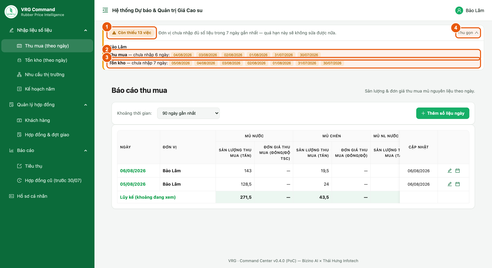

*Hình 1b. Bảng nhắc việc hiện ở đầu mọi màn hình*

1. **Số việc còn thiếu** — tổng số việc đơn vị chưa làm. Nếu đã nộp đủ, chỗ này là dòng xanh **“Đã nhập đủ”**.
2. **Thu mua** — các ngày chưa nhập biểu Thu mua. Chỉ hiện với đơn vị được giao kế hoạch thu mua.
3. **Tồn kho** — các ngày chưa nhập biểu Tồn kho.
4. **Thu gọn / Xem chi tiết** — thu bảng lại còn một dòng khi đang tập trung làm việc khác.

> - Ngày **màu cam** bấm vào là mở luôn phiếu nhập của đúng ngày đó — không phải tự đi tìm trong danh sách. Ngày **màu xám** là đã quá hạn sửa: đơn vị không tự nhập được nữa, phải báo Ban TTKD nhập hộ.
> - Nhập xong bảng tự trừ ngay việc đó, không cần tải lại trang.
> - Bảng còn nhắc: **chưa khai Kế hoạch năm** và **đợt giao bỏ trống ngày giao** (sản lượng của đợt đó chưa được tính vào tiêu thụ cho tới khi điền ngày giao).
> - Ngày đã tích “không tổ chức thu mua” / “không phát sinh tồn kho” được tính là **đã nộp** — không bị nhắc nữa.

## 4. Màn hình danh sách và nút thao tác

**Vị trí:** Nhập liệu số liệu → Thu mua (các màn khác bố trí tương tự)

Mỗi màn nhập theo ngày đều có danh sách các ngày đã nhập kèm dòng luỹ kế.

*Hình 2. Danh sách theo ngày và các nút thao tác*

1. **Thêm số liệu ngày** — mở phiếu nhập cho một ngày mới.
2. **Biểu tượng bút** ở cuối mỗi dòng — mở lại phiếu của ngày đó để sửa.

> - Danh sách chỉ hiện những ngày **đã có số liệu**; ngày chưa nhập sẽ không xuất hiện.
> - Chọn **Khoảng thời gian** ở góc trái để xem xa hơn 90 ngày.

## 5. Nhập Thu mua

**Vị trí:** Nhập liệu số liệu → Thu mua → Thêm số liệu ngày

Phiếu chia theo loại mủ, mỗi loại nhập sản lượng và đơn giá đi liền nhau.

*Hình 3. Phiếu Thu mua theo ngày*

1. **Hôm nay đơn vị KHÔNG tổ chức thu mua** — chỉ tích khi thật sự không tổ chức mua. Có công bố giá và có tổ chức mua nhưng không mua được thì **đừng tích**: nhập sản lượng 0 kèm đúng mức giá đã công bố. Hai trường hợp này khác nhau khi tổng hợp báo cáo.
2. **Mủ nước** — sản lượng (tấn, quy khô) và đơn giá (đồng/độ TSC).
3. **Mủ chén** — sản lượng, chọn **Đơn giá tính theo** “Độ TSC” hay “Độ DRC”; nhãn ô đơn giá đổi theo lựa chọn này.
4. **Thu mua thành phẩm** — bảng nhập, **mỗi chủng loại mua trong ngày là một dòng riêng**: Chủng loại · SL · Đơn giá · Loại tiền · Tỷ giá (chỉ hiện khi dòng chọn ngoại tệ). Cột Thành tiền tự tính.

> - Ngày nào không phát sinh loại nào thì để trống loại đó, không nhập số 0.
> - Nút **Lấy tỷ giá VCB cho các dòng USD** điền tỷ giá Vietcombank cho mọi dòng đang chọn USD.

## 6. Nhập Tồn kho

**Vị trí:** Nhập liệu số liệu → Tồn kho → Thêm số liệu ngày

Tồn kho là số tại thời điểm cuối ngày, không cộng dồn giữa các ngày. Phiếu còn đúng 3 khối nhập tay.

*Hình 4. Phiếu Tồn kho theo ngày*

1. **Lấy tồn ngày trước** — chép số tồn của ngày gần nhất sang rồi sửa cho đúng ngày này.
2. **Khối 1 — Tồn kho thành phẩm chế biến chưa nhập kho**: mỗi chủng loại một dòng.
3. **Khối 2 — Tồn kho thành phẩm đã nhập kho**: mỗi chủng loại một dòng.
4. **Khối 3 — Tồn kho nguyên liệu chưa sản xuất (quy khô)**: một ô tổng.

> - Ô **Tồn kho thành phẩm** ở cuối phiếu là số **tự tính** = khối 1 + khối 2.
> - Sản lượng **đã ký hợp đồng nhưng chưa giao** không còn nhập ở đây — hệ thống tự tính từ hợp đồng, xem ở cột “Chưa giao” trên màn Báo cáo tiêu thụ.
> - Tích **Hôm nay không phát sinh tồn kho để khai** nếu ngày đó đơn vị không có gì để báo.

## 7. Khách hàng

**Vị trí:** Quản lý hợp đồng → Khách hàng

Danh mục khách hàng riêng của từng đơn vị — đơn vị khác không thấy danh mục của đơn vị mình. Phải có khách hàng trước thì mới lập được hợp đồng.

*Hình 5. Danh mục khách hàng của đơn vị*

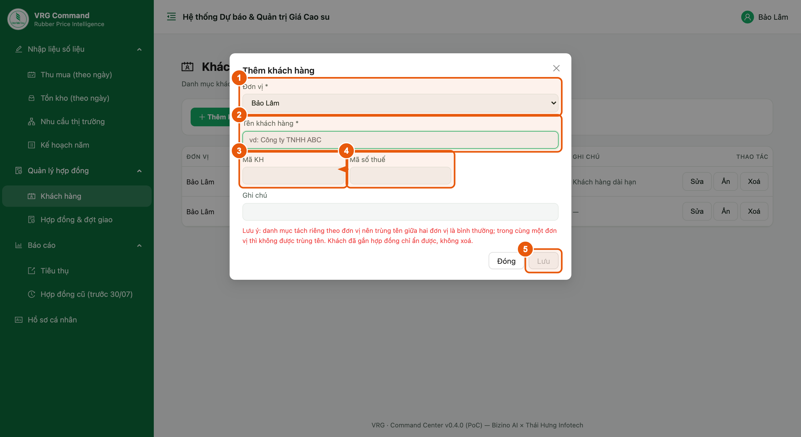

*Hình 5b. Popup thêm/sửa khách hàng*

1. **Thêm khách hàng** — bấm nút ở đầu trang (Hình 5 · ①), popup hiện ra để nhập.
2. Trong popup (Hình 5b): chọn **Đơn vị** (1), nhập **Tên khách hàng** (2) — bắt buộc; **Mã KH** (3) và **Mã số thuế** (4) nhập nếu có. Bấm **Lưu** (5), popup đóng lại và khách hàng hiện trong bảng.
3. **Sửa** ở cuối mỗi dòng (Hình 5 · ②) mở lại chính popup đó với dữ liệu đã điền sẵn; **Ẩn / Xoá** nằm cạnh bên.

> - Ô **Đơn vị** bị khoá khi sửa — khách hàng đã tạo không chuyển sang đơn vị khác được (hợp đồng đang gắn sẽ theo sang). Cần khách đó ở đơn vị khác thì tạo mới.
> - Trùng tên trong cùng một đơn vị sẽ bị chặn; hai đơn vị khác nhau được phép trùng tên khách.
> - Khách hàng đang có hợp đồng thì không xoá được — hãy ẩn thay vì xoá.

## 8. Hợp đồng mẹ (HĐNT/HĐDH)

**Vị trí:** Quản lý hợp đồng → Hợp đồng mẹ (HĐNT/HĐDH)

Nơi lưu **hồ sơ gốc** của hợp đồng nguyên tắc (HĐNT) hoặc hợp đồng dài hạn (HĐDH) đã ký với khách hàng: số hợp đồng, khách hàng, chủng loại kèm đơn giá, công thức giá và bản scan. Từng chuyến hàng vẫn nhập ở *Hợp đồng & đợt giao* như bình thường, chỉ chọn thêm hồ sơ này để nối vào. **Không bắt buộc** — đơn vị không có HĐNT/HĐDH thì bỏ qua mục này.

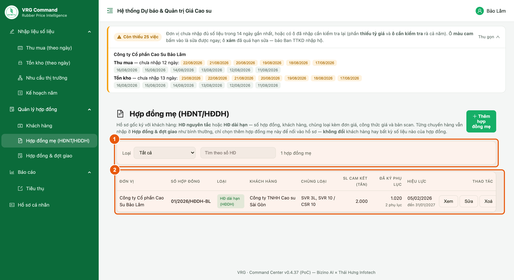

*Hình 5c. Danh sách hồ sơ hợp đồng mẹ*

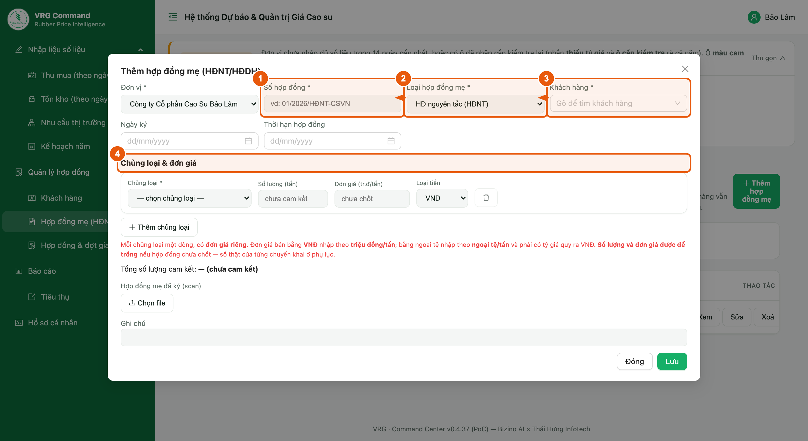

*Hình 5d. Phiếu thêm hợp đồng mẹ*

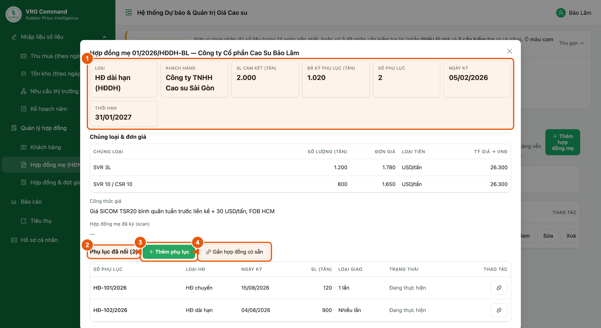

*Hình 5e. Chi tiết hồ sơ và danh sách phụ lục*

Lập hồ sơ:

1. Bấm **Thêm hợp đồng mẹ**.
2. **Số hợp đồng** — bắt buộc, không trùng trong cùng đơn vị.
3. **Loại hợp đồng mẹ** — bắt buộc: *HĐ nguyên tắc (HĐNT)* hay *HĐ dài hạn (HĐDH)*.
4. **Khách hàng** — bắt buộc, chọn trong danh mục khách của đơn vị (mục 7).
5. **Chủng loại & đơn giá** — mỗi chủng loại một dòng, **mỗi loại một đơn giá riêng**. **Số lượng và đơn giá được để trống** nếu hợp đồng chưa chốt (HĐNT thường chỉ ghi chủng loại).
6. **Công thức giá** — ô này **chỉ hiện với HĐ dài hạn**; HĐ nguyên tắc không có phần này.
7. **Hợp đồng mẹ đã ký (scan)** — đính kèm bản scan; **Ghi chú** nếu cần. Bấm **Lưu**.

> - **Nối phụ lục vào hồ sơ — có 2 cách**, đều nằm trong mục *Phụ lục* ở màn chi tiết hồ sơ (bấm **Xem**): **Thêm phụ lục** để nhập một hợp đồng mới ngay tại chỗ (đơn vị và hồ sơ đã chọn sẵn), hoặc **Gắn hợp đồng có sẵn** để chọn các hợp đồng đã nhập trước đó — danh sách chỉ hiện hợp đồng **của đơn vị mình** và **chưa thuộc hồ sơ nào**.
> - **Nối hoặc gỡ chỉ đổi liên kết**, KHÔNG đổi khách hàng, loại hợp đồng hay bất kỳ số liệu nào của hợp đồng. Gỡ ra thì hợp đồng vẫn còn nguyên, chỉ thôi thuộc hồ sơ.
> - **Hồ sơ hợp đồng mẹ không vào báo cáo sản lượng.** Tiêu thụ và “đã ký HĐ chưa giao” vẫn tính trên hợp đồng/đợt giao như trước — cộng cả hai cấp là đếm hai lần. Số *Đã ký phụ lục* trên hồ sơ chỉ để đối chiếu với sản lượng cam kết.
> - Muốn **xoá hồ sơ** thì phải **gỡ hết phụ lục** trước — tránh xoá nhầm làm mất liên kết của hàng loạt hợp đồng.
> - Ở màn *Hợp đồng & đợt giao* có ô lọc **Hợp đồng mẹ** để xem trọn các phụ lục của một hồ sơ, và ô tick **Chưa gắn hồ sơ** để rà những hợp đồng còn phải đưa vào hồ sơ.

## 9. Hợp đồng & đợt giao — danh sách

**Vị trí:** Quản lý hợp đồng → Hợp đồng & đợt giao

Danh sách các hợp đồng của đơn vị kèm tiến độ giao hàng.

*Hình 6. Danh sách hợp đồng và tiến độ giao*

1. **Thêm hợp đồng** — lập hợp đồng mới (xem mục 10).
2. **Lọc theo Hình thức** — *Xuất khẩu / UTXK* · *Tiêu thụ trong nước* · *Tiêu thụ nội bộ*, hoặc **Chưa khai hình thức** để tìm nhanh những hợp đồng cũ còn thiếu mục này.
3. **Xem / Sửa / Xoá** ở cuối mỗi dòng. Bấm **Xem** để mở màn chi tiết (mục 11).

> - **SL hợp đồng** — tổng sản lượng ghi trên hợp đồng đã ký.
> - **Đã giao** — tổng của các đợt giao đã điền ngày giao (kèm dòng *vượt …* nếu giao quá hợp đồng).
> - **Còn phải giao** = SL hợp đồng − Đã giao. Đây chính là phần “đã ký HĐ chưa giao”; dòng nhỏ *chờ giao …* cho biết trong đó bao nhiêu đã lập đợt nhưng chưa điền ngày giao.
> - **Hình thức** — hình thức tiêu thụ khai ở **lần giao**, nên hợp đồng giao nhiều lần hiện **tất cả** hình thức của các đợt; hợp đồng chưa giao lần nào thì để trống.
> - **Trạng thái** — *Đang thực hiện* hay *Hoàn thành dd/mm/yyyy*. Hợp đồng đã hoàn thành không còn tính vào “đã ký HĐ chưa giao” và bị khoá sửa.
> - Các bộ lọc dùng chung được: **Đơn vị · Khách hàng** (gõ để tìm, chọn nhiều) **· Trạng thái · Hình thức · Ngày ký** và ô **tìm theo số HĐ** (gõ không dấu vẫn ra).

## 10. Thêm hợp đồng

**Vị trí:** Quản lý hợp đồng → Hợp đồng & đợt giao → Thêm hợp đồng

*Hình 7. Phiếu thêm hợp đồng*

1. **Số hợp đồng** — bắt buộc, không trùng trong cùng đơn vị.
2. **Hợp đồng mẹ (HĐNT/HĐDH)** — **để trống nếu không có**. Chuyến hàng này nằm trong một hợp đồng nguyên tắc / dài hạn đã lập hồ sơ (mục 8) thì gõ số hồ sơ rồi chọn. Chọn vào **không đổi** khách hàng, loại hợp đồng hay bất kỳ ô nào khác — chỉ ghi nhận hợp đồng này thuộc hồ sơ đó.
3. **Khách hàng** — bắt buộc; gõ vài chữ trong tên (hoặc mã khách) rồi chọn. Danh sách chỉ có khách của chính đơn vị (mục 7).
4. **Loại hợp đồng** — bắt buộc: *HĐ dài hạn* hay *HĐ chuyến*. Đây là chỉ tiêu của báo cáo, **khác** với Loại giao bên dưới.
5. **Loại giao** — *Giao 1 lần* (cả hợp đồng giao trọn một lần) hay *Giao nhiều lần* (chia thành nhiều đợt giao). Chọn nhầm vẫn đổi được sau, xem mục 11.
6. **Ngày ký** — bắt buộc. Từ ngày này, sản lượng hợp đồng nằm ở mục “đã ký HĐ chưa giao”.
7. **Ngày giao** — chỉ hiện với hợp đồng *giao 1 lần*; điền khi đã giao xong. Bên dưới là **Hình thức tiêu thụ** và khối **Hoá đơn** (số hoá đơn + file scan).
8. **Chi tiết hợp đồng** — mỗi chủng loại một dòng (ô SL đổi nhãn thành **SL nước** với latex và mủ nguyên liệu). Ô **Quy khô** chỉ hiện với latex và mủ nguyên liệu; ô **Tỷ giá** chỉ hiện khi dòng bán bằng ngoại tệ và **chỉ bắt buộc khi đã điền Ngày giao**.
9. **Thành tiền** — ô CHỈ ĐỌC ở cuối mỗi dòng (= số lượng × đơn giá, theo đúng loại tiền của dòng). Tổng thành tiền của hợp đồng hiện ngay dưới bảng, quy về triệu đồng.

> - **Hợp đồng mẹ chỉ là hồ sơ đính kèm.** Nối vào hay không, hợp đồng vẫn khai đủ khách hàng, loại hợp đồng và chi tiết hàng như nhau; báo cáo cũng không đổi.
> - **LATEX và 2 loại mủ nguyên liệu bán theo MỦ NƯỚC:** ô **SL nước (tấn)** là số để tính **Thành tiền** (đơn giá là giá theo tấn mủ nước), còn **sản lượng tiêu thụ trên báo cáo lấy theo ô Quy khô**. Vì vậy hai ô này phải khai đủ và đúng.
> - Bán bằng **VNĐ** nhập đơn giá theo **triệu đồng/tấn**; bán bằng **ngoại tệ** nhập theo **ngoại tệ/tấn**. **Tỷ giá chỉ bắt buộc khi đã điền Ngày giao** — lúc ký hợp đồng chưa biết tỷ giá ngày giao hàng nên để trống vẫn lưu được, khi đó doanh thu hiện “—” cho tới lúc điền tỷ giá.
> - Bán **LATEX** và 2 loại mủ nguyên liệu thì **bắt buộc nhập quy khô** mới lưu được.
> - Hợp đồng **giao nhiều lần** không tự đánh dấu đã giao — mỗi lần giao nhập một đợt giao.

## 11. Màn chi tiết hợp đồng

**Vị trí:** Quản lý hợp đồng → Hợp đồng & đợt giao → bấm Xem ở dòng hợp đồng

Nơi theo dõi tiến độ một hợp đồng, nhập các đợt giao và chốt hợp đồng khi kết thúc.

*Hình 8. Màn chi tiết hợp đồng*

1. **Hàng số liệu** — khách hàng, loại hợp đồng, sản lượng hợp đồng, đã giao, còn phải giao, trạng thái. Luôn hiện dù đang ở tab nào.
2. **Chuyển sang giao nhiều lần / Chuyển về giao 1 lần** — đổi loại giao ngay tại đây, **không phải xoá hợp đồng nhập lại**. Hợp đồng giao-1-lần đã ghi ngày giao thì lần giao đó tự chuyển thành **đợt giao đầu tiên** (giữ nguyên ngày giao, hoá đơn, thanh toán, chi tiết hàng).
3. **Hoàn thành hợp đồng** — chốt thời điểm kết thúc (xem mục 13).
4. **Tab Thông tin hợp đồng** — sửa hợp đồng, file scan, ghi chú và các dòng chi tiết đã ký.
5. **Tab Đợt giao** — danh sách các lần giao; hợp đồng giao nhiều lần mở thẳng vào tab này.
6. **Thêm đợt giao** — ghi một lần giao mới (xem mục 12).

> - Hợp đồng **giao 1 lần** không có tab Đợt giao: chính hợp đồng là một lần giao.
> - Chỉ chuyển được **về** giao 1 lần khi hợp đồng chưa có đợt giao nào.
> - Hợp đồng **đã hoàn thành** chỉ còn nút **Mở lại hợp đồng**; muốn sửa hay thêm đợt giao thì phải mở lại trước.

## 12. Thêm đợt giao — mỗi đợt là một lần giao

**Vị trí:** Màn chi tiết hợp đồng (mục 11) → tab Đợt giao → Thêm đợt giao

Mỗi đợt giao = một lần giao hàng + một lần thanh toán. Đây là cách ghi nhận tiêu thụ của cơ chế mới.

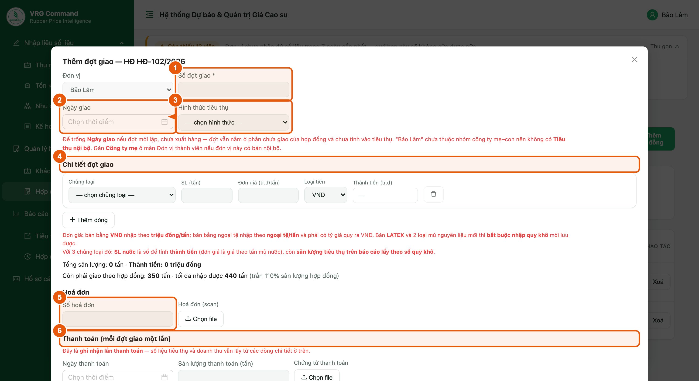

*Hình 9. Phiếu thêm đợt giao*

1. **Số đợt giao** — bắt buộc, không trùng trong cùng đơn vị (ví dụ *Đợt 01/HĐ-102*).
2. **Ngày giao** — để trống nghĩa là **đang chờ giao**; điền vào là đợt đã giao xong và **tính ngay vào tiêu thụ của ngày đó**.
3. **Hình thức tiêu thụ** — *Xuất khẩu / UTXK* · *Tiêu thụ trong nước* · *Tiêu thụ nội bộ*. Bắt buộc khi đã giao.
4. **Chi tiết đợt giao** — chủng loại, sản lượng, đơn giá thực tế của lần giao này. Ô Quy khô và Tỷ giá chỉ hiện khi áp dụng, giống phiếu hợp đồng.
5. **Số hoá đơn** + **Hoá đơn (scan)** — số hoá đơn bán hàng của đợt và file đính kèm.
6. **Thanh toán** — ngày thanh toán, sản lượng của lần thanh toán, kèm chứng từ.

> - Phiếu hiện sẵn dòng *Còn phải giao theo hợp đồng … · tối đa nhập được …*. Sản lượng thực giao **được phép lệch** so với hợp đồng: vượt thì có cảnh báo vàng nhưng vẫn lưu, **quá 110% sản lượng hợp đồng mới bị chặn**.
> - **Tiêu thụ nội bộ** chỉ hiện khi đơn vị thuộc một nhóm công ty mẹ–con, và chỉ chọn được đơn vị trong cùng nhóm.
> - **Thành tiền** của mỗi dòng = số lượng × đơn giá, hệ thống tự tính (không nhập tay); tổng của cả đợt hiện ngay dưới bảng chi tiết.
> - Lần giao đã ghi quá **số ngày cho phép sửa** sẽ chuyển sang **chỉ xem** (dòng hiện “(chỉ xem)” thay cho nút Sửa/Xoá). Hợp đồng **không** bị khoá, vẫn thêm đợt giao mới bình thường.
> - **Tỷ giá:** đợt chưa điền *Ngày giao* thì để trống được (ô ghi “khi giao”); vừa điền ngày giao là **bắt buộc** phải có tỷ giá, nếu không sẽ không lưu được.

## 13. Hoàn thành hợp đồng

**Vị trí:** Màn chi tiết hợp đồng (mục 11) → Hoàn thành hợp đồng

Sản lượng thực giao thường lệch vài phần trăm so với hợp đồng đã ký. Khi hai bên đã kết thúc hợp đồng, bấm Hoàn thành hợp đồng để chốt lại — phần chênh còn lại thôi không nằm ở “đã ký HĐ chưa giao” nữa.

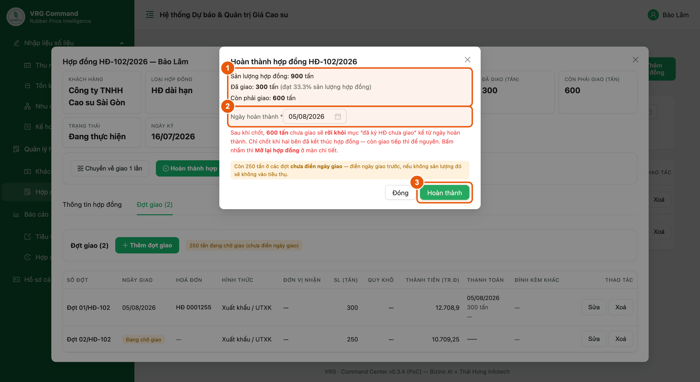

*Hình 10. Chốt hoàn thành hợp đồng*

1. **Bảng đối chiếu** — sản lượng hợp đồng, đã giao (kèm tỷ lệ thực hiện) và phần còn phải giao.
2. **Ngày hoàn thành** — mặc định là hôm nay; phải từ ngày giao gần nhất trở đi và không được ở tương lai.
3. **Hoàn thành** — chốt hợp đồng. Từ ngày này, phần chưa giao rời khỏi “đã ký HĐ chưa giao”.

> - Chỉ chốt khi **thật sự kết thúc hợp đồng**. Còn giao tiếp thì để nguyên — chốt rồi hợp đồng bị khoá, không thêm/sửa đợt giao được nữa.
> - Bấm nhầm thì vào lại màn chi tiết bấm **Mở lại hợp đồng**, mọi số liệu trở về như cũ.
> - Nếu còn đợt **chưa điền ngày giao**, màn này báo bằng khung vàng — điền ngày giao trước, nếu không sản lượng đó sẽ không được tính vào tiêu thụ.

## 14. Báo cáo tiêu thụ

**Vị trí:** Báo cáo → Tiêu thụ

Bảng chỉ để xem — số do hệ thống tổng hợp từ các lần giao, đơn vị không nhập tay.

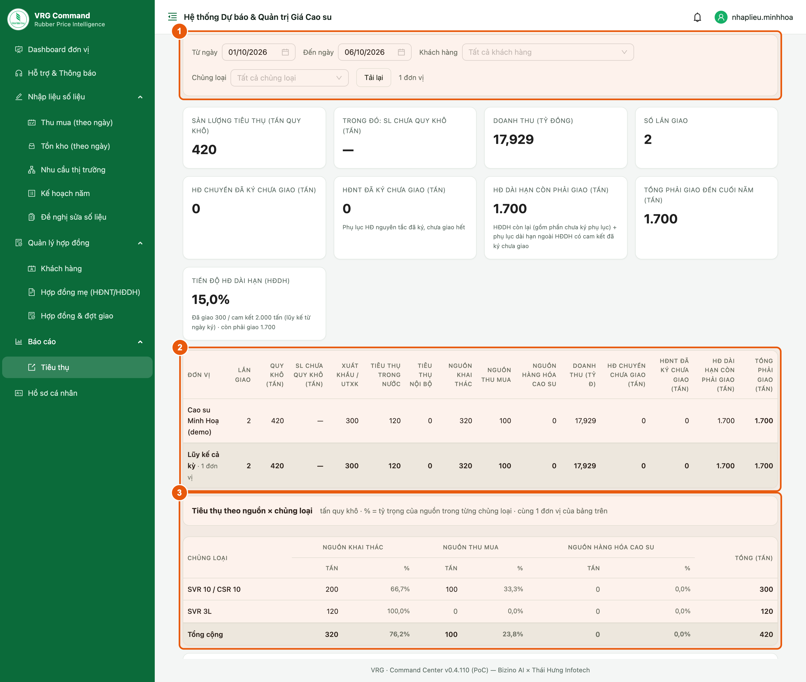

*Hình 11. Báo cáo tiêu thụ theo kỳ*

1. **Bộ lọc** — Từ ngày / Đến ngày · Đơn vị · **Khách hàng** (gõ để tìm, chọn nhiều) · **Chủng loại** (chọn nhiều). Bảng, khối theo khách hàng và file Excel đều theo bộ lọc này.
2. **Bảng tổng hợp** — Lần giao · SL · Quy khô · Xuất khẩu · Trong nước · Nội bộ · Doanh thu · **Chưa giao**.

> - Cột **SL (tấn)** là sản lượng tiêu thụ thực tế: latex và mủ nguyên liệu tính theo **quy khô**, các chủng loại thành phẩm tính theo chính số lượng bán.
> - Cột **Chưa giao** là số **tại ngày cuối kỳ** = sản lượng các hợp đồng chưa hoàn thành − đã giao; không phải số cộng dồn.
> - Khối **Theo khách hàng** bên dưới tách sản lượng và doanh thu theo từng khách.
> - **Xuất Excel** để lấy đúng bảng đang xem.
> - Doanh thu hiện “—” khi có lần giao bán ngoại tệ mà chưa nhập tỷ giá — bổ sung tỷ giá trên đợt giao để có số đầy đủ.

## 15. Nhu cầu thị trường

**Vị trí:** Nhập liệu số liệu → Nhu cầu thị trường

Ghi nhận nhu cầu và tín hiệu thị trường của đơn vị, nhập tự do bằng chữ theo ngày.

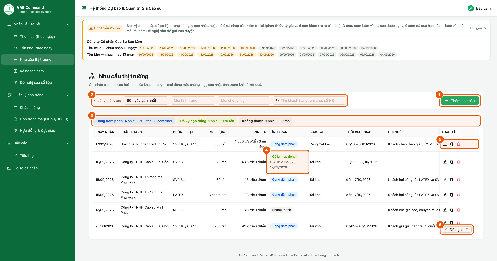

*Hình 12. Nhu cầu thị trường theo ngày*

1. Chọn ngày rồi viết nội dung: khách hỏi mua gì, số lượng, mức giá chào, tình hình thương lượng.

> Viết ngắn gọn nhưng có **con số cụ thể** (chủng loại, sản lượng, mức giá) — Ban TTKD dùng thông tin này để đối chiếu với diễn biến giá sàn.

## 16. Kế hoạch năm

**Vị trí:** Nhập liệu số liệu → Kế hoạch năm

Số liệu nhập một lần cho cả năm, cập nhật khi có điều chỉnh.

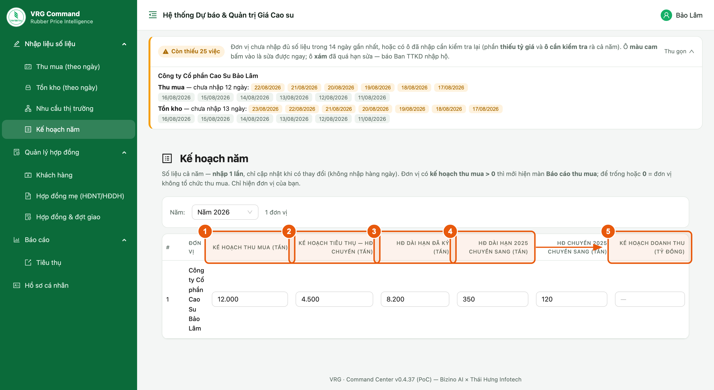

*Hình 13. Kế hoạch năm của đơn vị*

1. **Kế hoạch thu mua** (tấn) — dùng để tính % hoàn thành kế hoạch trên báo cáo.
2. **Kế hoạch tiêu thụ — HĐ chuyến** (tấn) — chỉ tiêu tiêu thụ giao cho hợp đồng chuyến trong năm.
3. **HĐ dài hạn đã ký** (tấn) trong năm.
4. **HĐ dài hạn / HĐ chuyến năm trước chuyển sang** (tấn).
5. **Kế hoạch doanh thu** — chỉ tiêu doanh thu cả năm, đơn vị **TỶ ĐỒNG**. Đây là ô TIỀN duy nhất của bảng (các ô còn lại đều là **tấn**) — nhập nhầm sang tấn là % thực hiện sai hàng nghìn lần.

> - Ô **Kế hoạch thu mua** chính là công tắc: có số **> 0** thì đơn vị mới thấy màn **Báo cáo thu mua**; để trống hoặc **0** = đơn vị không tổ chức thu mua.
> - Ô **Kế hoạch tiêu thụ — HĐ chuyến** dùng để đối chiếu **% thực hiện** trên báo cáo kỳ; ô này KHÔNG bật/tắt màn nào.
> - Kế hoạch doanh thu dùng để tính **% thực hiện** ở màn *Thống kê tiêu thụ* của Ban TTKD (= doanh thu trong kỳ / kế hoạch năm). Để trống ô này = không đặt chỉ tiêu, không phải đặt bằng 0.

## 17. Hợp đồng cũ (trước 30/07)

**Vị trí:** Báo cáo → Hợp đồng cũ (trước 30/07)

Toàn bộ hợp đồng đã ký nhập theo cách cũ, kể cả hợp đồng đã giao. Màn này chỉ để tra cứu — không có nút sửa.

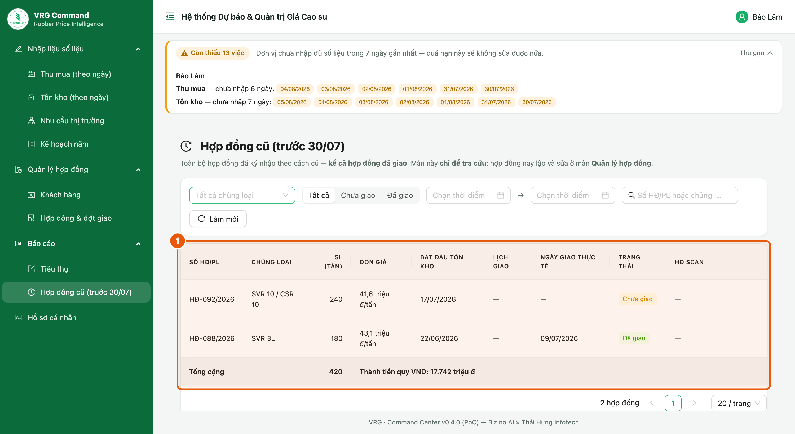

*Hình 14. Tra cứu hợp đồng cũ*

1. Lọc theo khu vực, đơn vị, chủng loại, trạng thái giao và khoảng thời gian; tìm nhanh theo số HĐ.

> - Hợp đồng phát sinh từ 30/07 trở đi nằm ở mục **Hợp đồng & đợt giao**, không nằm ở đây.
> - Cần sửa một hợp đồng cũ thì báo Ban TTKD.

## 18. Những lỗi hay gặp

| Hiện tượng | Nguyên nhân & cách xử lý |
|---|---|
| **Không lưu được hợp đồng, báo thiếu loại hợp đồng** | Chưa chọn **HĐ dài hạn / HĐ chuyến** — đây là ô bắt buộc. |
| **Doanh thu trên báo cáo hiện “—”** | Có lần giao bán ngoại tệ chưa nhập tỷ giá. Mở lần giao đó, điền tỷ giá quy ra VNĐ. Hợp đồng **chưa tới ngày giao** mà chưa có tỷ giá là bình thường. |
| **Báo cáo tiêu thụ ra 0 dù đơn vị có bán** | Ngày giao nằm ngoài kỳ đang xem, hoặc đợt giao **chưa điền Ngày giao** (vẫn đang chờ giao). |
| **Không thấy “Tiêu thụ nội bộ”** | Đơn vị chưa thuộc nhóm công ty mẹ–con. Báo Ban TTKD gán Công ty mẹ. |
| **Không lưu được đợt giao, báo vượt quá 110%** | Tổng các đợt giao vượt quá 110% sản lượng hợp đồng. Kiểm lại số cân; nếu hai bên đã thống nhất tăng thì sửa sản lượng trên hợp đồng. |
| **Hợp đồng còn treo sản lượng chưa giao dù đã bán xong** | Giao thiếu vài % là bình thường; bấm **Hoàn thành hợp đồng** để chốt, phần chênh sẽ rời khỏi “đã ký HĐ chưa giao”. |
| **Không sửa được hợp đồng, báo “đã hoàn thành”** | Hợp đồng đã chốt. Bấm **Mở lại hợp đồng** ở màn chi tiết rồi sửa. |
| **Không sửa được số liệu ngày cũ** | Ngoài cửa sổ sửa cho phép. Báo Ban TTKD nếu cần mở lại. |
| **Đợt giao hiện “(chỉ xem)”, không có nút Sửa** | Lần giao đã quá số ngày cho phép sửa. Báo Ban TTKD nếu thật sự cần chỉnh. |
| **Không thấy hợp đồng cần gắn trong danh sách “Gắn hợp đồng có sẵn”** | Hợp đồng đó đã thuộc một hồ sơ khác. Mở hồ sơ đó gỡ ra trước, rồi gắn sang hồ sơ mới. |
| **Không xoá được hợp đồng mẹ** | Hồ sơ còn phụ lục. Gỡ hết phụ lục ở màn chi tiết rồi mới xoá. |
