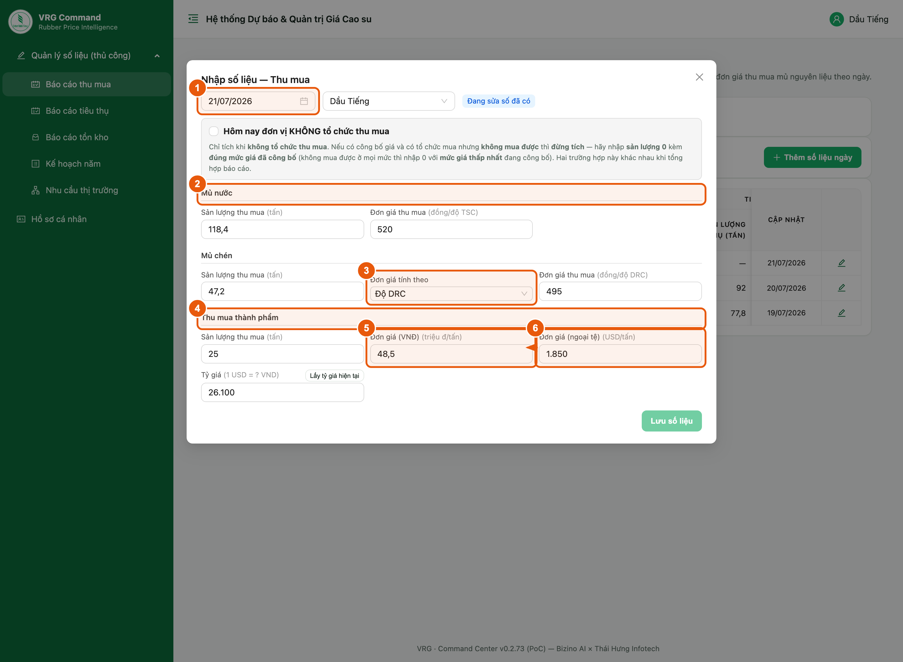
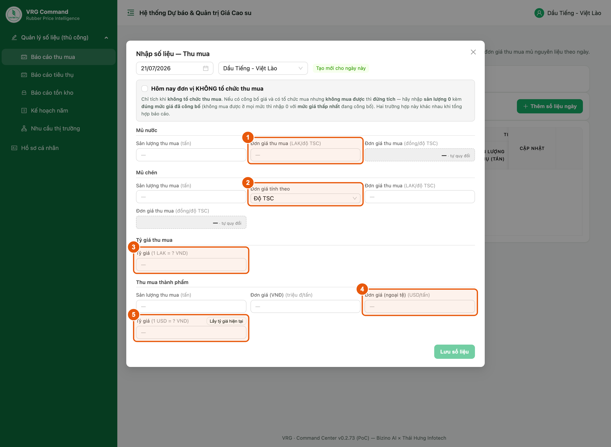
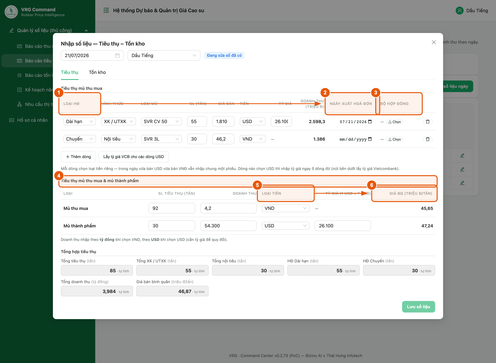
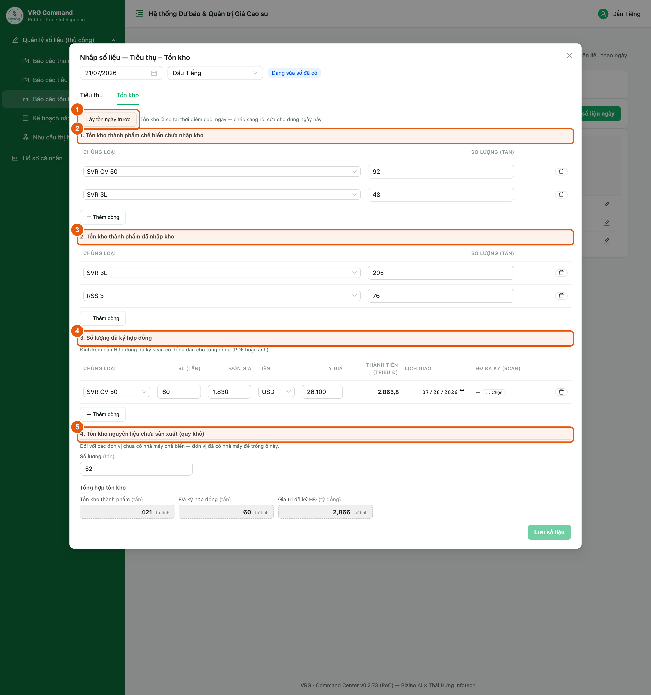
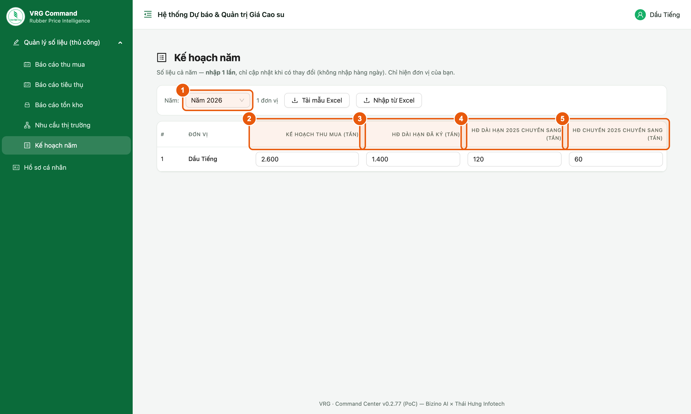
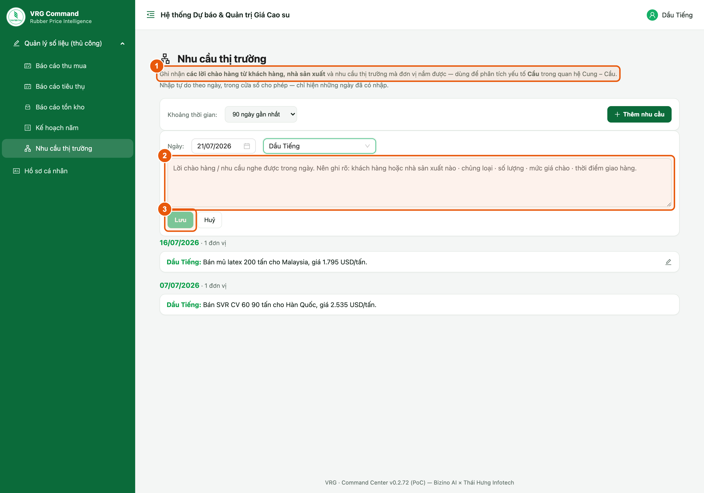
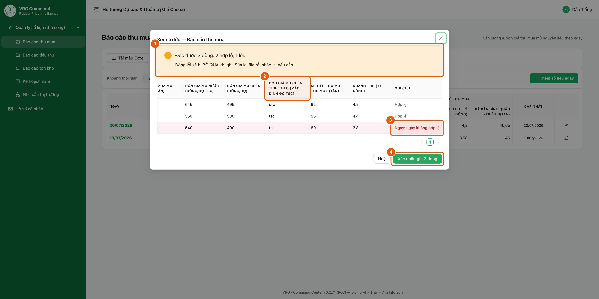

# Hướng dẫn nhập liệu — Đơn vị thành viên

Tài liệu dành cho cán bộ đơn vị thành viên VRG nhập số liệu hằng ngày trên Hệ thống Dự báo & Quản trị Giá Cao su. Tài khoản đơn vị chỉ thấy và chỉ nhập được số liệu của chính đơn vị mình. Có 5 mục cần nhập: Báo cáo thu mua, Báo cáo tiêu thụ, Báo cáo tồn kho và Nhu cầu thị trường (nhập theo NGÀY), cùng Kế hoạch năm (nhập 1 lần cho cả năm). Tài liệu bám theo phiên bản 0.2.74. Riêng 4 mục báo cáo còn có thể tải mẫu Excel về điền rồi nhập lên thay vì gõ tay (xem mục 9).

> Bản Word đầy đủ (có ảnh chú thích): [Huong-dan-nhap-lieu-don-vi-thanh-vien.docx](./Huong-dan-nhap-lieu-don-vi-thanh-vien.docx)

## 1. Đăng nhập và các mục cần nhập

**Vị trí:** Menu bên trái, nhóm “Quản lý số liệu (thủ công)”

Sau khi đăng nhập bằng tài khoản đơn vị, menu bên trái hiển thị đúng các mục đơn vị cần làm. Số liệu nhập vào luôn tự gắn với đơn vị của tài khoản — không cần và không thể chọn đơn vị khác.

*Hình 1. Menu của tài khoản đơn vị thành viên*

**Năm mục cần nhập:**

1. **Báo cáo thu mua** — sản lượng và đơn giá thu mua mủ nguyên liệu **theo ngày**.
2. **Báo cáo tiêu thụ** — sản lượng bán theo từng hợp đồng, giá bán và doanh thu **theo ngày**.
3. **Báo cáo tồn kho** — tồn kho thành phẩm (đã / chưa có hợp đồng) và tồn kho nguyên liệu **theo ngày**.
4. **Kế hoạch năm** — kế hoạch thu mua và hợp đồng dài hạn đã ký, **nhập 1 lần cho cả năm**.
5. **Nhu cầu thị trường** — ghi nhận nhu cầu/tín hiệu thị trường của đơn vị, nhập **tự do bằng chữ**.

> - Báo cáo tiêu thụ và Báo cáo tồn kho là **hai tab của cùng một phiếu ngày** — nhập bên này không làm mất số bên kia.
> - Chỉ nhập/sửa được ngày hôm nay và một số ngày gần nhất theo quy định; ngày cũ hơn chỉ để xem.

## 2. Màn hình danh sách và 3 nút thao tác

**Vị trí:** Menu → Báo cáo thu mua (các màn khác bố trí tương tự)

Mỗi màn báo cáo đều có danh sách các ngày đã nhập và 3 nút thao tác giống nhau.

*Hình 2. Danh sách theo ngày và các nút thao tác*

1. **Thêm số liệu ngày** — mở phiếu nhập cho một ngày mới.
2. **Tải mẫu Excel** — tải file mẫu về để điền ngoại tuyến (xem mục 8).
3. **Nhập từ Excel** — nhập file đã điền lên hệ thống (xem mục 8).
4. **Biểu tượng bút** ở cuối mỗi dòng — mở lại phiếu của ngày đó để sửa.

> - Danh sách chỉ hiện những ngày **đã có số liệu**; ngày chưa nhập sẽ không xuất hiện.

## 3. Nhập Báo cáo thu mua — đơn vị trong nước

**Vị trí:** Báo cáo thu mua → Thêm số liệu ngày

Áp dụng cho các đơn vị tại Việt Nam. Phiếu chia theo loại mủ: mỗi loại nhập sản lượng và đơn giá đi liền nhau. Mủ chén phải chọn tính theo độ TSC hay độ DRC. Cuối phiếu là khối thu mua THÀNH PHẨM (mua lại mủ đã chế biến).

*Hình 3. Phiếu Thu mua của đơn vị trong nước*

1. Chọn **ngày báo cáo**.
2. **Mủ nước** — sản lượng (tấn, quy khô) và đơn giá (đồng/độ TSC).
3. **Mủ chén — Đơn giá tính theo**: chọn *Độ TSC* hoặc *Độ DRC*; nhãn ô đơn giá đổi theo lựa chọn này.
4. **Thu mua thành phẩm** — sản lượng mủ thành phẩm mua vào (tấn).
5. **Đơn giá (VNĐ)** — triệu đ/tấn.
6. **Đơn giá (ngoại tệ)** — USD/tấn; kèm ô **Tỷ giá** có nút *Lấy tỷ giá hiện tại* (Vietcombank). Xong bấm **Lưu số liệu**.

> - Đơn giá mủ nước/mủ chén nhập ở đây đồng thời ghi vào kho “Giá mủ nguyên liệu”, kèm đúng đơn vị tính (độ TSC hay độ DRC) đã chọn.
> - **Sản lượng tiêu thụ và doanh thu đã chuyển sang biểu Tiêu thụ** — không còn nhập ở phiếu Thu mua nữa.
> - Ô **Hôm nay đơn vị KHÔNG tổ chức thu mua** chỉ tích khi thật sự không tổ chức mua. Có công bố giá, có tổ chức mua nhưng không mua được thì **đừng tích** — nhập **sản lượng 0** kèm **đúng mức giá đã công bố** (không mua được ở mọi mức thì nhập 0 với **mức giá thấp nhất**). Hai trường hợp này khác nhau khi tổng hợp báo cáo.

## 4. Nhập Báo cáo thu mua — đơn vị ngoài Việt Nam

**Vị trí:** Báo cáo thu mua → Thêm số liệu ngày (đơn vị tại Lào / Campuchia)

Đơn vị ở nước ngoài mua mủ bằng nội tệ (LAK/KHR) và bán bằng USD, nên phiếu có thêm ô nội tệ và HAI tỷ giá riêng. Các ô nền xám là hệ thống tự quy đổi, không nhập tay.

*Hình 4. Phiếu Thu mua của đơn vị nước ngoài (ví dụ đơn vị tại Lào — LAK)*

**Khác biệt so với đơn vị trong nước:**

1. **Đơn giá theo nội tệ** (LAK/KHR trên độ) — giá mua thực tế tại nước sở tại.
2. **Mủ chén — Đơn giá tính theo**: *Độ TSC* hoặc *Độ DRC*.
3. **Tỷ giá thu mua** (1 nội tệ = ? VND) — quy đơn giá về đồng.
4. **Đơn giá thành phẩm (ngoại tệ)** — USD/tấn cho phần thu mua thành phẩm.
5. **Tỷ giá** (1 USD = ? VND) — có nút *Lấy tỷ giá hiện tại*.

> - Hai tỷ giá **khác nhau và độc lập**: tỷ giá nội tệ cho đơn giá mủ nước/mủ chén; tỷ giá USD cho thành phẩm.
> - Ô nền xám là hệ thống **tự quy đổi**, chỉ để xem.
> - Sản lượng và cách lưu giống đơn vị trong nước (mục 3).

## 5. Nhập Báo cáo tiêu thụ

**Vị trí:** Menu → Báo cáo tiêu thụ → Thêm số liệu ngày

Mỗi hợp đồng bán là một dòng, hệ thống tự cộng lại. Bên dưới là bảng tiêu thụ mủ thu mua và mủ thành phẩm (phần này trước nằm ở phiếu Thu mua).

*Hình 5. Phiếu Tiêu thụ — bảng nhiều dòng*

1. **Loại HĐ** (Dài hạn / Chuyến) · **Hình thức** (XK-UTXK / Nội tiêu) · **Loại mủ** · **SL (tấn)** · **Giá bán**.
2. **Ngày xuất hoá đơn** — chưa xuất thì để trống.
3. **Bộ Hợp đồng** — đính kèm PDF hoặc ảnh; bấm tên file để mở lại.
4. **Tiêu thụ mủ thu mua & mủ thành phẩm** — bảng 2 dòng cố định, nhập SL tiêu thụ và doanh thu cho từng loại.
5. **Loại tiền** — chọn VND hoặc USD **cho từng dòng**; chọn USD thì nhập **Tỷ giá** ngay ở dòng đó.
6. **Giá BQ** hệ thống tự tính = doanh thu ÷ sản lượng. Xong bấm **Lưu số liệu**.

> - **Loại tiền chọn theo từng dòng** — trong ngày vừa bán USD vừa bán VNĐ vẫn nhập chung một phiếu.
> - Nút **Lấy tỷ giá VCB cho các dòng USD** điền tỷ giá Vietcombank cho mọi dòng đang chọn USD.
> - Doanh thu nhập theo **tỷ đồng** khi chọn VND, theo **USD** khi chọn USD (thiếu tỷ giá thì để trống, hệ thống không tự đoán).
> - Khối **Tổng hợp tiêu thụ** và cột **Doanh thu** từng dòng đều tự tính — không nhập tay.

## 6. Nhập Báo cáo tồn kho

**Vị trí:** Menu → Báo cáo tồn kho → Thêm số liệu ngày

Tồn kho là số liệu **tại thời điểm cuối ngày** (không cộng dồn giữa các ngày), đơn vị tính là **tấn**. Phiếu chia thành 4 khối theo tình trạng hàng.

*Hình 6. Phiếu Tồn kho — hai bảng theo tình trạng hợp đồng*

**Bốn khối tồn kho:**

1. **Lấy tồn ngày trước** — chép toàn bộ tồn kho ngày gần nhất sang rồi sửa lại cho đúng ngày này.
2. **1. Tồn kho thành phẩm chế biến chưa nhập kho** — chủng loại + số lượng (tấn).
3. **2. Tồn kho thành phẩm đã nhập kho** — chủng loại + số lượng (tấn).
4. **3. Số lượng đã ký hợp đồng** — thêm đơn giá, lịch giao và **file Hợp đồng đã ký scan có đóng dấu**.
5. **Đơn giá nhập bằng** — chọn VND hoặc USD cho đơn giá ở khối 3.
6. **4. Tồn kho nguyên liệu chưa sản xuất (quy khô)** — 1 ô số lượng (tấn). Xong bấm **Lưu số liệu**.

> - Khối **4** hiện với **mọi đơn vị**, **không phân biệt** đơn vị có nhà máy hay không. Đơn vị nào không có số thì để trống.
> - Nút **Lấy tồn ngày trước** chỉ chép **tồn kho**, KHÔNG chép các dòng bán ở tab Tiêu thụ — vì tiêu thụ là số phát sinh trong ngày, chép sang sẽ thành khai khống.
> - Khối **Tổng hợp tồn kho**: *Tồn kho thành phẩm* = khối 1 + khối 2. Khối 3 là **cam kết giao hàng**, đứng riêng — không cộng vào và không trừ khỏi tồn kho, nên ký nhiều hơn lượng đang có cũng không sao.
> - Chủng loại tách theo từng loại giống bảng Giá sàn Tập đoàn — **SVR CV 50** và **SVR CV60** là 2 loại riêng.

## 7. Nhập Kế hoạch năm

**Vị trí:** Menu → Kế hoạch năm

Đây là số liệu của cả năm, chỉ nhập một lần và cập nhật lại khi có thay đổi — KHÔNG nhập hằng ngày. Số liệu này dùng để tính % thực hiện kế hoạch trong báo cáo.

*Hình 7. Màn Kế hoạch năm*

1. Chọn **năm** cần khai.
2. **Kế hoạch thu mua** (tấn) — chỉ tiêu Tập đoàn giao hoặc kế hoạch của công ty.
3. **HĐ dài hạn đã ký** (tấn) — tổng sản lượng đã ký hợp đồng dài hạn trong năm.
4. **HĐ dài hạn năm trước chuyển sang** (tấn).
5. **HĐ chuyến năm trước chuyển sang** (tấn).
6. Số liệu **tự lưu khi rời khỏi ô** — không có nút Lưu riêng.

> - Nếu tài khoản được giao nhiều đơn vị thì màn này hiện đủ các đơn vị đó.

## 8. Nhập Nhu cầu thị trường

**Vị trí:** Menu → Nhu cầu thị trường

Ghi nhận **các lời chào hàng từ khách hàng, nhà sản xuất** và nhu cầu thị trường mà đơn vị nắm được trong ngày — dùng để phân tích yếu tố **Cầu** trong quan hệ Cung – Cầu.

*Hình 9. Nhập Nhu cầu thị trường*

1. Bấm **Thêm nhu cầu** để mở ô nhập.
2. Chọn **ngày** ghi nhận nhu cầu.
3. Chọn **đơn vị** (tài khoản chỉ có đơn vị của mình).
4. Nhập **nội dung** — viết tự do, nên ghi rõ: khách hàng, chủng loại, số lượng, giá chào và thời điểm giao.
5. Bấm **Lưu**.
6. Muốn sửa nội dung đã ghi: bấm **biểu tượng bút** ở dòng tương ứng trong danh sách bên dưới.

> - Nên ghi rõ: **khách hàng hoặc nhà sản xuất nào · chủng loại · số lượng · mức giá chào · thời điểm giao hàng**. Càng cụ thể thì phần phân tích Cung – Cầu càng dùng được.
> - Đây là mục nhập **tự do bằng chữ**, không có ô số liệu.
> - Mỗi ngày mỗi đơn vị chỉ có **một nội dung** — nhập lại ngày đã có sẽ được nhắc dùng chức năng Sửa.
> - Mục này **không có nhập bằng Excel**.

## 9. Nhập nhanh bằng Excel (tải mẫu → nhập lên)

**Vị trí:** Có ở 4 màn báo cáo: Thu mua / Tiêu thụ / Tồn kho / Kế hoạch năm

Thay vì gõ tay từng ngày, có thể tải file Excel mẫu về điền rồi nhập lên. Hệ thống đọc file và cho **xem trước** — dòng nào sai sẽ chỉ rõ sai ở đâu, chỉ những dòng hợp lệ mới được ghi.

*Hình 9. Bảng xem trước trước khi ghi*

**Cách làm:**

1. **Tải mẫu Excel** ở màn danh sách → điền số vào file (mỗi biểu một mẫu riêng).
2. **Nhập từ Excel** → chọn file vừa điền, hệ thống mở bảng **xem trước**.
3. Dòng tóm tắt cho biết đọc được bao nhiêu dòng, **bao nhiêu hợp lệ / bao nhiêu lỗi**.
4. Các cột **chọn từ danh sách** (vd *Đơn giá mủ chén tính theo*) hiện đúng giá trị đã điền — để trống thì hệ thống dùng mặc định ghi ngay trên tiêu đề cột.
5. Cột **Ghi chú** nói rõ dòng lỗi sai ở đâu (vd *Ngày: ngày không hợp lệ*).
6. Bấm **Xác nhận ghi N dòng** — chỉ ghi các dòng hợp lệ, dòng lỗi bị bỏ qua.

> - File mẫu của đơn vị **không có cột “Đơn vị”** — hệ thống tự gán đúng đơn vị của tài khoản, không cần gõ tên.
> - **Không đổi tên hoặc xoá dòng tiêu đề** của file mẫu; nếu thiếu cột bắt buộc hệ thống sẽ báo và không đọc file.
> - Muốn sửa dòng lỗi: sửa lại trong file Excel rồi nhập lên lần nữa — các dòng đã ghi đúng sẽ được ghi đè, không bị nhân đôi.
> - Nhập Tiêu thụ không làm mất số Tồn kho của cùng ngày và ngược lại.
> - **Mẫu Excel đã đổi cột** — luôn bấm *Tải mẫu Excel* để lấy file mới nhất, đừng dùng lại file tải từ trước (sai cột sẽ báo lỗi khi nhập lên).
> - Ba cột **chọn từ danh sách** mới có, phải điền đúng thì số mới vào đúng đơn vị tính: *Đơn giá mủ chén tính theo* (Độ TSC / Độ DRC) ở mẫu **Thu mua**; *Giá bán bằng* (VND / USD) ở mẫu **Tiêu thụ**; *Đơn giá bằng* (VND / USD) ở mẫu **Tồn kho**. Bỏ trống thì hệ thống hiểu là Độ TSC và VND.
> - Mẫu **Thu mua** đã bỏ 2 cột *SL tiêu thụ* và *Doanh thu* (chuyển sang biểu Tiêu thụ), thêm 3 cột: *SL thu mua thành phẩm* · *Đơn giá thành phẩm (VNĐ)* · *Đơn giá thành phẩm (ngoại tệ)*.
> - Mẫu **Tồn kho**: cột *Nhóm* có 3 lựa chọn — Chế biến chưa nhập kho · Đã nhập kho · **Đã ký HĐ**. Số lượng tính bằng **tấn**.
> - Mẫu **Tiêu thụ** có cột *Ngày xuất hoá đơn*. Riêng **file bộ Hợp đồng phải đính kèm trên web** — file Excel không mang theo file đính kèm được.
