# Hướng dẫn quản trị hệ thống & cấu hình đơn vị thành viên

Tài liệu dành cho Quản trị viên (admin) của Hệ thống Dự báo & Quản trị Giá Cao su. Gồm hai nhóm việc: (1) quản trị tài khoản — tạo tài khoản, phân quyền theo từng mục số liệu, khoá/xoá, đặt lại mật khẩu; (2) cấu hình đơn vị thành viên — khai báo đơn vị, gán khu vực, đặt quốc gia/tiền tệ và tình trạng nhà máy. Riêng phần cấu hình đơn vị (mục 7–9) quyết định trực tiếp giao diện nhập liệu mà đơn vị nhìn thấy, nên cần khai báo đúng ngay từ đầu.

> Bản Word đầy đủ (có ảnh chú thích): [Huong-dan-quan-tri-he-thong.docx](./Huong-dan-quan-tri-he-thong.docx)

## 1. Menu Quản trị

**Vị trí:** Menu bên trái, nhóm “Quản trị” (chỉ tài khoản Quản trị viên mới thấy)

Đăng nhập bằng tài khoản Quản trị viên, menu bên trái có thêm nhóm “Quản trị” ở gần cuối. Ba mục con phụ trách toàn bộ việc vận hành hệ thống.

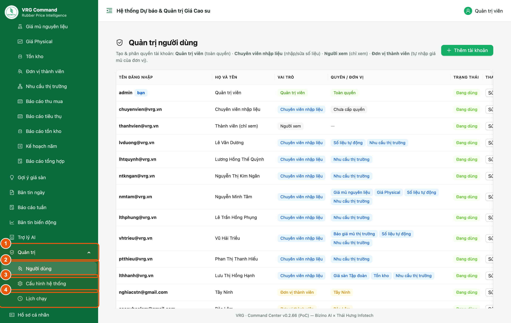

*Hình 1. Nhóm Quản trị và ba mục con*

1. **Quản trị** — bấm để mở/đóng nhóm.
2. **Người dùng** — tạo tài khoản và phân quyền (mục 2–6).
3. **Cấu hình hệ thống** — khoá API của AI, link công khai, cửa sổ nhập liệu (mục 10).
4. **Lịch chạy** — các tác vụ tự động chạy theo giờ (mục 11).

> - Mục **Đơn vị thành viên** (dùng để cấu hình đơn vị — mục 7) nằm ở nhóm **Quản lý số liệu (thủ công)**, không nằm trong nhóm Quản trị.

## 2. Danh sách tài khoản

**Vị trí:** Quản trị → Người dùng

Màn hình liệt kê toàn bộ tài khoản của hệ thống. Nhìn vào đây là biết ai đang giữ quyền gì.

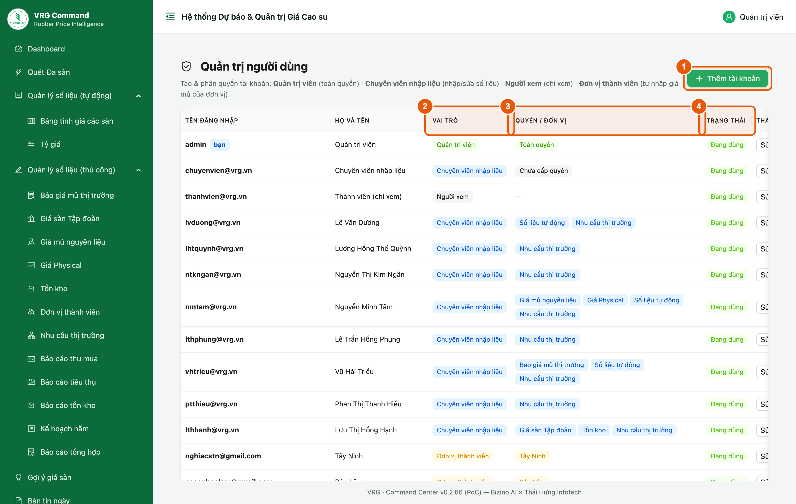

*Hình 2. Danh sách tài khoản và các cột cần đọc*

**Bốn vai trò:**

1. **Thêm tài khoản** — tạo tài khoản mới.
2. **Vai trò** — một trong bốn vai trò (xem bảng bên dưới).
3. **Quyền / Đơn vị** — chuyên viên hiện danh sách quyền; đơn vị thành viên hiện tên đơn vị được gán.
4. **Trạng thái** — *Đang dùng* hoặc *Đã khoá*.

> - **Quản trị viên** — toàn quyền, không cần cấp quyền lẻ.
> - **Chuyên viên nhập liệu** — chỉ vào được những mục được cấp quyền; mỗi mục nhập liệu cấp ở mức **Xem** hoặc **Sửa**.
> - **Người xem** — chỉ xem, không nhập/sửa số liệu.
> - **Đơn vị thành viên** — tài khoản của công ty thành viên, chỉ nhập số liệu của đơn vị được gán.

## 3. Tạo tài khoản Chuyên viên nhập liệu

**Vị trí:** Quản trị → Người dùng → Thêm tài khoản

Dùng cho cán bộ Ban/Phòng tại Tập đoàn. Điểm quan trọng nhất là bước 4 — tích đúng những mục người này được phép làm.

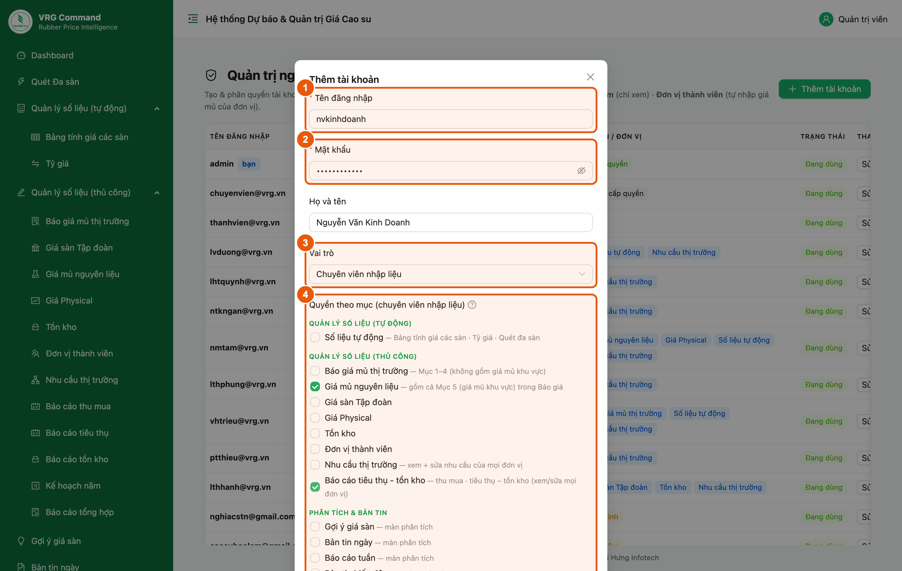

*Hình 3. Tạo tài khoản chuyên viên và cấp quyền theo mục*

1. **Tên đăng nhập** — nên dùng email công việc, tối thiểu 3 ký tự.
2. **Mật khẩu** — tối thiểu 6 ký tự; nhắc người dùng tự đổi sau lần đăng nhập đầu.
3. **Vai trò** — chọn *Chuyên viên nhập liệu*.
4. **Quyền theo mục** — chọn mức cho từng mục. Danh sách chia ba nhóm: Quản lý số liệu (tự động) · Quản lý số liệu (thủ công) · Phân tích & Bản tin.
   Mỗi mục **nhập liệu** có ba lựa chọn:
   - **Không** — ẩn khỏi menu, gõ thẳng địa chỉ màn hình cũng không vào được.
   - **Xem** — vào được màn hình và đọc số liệu, nhưng mọi ô nhập bị khoá và các nút Thêm/Sửa/Xoá đều ẩn.
     Quyền này chặn ở cả giao diện lẫn API — người dùng không thể lách bằng cách gọi thẳng API để ghi.
   - **Sửa** — xem và nhập/sửa/xoá (vẫn theo cửa sổ nhập liệu N ngày như trước).

   Các mục ở nhóm **Phân tích & Bản tin** chỉ có **Không** / **Có quyền** (không tách hai mức).
5. Kéo xuống cuối cửa sổ, bấm **Lưu**.

> - **Không cấp mục nào thì tài khoản gần như trống** — đăng nhập được nhưng menu không có gì để làm.
> - Mức **Xem** hợp cho lãnh đạo Ban hoặc người cần đối chiếu số liệu mà không được sửa; muốn thu hồi quyền nhập của một người, hạ từ *Sửa* xuống *Xem* thay vì bỏ hẳn mục.
> - Quyền **Báo cáo tiêu thụ - tồn kho** cho phép xem/sửa số liệu của **mọi** đơn vị, gồm cả màn *Báo cáo tổng hợp*. Chỉ cấp cho người thực sự cần tổng hợp toàn Tập đoàn.
> - Quyền **Đơn vị thành viên** cho phép sửa danh mục đơn vị (mục 7) — nên giữ ở phạm vi hẹp.

## 4. Tạo tài khoản Đơn vị thành viên

**Vị trí:** Quản trị → Người dùng → Thêm tài khoản

Đây là tài khoản cấp cho công ty thành viên tự nhập số liệu hằng ngày. Khác với chuyên viên: không cấp quyền theo mục, mà **gán đơn vị**.

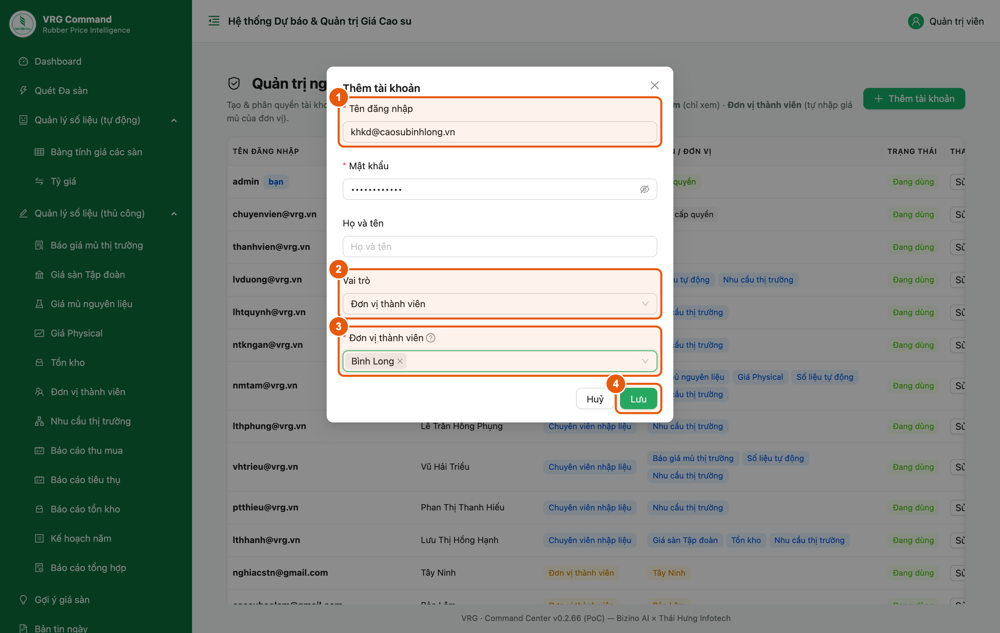

*Hình 4. Tạo tài khoản cho công ty thành viên và gán đơn vị*

1. **Tên đăng nhập** — thường dùng email của phòng Kế hoạch – Kinh doanh đơn vị.
2. **Vai trò** — chọn *Đơn vị thành viên*. Khi chọn xong, ô “Quyền theo mục” biến mất và thay bằng ô chọn đơn vị.
3. **Đơn vị thành viên** — chọn một hoặc nhiều đơn vị mà tài khoản này được phép nhập.
4. Bấm **Lưu**.

> - Một tài khoản có thể quản **nhiều đơn vị** (vd công ty mẹ nhập hộ đơn vị trực thuộc). Khi đó màn nhập liệu sẽ có thanh chọn đơn vị.
> - Tài khoản đơn vị **chỉ thấy và chỉ ghi được** số liệu của đơn vị được gán — hệ thống chặn ở máy chủ, không thể lách bằng cách sửa trên trình duyệt.
> - Nếu danh sách chưa có đơn vị cần chọn, khai báo trước ở mục 7.

## 5. Sửa quyền · Khoá tài khoản

**Vị trí:** Quản trị → Người dùng → nút Sửa ở cuối dòng

Dùng khi cán bộ đổi nhiệm vụ, nghỉ việc hoặc cần bổ sung/thu hồi quyền.

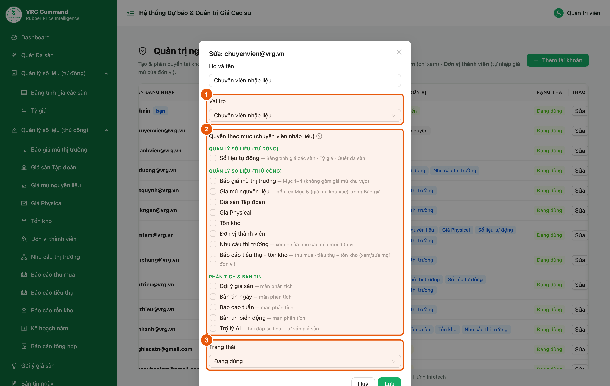

*Hình 5. Cửa sổ sửa tài khoản*

1. **Vai trò** — đổi vai trò nếu cần (đổi sang *Đơn vị thành viên* thì phải gán đơn vị).
2. **Quyền theo mục** — nâng/hạ mức từng mục (Không · Xem · Sửa) để cấp thêm hoặc thu hồi quyền.
3. **Trạng thái** — chuyển *Đã khoá* để chặn đăng nhập mà vẫn giữ lịch sử số liệu đã nhập.

> - **Ưu tiên khoá thay vì xoá** khi cán bộ nghỉ việc — xoá tài khoản sẽ mất dấu vết người nhập.
> - Cửa sổ này không đổi được tên đăng nhập và không hiện mật khẩu; muốn đổi mật khẩu dùng nút riêng ở mục 6.

## 6. Đặt lại mật khẩu · Xoá tài khoản

**Vị trí:** Quản trị → Người dùng → cuộn bảng sang phải

Ba nút thao tác nằm ở cột cuối cùng. Bảng rộng nên phải cuộn ngang mới thấy.

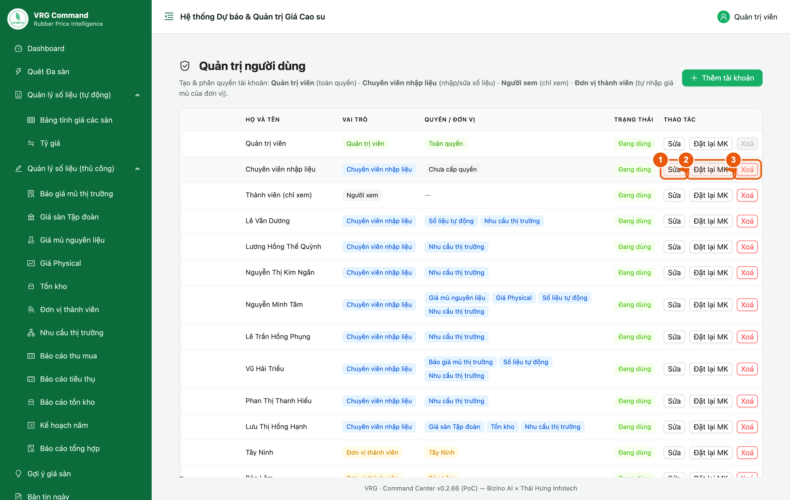

*Hình 6. Ba nút thao tác ở cột cuối mỗi dòng*

1. **Sửa** — mở cửa sổ ở mục 5.
2. **Đặt lại MK** — đặt mật khẩu mới cho người dùng (tối thiểu 6 ký tự). Dùng khi họ quên mật khẩu.
3. **Xoá** — xoá hẳn tài khoản. Có hỏi xác nhận trước khi xoá.

> - Nút **Xoá** ở dòng của chính bạn bị vô hiệu hoá — hệ thống không cho tự xoá tài khoản đang đăng nhập.
> - Sau khi đặt lại mật khẩu, báo lại cho người dùng và nhắc họ tự đổi ở mục *Hồ sơ cá nhân*.

## 7. Cấu hình đơn vị thành viên

**Vị trí:** Quản lý số liệu (thủ công) → Đơn vị thành viên → tab Đơn vị

Đây là màn hình quan trọng nhất của tài liệu này. Ba cột cấu hình bên phải quyết định **giao diện nhập liệu mà đơn vị nhìn thấy** — khai báo sai thì đơn vị sẽ thiếu ô cần nhập.

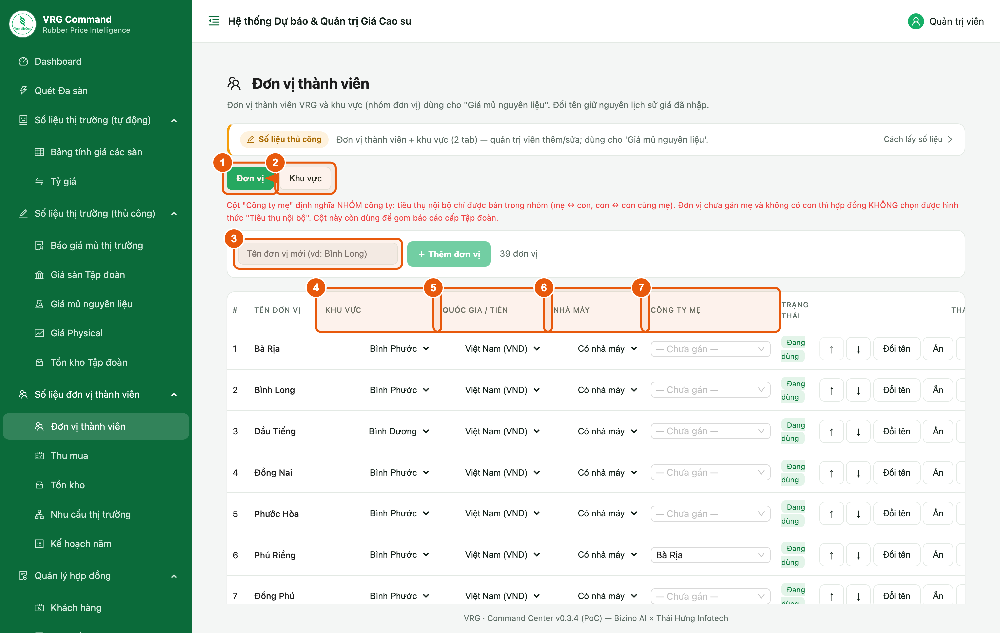

*Hình 7. Danh sách đơn vị và ba cột cấu hình*

1. Tab **Đơn vị** — danh sách các công ty thành viên.
2. Tab **Khu vực** — nhóm đơn vị theo vùng (mục 9).
3. Ô **Tên đơn vị mới** + nút **Thêm đơn vị** — khai báo đơn vị mới.
4. Cột **Khu vực** — chọn khu vực cho đơn vị; dùng để gom giá mủ nguyên liệu theo vùng trong bản tin.
5. Cột **Quốc gia / Tiền** — Việt Nam (VND) · Lào (LAK) · Campuchia (KHR).
6. Cột **Nhà máy** — *Có nhà máy* hoặc *Không có nhà máy*.
7. Cột **Công ty mẹ** — gán đơn vị vào NHÓM công ty mẹ – con; chỉ trong cùng nhóm mới bán **Tiêu thụ nội bộ** cho nhau.

> - Đơn vị có thấy màn **Báo cáo thu mua** hay không do **kế hoạch thu mua** ở màn *Kế hoạch năm* quyết định (khai **> 0** thì hiện) — không còn ô bật/tắt ở màn này.

> - **Đổi tên đơn vị giữ nguyên toàn bộ lịch sử giá đã nhập** — cứ đổi khi tên thay đổi, không mất dữ liệu.
> - Ba cột cấu hình lưu **ngay khi chọn**, không cần bấm nút lưu.
> - Nút **Ẩn** dùng cho đơn vị ngừng hoạt động: không còn hiện ở ô chọn nhưng số liệu cũ vẫn giữ. An toàn hơn **Xoá**.

### Sáp nhập đơn vị

Dùng khi một đơn vị nhập vào đơn vị khác. Cột **Sáp nhập** ở cuối bảng.

1. Bấm **Sáp nhập…** ở dòng đơn vị **bị sáp nhập** (đơn vị sẽ không còn nữa).
2. Chọn **đơn vị nhận** ở ô *Sáp nhập vào…*.
3. Chọn **ngày hiệu lực** — ngày quyết định sáp nhập có hiệu lực. Chọn lùi ngày cũng được.
4. Bấm **Lưu** rồi đọc kỹ bảng xác nhận trước khi đồng ý.

Sau khi sáp nhập:

- Số liệu của **những ngày trước ngày hiệu lực vẫn đứng tên đơn vị cũ** — không mất, không bị
  chuyển sang đơn vị mới. Nhờ vậy vẫn tra được đơn vị đó làm được bao nhiêu khi chưa sáp nhập.
- Từ ngày hiệu lực, **đơn vị cũ không nhận số liệu mới**; nhập nhầm vào đó hệ thống sẽ báo tên
  đơn vị phải nhập thay thế. Số liệu của những ngày trước đó **vẫn sửa được** như cũ.
- **Tài khoản của đơn vị cũ chuyển sang đơn vị mới**, người dùng đăng nhập như bình thường.
- Các bảng thống kê và Báo cáo tổng hợp **mặc định cộng gộp** số của đơn vị cũ vào đơn vị mới.
  Muốn xem riêng từng đơn vị thì tích ô **Tách đơn vị đã sáp nhập** trên thanh lọc.
- Bảng **Theo dõi nộp báo cáo** không đòi đơn vị cũ nộp cho những ngày từ ngày hiệu lực trở đi.

> - **Hợp đồng đã ký của đơn vị cũ vẫn chạy tiếp**: thêm đợt giao, điền ngày giao, chốt hoàn thành
>   đều bình thường. Chỉ **hợp đồng mới** là phải ký ở đơn vị nhận.
> - Bấm nhầm thì bấm **Gỡ** ở cột Sáp nhập — đơn vị hoạt động trở lại ngay, số liệu không suy
>   suyển. Riêng **tài khoản không tự trả về**, phải gán lại ở *Quản trị → Người dùng*.
> - Sáp nhập **khác đổi tên**: đổi tên là cùng một đơn vị mang tên mới nên toàn bộ lịch sử đi theo
>   tên mới; sáp nhập là hai đơn vị nên lịch sử của mỗi bên vẫn đứng tên của bên đó.

## 8. Đơn vị ngoài Việt Nam và đơn vị chưa có nhà máy

**Vị trí:** Quản lý số liệu (thủ công) → Đơn vị thành viên → tab Đơn vị

Hai cấu hình dưới đây thay đổi hẳn biểu mẫu nhập liệu của đơn vị, nên cần đặt đúng trước khi đơn vị bắt đầu nhập.

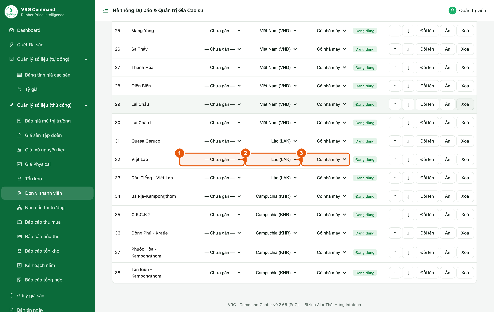

*Hình 8. Các đơn vị tại Lào (LAK) và Campuchia (KHR)*

**Hệ quả của từng lựa chọn:**

1. Cột **Khu vực** — đơn vị ngoài nước thường để *Chưa gán*.
2. Cột **Quốc gia / Tiền** — chọn *Lào (LAK)* hoặc *Campuchia (KHR)*.
3. Cột **Nhà máy** — chọn *Không có nhà máy* nếu đơn vị chưa có nhà máy chế biến.

> - **Quốc gia ≠ Việt Nam** → biểu mẫu Thu mua của đơn vị đó hiện thêm ô **đơn giá theo nội tệ** và **hai ô tỷ giá** (nội tệ→VND cho đơn giá, USD→VND cho doanh thu). Để là Việt Nam thì các ô này không xuất hiện.
> - **Không có nhà máy** → biểu mẫu Tồn kho của đơn vị đó hiện thêm mục **Tồn kho nguyên liệu**.
> - Hai cấu hình này **chỉ đổi giao diện từ lúc đặt trở đi**, không sửa lại số liệu đã nhập trước đó.

## 9. Khai báo Khu vực

**Vị trí:** Quản lý số liệu (thủ công) → Đơn vị thành viên → tab Khu vực

Khu vực là cách nhóm nhiều đơn vị lại theo vùng địa lý. Bản tin dùng khu vực để gom giá mủ nguyên liệu thành khoảng giá thay vì liệt kê từng đơn vị.

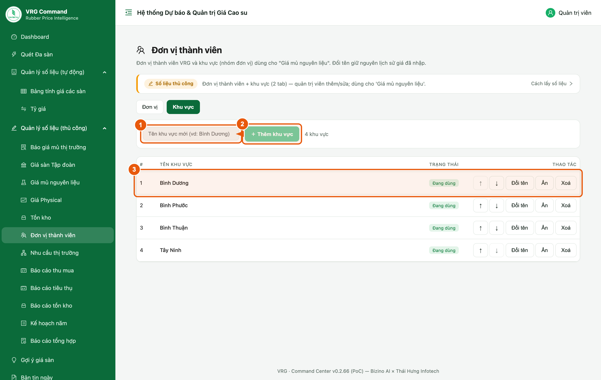

*Hình 9. Tab Khu vực*

1. Ô **Tên khu vực mới** — nhập tên vùng, vd *Bình Dương*.
2. Bấm **Thêm khu vực**.
3. Mỗi dòng có nút **↑ ↓** đổi thứ tự hiển thị, **Đổi tên**, **Ẩn**, **Xoá**.

> - Tạo khu vực xong mới gán được cho đơn vị ở tab *Đơn vị* (mục 7).
> - **Xoá một khu vực sẽ gỡ gán** ở tất cả đơn vị đang thuộc khu vực đó — cân nhắc dùng *Ẩn* thay vì *Xoá*.
> - Đơn vị chưa gán khu vực sẽ **không xuất hiện** trong phần giá mủ nguyên liệu gom theo vùng của bản tin.

## 10. Cấu hình hệ thống

**Vị trí:** Quản trị → Cấu hình hệ thống

Nơi khai báo khoá API của AI, mật khẩu trang công khai và cửa sổ thời gian cho phép nhập liệu. Chia theo tab.

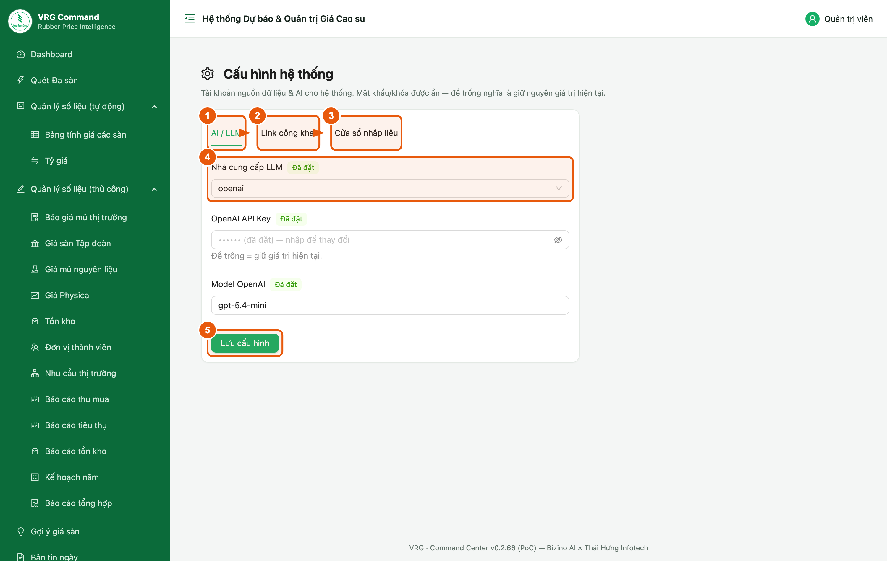

*Hình 10. Tab AI / LLM của trang Cấu hình hệ thống*

1. Tab **AI / LLM** — nhà cung cấp, khoá API và mô hình dùng để sinh nhận định.
2. Tab **Link công khai** — mật khẩu của trang nhập giá mủ dành cho đơn vị (không cần đăng nhập).
3. Tab **Cửa sổ nhập liệu** — số ngày gần nhất mà đơn vị / chuyên viên còn được sửa số liệu.
4. **Nhà cung cấp LLM** — chọn nhà cung cấp; danh sách mô hình bên dưới đổi theo lựa chọn này.
5. Bấm **Lưu cấu hình**.

> - **Khoá API và mật khẩu luôn bị che**, chỉ hiện nhãn *Đã đặt*. **Để trống nghĩa là giữ nguyên giá trị cũ** — chỉ nhập khi thực sự muốn thay.
> - Tab **Cửa sổ nhập liệu** có hai thông số độc lập cho đơn vị thành viên và cho chuyên viên (mặc định 7 ngày). Quá số ngày này, dòng số liệu chuyển sang *(chỉ xem)*.
> - Riêng biểu **Tồn kho** được nhập trễ hơn các mục khác **1 ngày** — đặt ở ô **“Biểu Tồn kho được nhập trễ hơn các mục khác bao nhiêu ngày”**. Tồn cuối ngày phải kiểm kho xong mới có số, nên ví dụ đặt cửa sổ **0**: các mục khác phải nhập trong ngày, còn biểu Tồn kho vẫn nhập được hết ngày hôm sau. Đặt ô này **0** = biểu Tồn kho giống mọi mục khác.
> - Tab **Cửa sổ nhập liệu** còn ô **“Cảnh báo thiếu số liệu — rà bao nhiêu ngày gần nhất”** (mặc định **14**): bảng nhắc trên màn hình đơn vị rà lại bấy nhiêu ngày. Đặt **0 = tắt hẳn cảnh báo**; số âm bị bỏ qua, quay về mặc định. Rà xa hơn số ngày sửa được vẫn hợp lệ — những ngày quá hạn hiện màu xám, đơn vị phải báo Ban TTKD nhập hộ.
> - Quản trị viên không bị giới hạn bởi cửa sổ nhập liệu.

## 11. Lịch chạy tác vụ tự động

**Vị trí:** Quản trị → Lịch chạy

Các tác vụ tự động (quét giá các sàn, lấy tỷ giá…) chạy theo giờ do hệ thống tự lên lịch, không cần cài đặt gì trên máy chủ.

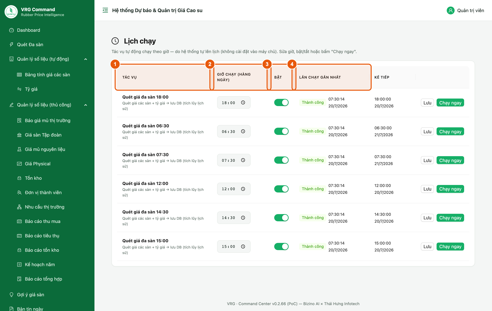

*Hình 11. Danh sách tác vụ tự động*

1. **Tác vụ** — tên và mục đích của từng tác vụ.
2. **Giờ chạy (hàng ngày)** — đặt giờ chạy.
3. **Bật** — bật/tắt từng tác vụ.
4. **Lần chạy gần nhất** — kết quả lần chạy vừa rồi: *Thành công* · *Lỗi* · *Không có dữ liệu* · *Đang chạy*.

> - Trạng thái **Không có dữ liệu** thường gặp vào thứ Bảy, Chủ nhật và ngày lễ — các sàn nghỉ giao dịch, không phải lỗi hệ thống.
> - Nếu một tác vụ báo **Lỗi** nhiều ngày liên tiếp, báo lại đơn vị triển khai để kiểm tra nguồn dữ liệu.
