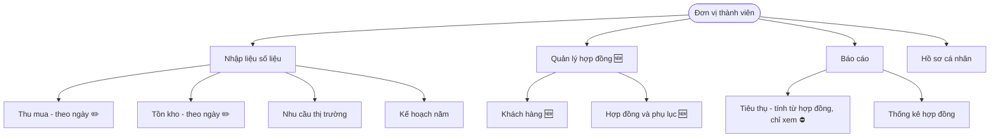

# Tổng hợp thay đổi — Quản lý khách hàng · Hợp đồng · Tiêu thụ nội bộ

> **Nguồn:** buổi feedback VRG 30/07/2026 (`feedback_vrg.xlsx` + trao đổi trực tiếp).
> **Phạm vi:** phân hệ báo cáo đơn vị thành viên (Thu mua · Tiêu thụ · Tồn kho).
> **Trạng thái:** đã chốt hướng, còn một số thông số chờ xác nhận (mục G).

---

## A. Tóm tắt

Chuyển trục nhập liệu: **Thu mua và Tồn kho giữ nhập theo ngày**; **Tiêu thụ và Đã-ký-HĐ-chưa-giao
chuyển sang gốc hợp đồng**. Bổ sung **quản lý khách hàng**, **hợp đồng 2 cấp**, **công ty mẹ – con**,
**tiêu thụ nội bộ**, **chi phí**, **2 loại mủ nguyên liệu mới**, **quy khô bắt buộc**, **tiền LAK**.
Bỏ hẳn hướng "nhập kho thành phẩm để tồn kho tự tính".

---

## B. Nguyên tắc chốt

| Chỉ tiêu | Grain | Cơ chế |
|---|---|---|
| Thu mua (nguyên liệu + thành phẩm) | Theo NGÀY | Đơn vị khai số trong ngày |
| Tồn kho thành phẩm (khối 1 + 2) | Theo NGÀY | Đơn vị khai **số luỹ kế mới nhất tại ngày báo cáo**; hệ thống **không tự trừ** khi giao hàng |
| Tồn kho nguyên liệu (khối 4) | Theo NGÀY | Đơn vị khai tay |
| Đã ký HĐ chưa giao (khối 3) | Tính từ HỢP ĐỒNG | **Không còn ô nhập.** Hệ thống tính = SL hợp đồng − tổng đã giao, tại ngày báo cáo. **Nằm trong** tồn kho thành phẩm, không cộng thêm |
| Tiêu thụ | Tính từ HỢP ĐỒNG | **Không còn biểu nhập.** Hệ thống tổng hợp từ **các lần giao** ghi trong hệ thống hợp đồng |

**Bỏ khỏi phần nhập liệu:** biểu **Tiêu thụ** và ô **Đã-ký-HĐ-chưa-giao (khối 3)**. Cả hai là **số hệ
thống tính ra từ hợp đồng**, đơn vị không nhập trực tiếp nữa.

**Đơn vị còn nhập:** Thu mua (theo ngày) · Tồn kho khối 1/2/4 (theo ngày) · **các lần giao trong hệ
thống hợp đồng** (nguồn để tính tiêu thụ và khối 3).

Tồn kho khai tay và tiêu thụ tính từ hợp đồng là **hai nguồn độc lập** — hệ thống **không tự trừ, không
tự sửa** tồn kho; chỉ cảnh báo khi lệch.

---

## C. Các tính năng và cách hoạt động

### C1. Quản lý khách hàng
- Danh mục khách hàng **quản lý riêng cho từng đơn vị** (mỗi đơn vị một danh sách của mình): mã · tên · MST · trạng thái.
- Hợp đồng **gán với một khách hàng** của chính đơn vị đó.
- Thống kê doanh thu / sản lượng **theo khách hàng** trong phạm vi đơn vị.

### C2. Quản lý hợp đồng
- Module riêng, tách khỏi biểu Tồn kho.
- **Loại giao:** mỗi hợp đồng là **giao 1 lần** hoặc **giao nhiều lần**.
  - **Giao 1 lần:** một hợp đồng, giao trọn một lần. Khi giao → tự chuyển thành đã giao (tính vào tiêu thụ).
  - **Giao nhiều lần (hợp đồng mẹ – con):** hợp đồng mẹ giữ **tổng sản lượng cam kết**; nhập **phụ lục (hợp đồng con) nhiều lần** cho đến khi **hết sản lượng** của mẹ.
- **Mỗi phụ lục = một lần giao = một lần thanh toán**, khi nhập **tự chuyển thành đã giao** (tính vào tiêu thụ, trừ vào phần chưa giao của mẹ). Mỗi phụ lục mang: **ngày giờ · sản lượng · chi phí · chứng từ / hóa đơn**.
- Không cho nhập phụ lục **vượt quá sản lượng còn lại** của hợp đồng mẹ.
- Hợp đồng mẹ và phụ lục đều nhập **nhiều dòng** (nhiều chủng loại · SL · đơn giá · loại tiền).
- **Cách thao tác:** danh sách hợp đồng **hiển thị các hợp đồng mẹ**; mở một hợp đồng mẹ để **thêm tiếp các phụ lục (hợp đồng con)**.
- **Không theo dõi công nợ** trong phần này.

### C3. Tiêu thụ (tính từ hợp đồng — không còn biểu nhập)
- Không còn biểu nhập tiêu thụ. Số tiêu thụ = **tổng các phần đã giao** trong hệ thống hợp đồng: phụ lục đã nhập (loại giao nhiều lần) + hợp đồng giao-1-lần đã đánh dấu giao.
- Mỗi phần giao mang: ngày giao · số lượng · chủng loại · đơn giá · loại tiền · **hình thức (Xuất khẩu/UTXK · Tiêu thụ trong nước · Tiêu thụ nội bộ)** · **chi phí (triệu đồng) trên từng dòng bán** · **quy khô** (bắt buộc với latex + 2 loại nguyên liệu mới). Khách hàng kế thừa từ hợp đồng.
- **Loại tiền:** đơn vị trong nước bán bằng **VND** (và USD khi xuất khẩu); đơn vị nước ngoài bán bằng **VND · USD · nội tệ của đơn vị** (Lào = LAK, Campuchia = KHR) — kèm tỷ giá quy về VND.
- Thuật ngữ: dùng **"Tiêu thụ nội bộ"** (không dùng "nội tiêu"); bán trong nước cho khách bên ngoài gọi **"Tiêu thụ trong nước"**.
- Ngoài chi phí trên từng dòng bán, có thêm **ô chi phí tổng cấp công ty mẹ** (mục C5).
- Báo cáo ngày / kỳ lấy sản lượng tiêu thụ, doanh thu, chi phí từ các phần đã giao trong kỳ.

### C4. Đã ký HĐ chưa giao (khối 3) — tính từ hợp đồng
- Không còn ô nhập. Hệ thống tính = **SL cam kết − tổng đã giao**, tại ngày báo cáo (giao 1 lần: chưa giao = toàn bộ; giao nhiều lần: mẹ − tổng phụ lục).
- Báo cáo ngày **hiển thị** SL còn lại tại ngày đó.
- Vẫn là phần **nằm trong** tồn kho thành phẩm; cảnh báo đỏ khi khối 3 > khối 1 + 2.

### C5. Công ty mẹ – con và tiêu thụ nội bộ
- Quản lý đơn vị thành viên thêm cấu hình quan hệ **mẹ – con** (đánh dấu công ty nào là mẹ).
- Đơn vị con chuyển tiêu thụ nội bộ được cho **bất kỳ đơn vị thành viên** nào (không giới hạn trong cây); dòng tiêu thụ nội bộ ghi rõ **đơn vị nhận**.
- **Hạch toán tiêu thụ nội bộ (chốt 30/07):**
  - **Đơn vị xuất (con):** vẫn **tính doanh thu** như bán thường.
  - **Đơn vị mẹ (nhận):** sau khi nhập và bán thành phẩm, **tự ghi vào mục chi phí** — trong đó **cộng thêm phần chi phí mua từ công ty con** (nhập tay).
  - Hệ thống **không tự liên kết, không tự đối soát** hai đầu; công ty mẹ tự ghi, tự chịu trách nhiệm số liệu.

### C6. Mủ nguyên liệu và quy khô
- Biểu Thu mua thêm **2 loại nguyên liệu** (nguyên văn):
  - Mủ nguyên liệu nước chưa cán vắt (chén)
  - Mủ nguyên liệu đã cán vắt (RSS)
- **Đơn giá tính riêng theo từng loại** (như các loại hiện có).

> ⛔ **ĐÃ HUỶ 14/08/2026** — khách báo đơn vị **không thu mua** 2 loại này, yêu cầu bỏ hẳn khỏi biểu
> Thu mua và mọi báo cáo thu mua. Prod khi đó chỉ có **1 bản ghi** chạm 2 ô này, giá trị 0 → không
> mất số liệu. **Chỉ huỷ phần THU MUA**: 2 loại vẫn là **chủng loại BÁN** trong danh mục dùng chung
> (39 hợp đồng đang dùng) và quy khô bắt buộc khi bán vẫn giữ nguyên (2 gạch đầu dòng bên dưới).
- **Quy khô nhập tay.** Bán **latex và 2 loại mới**: **bắt buộc nhập quy khô mới cho lưu**.
- Chỉ áp cho bản ghi mới; không suy diễn quy khô cho dữ liệu cũ.

### C7. Giảm nhập liệu
- Cờ **"hôm nay không phát sinh"** cho biểu Tiêu thụ (biểu Thu mua đã có cờ "không thu mua").
- Đẩy mạnh **nhập bằng Excel** (mẫu + parser đã có sẵn).

---

## D. Dữ liệu hệ thống theo dõi thêm

| Nhóm | Nội dung |
|---|---|
| **Khách hàng** | Mỗi đơn vị một danh sách riêng: mã · tên · mã số thuế · trạng thái |
| **Hợp đồng** | Số HĐ · khách hàng · **loại giao (1 lần / nhiều lần)** · thời hạn · tổng sản lượng cam kết (loại nhiều lần) · file scan · **nhiều dòng chi tiết** (chủng loại · SL · đơn giá · loại tiền) |
| **Phụ lục** | Thuộc một hợp đồng mẹ · nhiều dòng chi tiết · **khi nhập = một lần giao đã hoàn tất** + **một lần thanh toán**, không vượt sản lượng còn lại của mẹ |
| **Lần giao** (phụ lục, hoặc hợp đồng giao-1-lần) | Ngày giờ · số lượng · chủng loại · đơn giá · loại tiền · hình thức (Xuất khẩu / Trong nước / Nội bộ) · đơn vị nhận (nếu nội bộ) · **chi phí trên từng dòng** · quy khô · chứng từ / hóa đơn |
| **Thanh toán** | Mỗi phụ lục **một lần thanh toán** (ngày giờ · sản lượng · chi phí · chứng từ/hóa đơn); **không theo dõi công nợ** |
| **Đơn vị thành viên** | Bổ sung quan hệ công ty mẹ – con |
| **Biểu Tồn kho** | Chỉ còn tồn kho (khối 1/2/4); phần tiêu thụ và khối 3 rời khỏi biểu nhập |
| **Biểu Thu mua** | Thêm 2 loại nguyên liệu (nguyên văn): "Mủ nguyên liệu nước chưa cán vắt (chén)" · "Mủ nguyên liệu đã cán vắt (RSS)" |

**Chuyển dữ liệu cũ (không mất số liệu):** các hợp đồng đã-ký-chưa-giao đang nhập rời và các dòng tiêu
thụ đã khai chuyển sang cấu trúc hợp đồng / lần giao mới; cần **rà soát tay cùng đơn vị** khi module chạy lại.

---

## E. Ảnh hưởng lan toả — checklist khi làm

Mỗi chỉ tiêu mới đi qua các chỗ sau; bỏ sót là lệch số ở màn khác:

1. Danh mục ô hợp lệ phía server và phía web — phải khớp nhau
2. Biểu nhập (Thu mua · Tồn kho · Hợp đồng)
3. Mẫu Excel và bộ đọc file — dùng chung một khai báo
4. Báo cáo tổng hợp theo kỳ + xuất Excel (3 quy tắc: cộng dồn · thời điểm · bình quân gia quyền)
5. Các màn Thống kê số liệu + drill-down
6. Bản tin ngày / báo cáo tuần (nếu chỉ tiêu được dùng)
7. Nhật ký hoạt động (nhãn tiếng Việt cho chỉ tiêu mới)
8. Tài liệu hướng dẫn nhập liệu cho đơn vị + ảnh chụp minh hoạ

Ba điểm rủi ro riêng:
- **Tiêu thụ nội bộ:** đơn vị con tính doanh thu, đơn vị mẹ tự ghi chi phí mua từ con — **không tự đối soát**. Ở tổng Tập đoàn, doanh thu con và doanh thu mẹ có thể **đếm trùng phần trung gian**; đây là chủ ý ("mẹ tự chịu"), cần ghi rõ trong tài liệu nghiệp vụ để sau này có căn cứ.
- **Khối 3 (đã ký chưa giao):** tính = cam kết − tổng đã giao → giữ ràng buộc "nằm trong tồn kho, không cộng thêm".
- **Quy khô bắt buộc** chỉ áp cho bản ghi mới; không suy diễn cho dữ liệu cũ.

**Được phép tái cấu trúc menu và UI** phần nhập liệu và báo cáo cho thuận tiện hơn (khách đồng ý) — gom
lại theo trục mới: Nhập liệu (Thu mua · Tồn kho) · Hợp đồng (khách hàng · hợp đồng · phụ lục) · Báo cáo.

---

## F. Kế hoạch vận hành trong lúc nâng cấp (chốt 30/07/2026)

Nội dung để Ban ra thông báo cho các đơn vị.

| Phân hệ | Đơn vị làm gì |
|---|---|
| **Tiêu thụ + Đã ký HĐ chưa giao** | ⏸ Tạm dừng nhập, chờ nâng cấp (dự kiến đầu tuần sau có thông báo). Cấu trúc dữ liệu đổi → kỹ thuật xem và chuyển dữ liệu cũ; cần đơn vị rà soát tay khi module chạy lại |
| **Tồn kho** | ✅ Nhập mỗi ngày, số luỹ kế mới nhất của ngày báo cáo; ngày không đổi vẫn nhập lại số cũ; đủ từ 24/07/2026 |
| **Thu mua** | ✅ Rà đúng + đủ sản lượng, đơn giá từ 24/07/2026; nhập bù quá khứ từ 01/01/2026 (ngày không có → tick "không thu mua"); hoàn thành trước 07/08/2026 *(note ghi "07/07", cần xác nhận)*. Tham khảo Công ty Lộc Ninh |
| **Sau nâng cấp** | Ban phát file hướng dẫn nhập liệu phần mới trước khi đơn vị nhập lại |

Chuẩn bị phía đội triển khai:
- Chuyển dữ liệu tiêu thụ và hợp đồng đã-ký-chưa-giao đang có sang cấu trúc hợp đồng 2 cấp; có bảng đối chiếu trước/sau để đơn vị xác nhận.
- Khoá riêng 2 màn Tiêu thụ + Đã-ký-HĐ-chưa-giao (giữ Thu mua & Tồn kho mở), không xoá dữ liệu cũ.
- Giữ khoảng thời gian cho phép sửa đủ rộng để nhập bù tới 01/01/2026 (hiện đang cho sửa lùi xa — không thu hẹp trong giai đoạn này).

---

## G. Các quyết định đã chốt

| # | Nội dung | Chốt |
|---|---|---|
| Q1 | Hạch toán tiêu thụ nội bộ | Đơn vị con tính doanh thu; đơn vị mẹ tự ghi chi phí mua từ con (nhập tay); không tự đối soát |
| Q2 | Đơn giá 2 loại nguyên liệu mới | Tính riêng theo từng loại (như các loại hiện có) |
| Q3 | Chi phí | Theo **từng dòng bán** + ô **chi phí tổng cấp công ty mẹ** |
| Q4 | Quy khô | Nhập tay; latex + 2 loại mới **bắt buộc nhập quy khô mới cho lưu** |
| Q5 | Công nợ | **Không theo dõi công nợ** ở phần này |
| Q6 | Khách hàng | Danh mục **riêng cho từng đơn vị** |
| Q7 | Thanh toán | **Mỗi phụ lục một lần thanh toán** (ngày giờ · sản lượng · chi phí · chứng từ/hóa đơn) |
| Q8 | Hợp đồng mẹ – con | Danh sách hiển thị hợp đồng mẹ; mở hợp đồng mẹ để thêm phụ lục |
| Q9 | Báo cáo | Làm báo cáo theo nhu cầu, thiếu / thừa thì bổ sung |
| Q10 | Loại tiền | Nước ngoài bán VND · USD · nội tệ của đơn vị (Lào LAK, Campuchia KHR); trong nước VND (+ USD khi xuất khẩu) |

Còn lại nhỏ, để đơn vị tự quản: đơn vị mẹ có ghi hàng nhận nội bộ vào tồn kho hay không.

---

## H. Đề xuất phân đợt

| Đợt | Nội dung | Phụ thuộc |
|---|---|---|
| Đợt 0 | Loại tiền theo đơn vị (VND/USD/nội tệ) · chi phí theo dòng · 2 loại nguyên liệu · quy khô bắt buộc · cờ "không phát sinh" | Độc lập, làm ngay |
| Đợt 1 | Quản lý khách hàng (riêng từng đơn vị) + hợp đồng giao 1 lần / nhiều lần (mẹ–con) + phụ lục tự chuyển đã giao (kèm thanh toán) + tiêu thụ & khối 3 tính từ hợp đồng | Trọng tâm |
| Đợt 2 | Công ty mẹ – con + tiêu thụ nội bộ (con tính doanh thu, mẹ tự ghi chi phí mua từ con) | Sau đợt 1 (Q1 đã chốt) |
| Đợt 3 | Bổ sung báo cáo theo nhu cầu (feedback #4) + cảnh báo đẩy cho quản trị viên | Sau đợt 1 |
| Xuyên suốt | Tái cấu trúc menu / UI nhập liệu + báo cáo theo trục mới | Làm dần cùng các đợt |

---

## I. Đối chiếu 6 feedback trong Excel

| # | Feedback | Quyết định |
|---|---|---|
| 1 | Nhập kho thành phẩm → tồn kho tự tính | ❌ Không triển khai |
| 2 | Quản lý theo hợp đồng → tiêu thụ + tồn-chưa-giao tự tính | ✅ Trọng tâm. Tiêu thụ + khối 3 **bỏ khỏi nhập liệu**, hệ thống tính từ hợp đồng; tồn kho khối 1/2/4 vẫn khai tay |
| 3 | Giảm tồn kho từng phần, khác ngày/tháng | ✅ Giải quyết bằng "các lần giao" của phụ lục |
| 4 | Report tổng tồn kho / tiêu thụ / thành phẩm lũy kế | ⚠ Đã có một phần; bổ sung cột lũy kế đầu năm (Q9) |
| 5 | Lùi ngày / xoá do nhập sai | ✅ Xong (đổi ngày bản ghi trong cửa sổ cho phép) |
| 6 | Nhập nhiều quá, khó nhập theo ngày | ⚠ Giảm gián tiếp nhờ autocomplete + cờ "không phát sinh" + nhập Excel |

---

## J. Trạng thái hệ thống hiện tại (đối chiếu)

- **Đang có:** báo cáo ngày 2 biểu (Thu mua · Tiêu thụ–Tồn kho) · tồn kho 4 khối · hợp đồng đã-ký-chưa-giao
  (nhập rời, có vòng đời từ ngày bắt đầu tồn đến ngày giao) · nhập bằng Excel · báo cáo tổng hợp theo kỳ +
  xuất Excel · các màn Thống kê số liệu có drill-down · đổi ngày bản ghi · cửa sổ sửa N ngày · nhật ký hoạt
  động · kế hoạch năm.
- **Chưa có:** khách hàng · hợp đồng 2 cấp (mẹ – con) · giao từng phần · công ty mẹ – con · tiêu thụ nội
  bộ · chi phí · quy khô ở dòng bán · nội tệ (LAK/KHR) ở dòng bán · 2 loại nguyên liệu mới.

---

## K. Menu chức năng dự kiến

Trục mới: **Nhập liệu (theo ngày)** · **Quản lý hợp đồng** · **Báo cáo & Thống kê**. Chú thích:
🆕 mới · ✏️ đổi · ⛔ bỏ khỏi nhập liệu (chuyển thành số tính từ hợp đồng).

### K1. Đơn vị thành viên

```
Nhập liệu số liệu
├── Thu mua (theo ngày)                        ✏️ (đổi tên từ "Báo cáo thu mua"; thêm 2 loại nguyên liệu, quy khô)
├── Tồn kho (theo ngày)                         ✏️ (gộp: bỏ "Báo cáo tiêu thụ"; chỉ còn tồn kho khối 1/2/4)
├── Nhu cầu thị trường
└── Kế hoạch năm

Quản lý hợp đồng                                 🆕
├── Khách hàng                                   🆕 (danh sách riêng của đơn vị)
└── Hợp đồng & phụ lục                           🆕 (loại giao 1 lần / nhiều lần; phụ lục = lần giao + thanh toán)

Báo cáo
├── Tiêu thụ                                     ⛔→ tính từ hợp đồng (chỉ xem, không nhập)
└── Thống kê hợp đồng

Hồ sơ cá nhân
```

Bỏ khỏi menu đơn vị: **Báo cáo tiêu thụ** và **Báo cáo tồn kho** dạng nhập tay cũ (khối "đã ký HĐ chưa
giao" không còn nhập ở biểu Tồn kho).



### K2. Chuyên viên / Quản trị viên

```
Dashboard
Quét Đa sàn

Số liệu thị trường (tự động)
├── Bảng tính giá các sàn
└── Tỷ giá

Số liệu thị trường (thủ công)
├── Báo giá mủ thị trường
├── Giá sàn Tập đoàn
├── Giá mủ nguyên liệu
├── Giá Physical
└── Tồn kho Tập đoàn

Số liệu đơn vị thành viên
├── Đơn vị thành viên                            ✏️ (thêm cấu hình công ty mẹ – con)
├── Thu mua                                       (xem/sửa mọi đơn vị)
├── Tồn kho                                      ✏️ (chỉ tồn kho khối 1/2/4)
├── Nhu cầu thị trường
└── Kế hoạch năm

Quản lý hợp đồng                                 🆕
├── Khách hàng (theo từng đơn vị)                🆕
└── Hợp đồng & phụ lục                           🆕

Báo cáo & Thống kê
├── Báo cáo tiêu thụ                             ⛔→ tính từ hợp đồng
├── Báo cáo tổng hợp
├── Theo dõi nộp báo cáo
├── Thống kê thu mua
├── Thống kê tiêu thụ
├── Thống kê tồn kho
└── Thống kê hợp đồng

Phân tích & Bản tin
├── Gợi ý giá sàn
├── Bản tin ngày
├── Báo cáo tuần
├── Bản tin biến động
└── Trợ lý AI

Quản trị                                         (chỉ admin)
├── Người dùng
├── Nhật ký hoạt động
├── Cấu hình hệ thống
└── Lịch chạy

Hồ sơ cá nhân
```



```mermaid
flowchart TD
  R([Chuyên viên / Quản trị viên])
  R --> M0["Dashboard"]
  R --> M1["Quét Đa sàn"]
  R --> A["Số liệu thị trường tự động"]
  A --> A1["Bảng tính giá các sàn"]
  A --> A2["Tỷ giá"]
  R --> B["Số liệu thị trường thủ công"]
  B --> B1["Báo giá mủ thị trường"]
  B --> B2["Giá sàn Tập đoàn"]
  B --> B3["Giá mủ nguyên liệu"]
  B --> B4["Giá Physical"]
  B --> B5["Tồn kho Tập đoàn"]
  R --> C["Số liệu đơn vị thành viên"]
  C --> C1["Đơn vị thành viên ✏️ thêm mẹ-con"]
  C --> C2["Thu mua"]
  C --> C3["Tồn kho ✏️"]
  C --> C4["Nhu cầu thị trường"]
  C --> C5["Kế hoạch năm"]
  R --> D["Quản lý hợp đồng 🆕"]
  D --> D1["Khách hàng - theo từng đơn vị 🆕"]
  D --> D2["Hợp đồng và phụ lục 🆕"]
  R --> E["Báo cáo và Thống kê"]
  E --> E1["Báo cáo tiêu thụ - từ hợp đồng ⛔"]
  E --> E2["Báo cáo tổng hợp"]
  E --> E3["Theo dõi nộp báo cáo"]
  E --> E4["Thống kê thu mua"]
  E --> E5["Thống kê tiêu thụ"]
  E --> E6["Thống kê tồn kho"]
  E --> E7["Thống kê hợp đồng"]
  R --> F["Phân tích và Bản tin"]
  F --> F1["Gợi ý giá sàn"]
  F --> F2["Bản tin ngày"]
  F --> F3["Báo cáo tuần"]
  F --> F4["Bản tin biến động"]
  F --> F5["Trợ lý AI"]
  R --> G["Quản trị - chỉ admin"]
  G --> G1["Người dùng"]
  G --> G2["Nhật ký hoạt động"]
  G --> G3["Cấu hình hệ thống"]
  G --> G4["Lịch chạy"]
  R --> H["Hồ sơ cá nhân"]
```

Thay đổi so với menu hiện tại:
- Gom cụm **"Số liệu đơn vị thành viên"** (Thu mua · Tồn kho · Nhu cầu · Kế hoạch năm + cấu hình Đơn vị) tách khỏi cụm số liệu thị trường.
- Thêm cụm **"Quản lý hợp đồng"** (Khách hàng · Hợp đồng & phụ lục).
- **Tiêu thụ** rời khỏi nhập liệu, về cụm **Báo cáo** (số tính từ hợp đồng).
- Gom **Gợi ý giá sàn · Bản tin · Trợ lý AI** thành cụm **"Phân tích & Bản tin"** (trước để rời ngoài).
